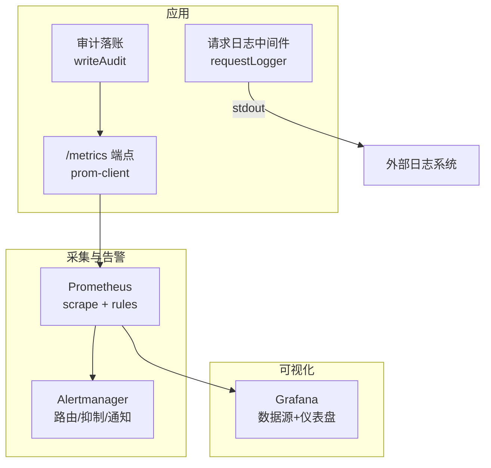
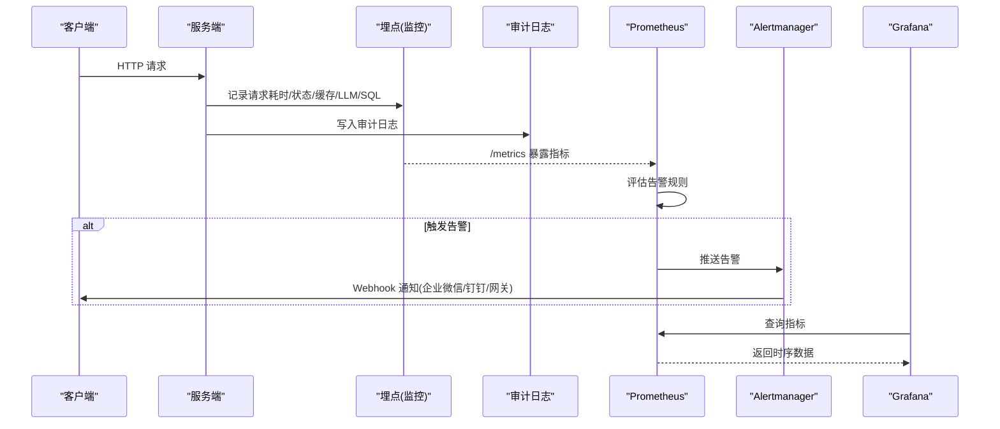
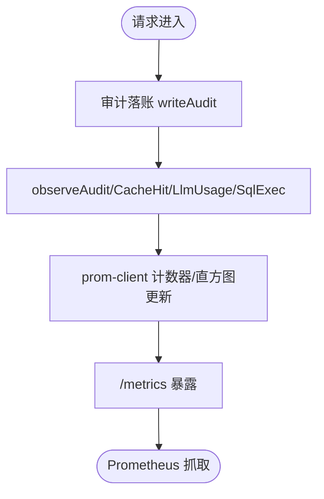
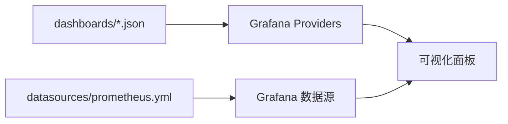
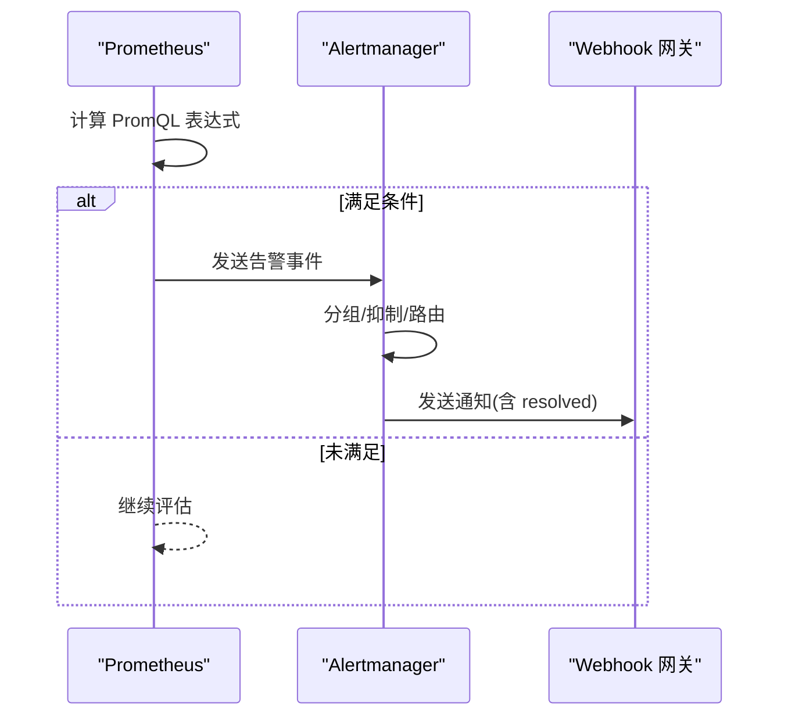
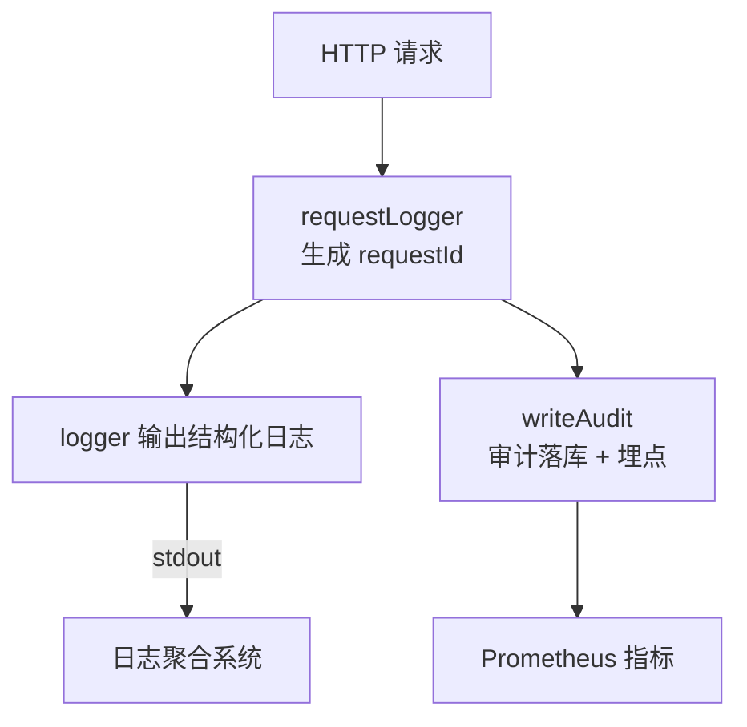
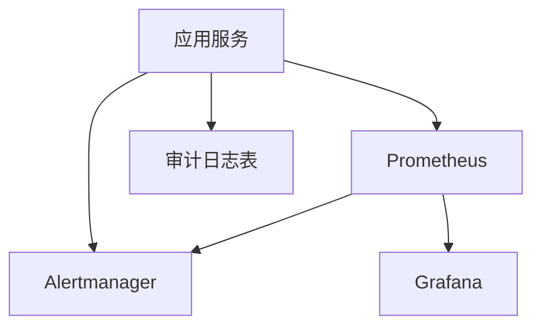

# 监控集成

<cite>
**本文引用的文件**
- [deploy/prometheus.yml](file://deploy/prometheus.yml)
- [deploy/alertmanager.yml](file://deploy/alertmanager.yml)
- [deploy/prometheus-alerts.yml](file://deploy/prometheus-alerts.yml)
- [server/infra/monitoring.ts](file://server/infra/monitoring.ts)
- [server/infra/logger.ts](file://server/infra/logger.ts)
- [server/infra/requestLogger.ts](file://server/infra/requestLogger.ts)
- [server/infra/auditLog.ts](file://server/infra/auditLog.ts)
- [deploy/grafana/provisioning/datasources/prometheus.yml](file://deploy/grafana/provisioning/datasources/prometheus.yml)
- [deploy/grafana/provisioning/dashboards/dashboards.yml](file://deploy/grafana/provisioning/dashboards/dashboards.yml)
- [deploy/grafana/dashboards/nl2sql-overview.json](file://deploy/grafana/dashboards/nl2sql-overview.json)
</cite>

## 目录
1. [简介](#简介)
2. [项目结构](#项目结构)
3. [核心组件](#核心组件)
4. [架构总览](#架构总览)
5. [详细组件分析](#详细组件分析)
6. [依赖关系分析](#依赖关系分析)
7. [性能考量](#性能考量)
8. [故障排查指南](#故障排查指南)
9. [结论](#结论)
10. [附录](#附录)

## 简介
本文件面向“智能问数据分析系统”的监控与可观测性集成，覆盖以下目标：
- APM 工具集成：Prometheus 指标采集、Grafana 仪表板配置、告警规则设置
- 日志收集配置：结构化日志格式、日志级别控制、日志聚合策略
- 业务指标定义：查询成功率、响应时间、用户活跃度、资源使用率
- 告警机制配置：阈值设置、通知渠道、告警升级策略
- 性能分析工具：慢查询分析、内存泄漏检测、CPU 使用分析
- 监控数据长期存储与归档策略

## 项目结构
本项目的监控相关能力由“应用侧埋点 + Prometheus 抓取 + Alertmanager 告警 + Grafana 可视化”组成，关键路径如下：
- 应用侧埋点：通过 prom-client 暴露 /metrics，并在审计、缓存、LLM、SQL 执行等关键路径旁路打点
- 采集层：Prometheus 按 job 抓取应用、Node、Redis、MySQL、Alertmanager 等指标
- 告警层：Prometheus 评估规则并推送至 Alertmanager，按路由策略通知 Webhook（企业微信/钉钉/自研网关）
- 可视化层：Grafana 自动加载数据源与仪表盘 JSON，提供统一视图

图表来源
- [server/infra/monitoring.ts:1-153](file://server/infra/monitoring.ts#L1-L153)
- [server/infra/requestLogger.ts:1-36](file://server/infra/requestLogger.ts#L1-L36)
- [server/infra/auditLog.ts:1-62](file://server/infra/auditLog.ts#L1-L62)
- [deploy/prometheus.yml:1-57](file://deploy/prometheus.yml#L1-L57)
- [deploy/alertmanager.yml:1-43](file://deploy/alertmanager.yml#L1-L43)
- [deploy/grafana/provisioning/datasources/prometheus.yml:1-11](file://deploy/grafana/provisioning/datasources/prometheus.yml#L1-L11)
- [deploy/grafana/provisioning/dashboards/dashboards.yml:1-14](file://deploy/grafana/provisioning/dashboards/dashboards.yml#L1-L14)

章节来源
- [deploy/prometheus.yml:1-57](file://deploy/prometheus.yml#L1-L57)
- [deploy/alertmanager.yml:1-43](file://deploy/alertmanager.yml#L1-L43)
- [deploy/grafana/provisioning/datasources/prometheus.yml:1-11](file://deploy/grafana/provisioning/datasources/prometheus.yml#L1-L11)
- [deploy/grafana/provisioning/dashboards/dashboards.yml:1-14](file://deploy/grafana/provisioning/dashboards/dashboards.yml#L1-L14)

## 核心组件
- 指标采集与暴露
  - 应用侧通过 prom-client 注册默认指标与业务指标，并通过 /metrics 暴露
  - 关键指标包括：请求计数与耗时直方图、缓存命中计数、LLM 调用耗时与 token 用量、SQL 执行耗时、HTTP 接口耗时
- 采集与告警
  - Prometheus 按 job 抓取多类目标（应用、节点、缓存、数据库、Alertmanager）
  - 告警规则按可用性、业务、资源、监控栈自监控分组定义，支持抑制与分级
  - Alertmanager 将告警路由到 Webhook，支持 resolve 通知与重复间隔控制
- 可视化
  - Grafana 通过 provisioning 自动注入 Prometheus 数据源与仪表盘
  - 仪表盘聚焦成功率、缓存命中率、端到端时延、LLM/SQL 时延对比等

章节来源
- [server/infra/monitoring.ts:1-153](file://server/infra/monitoring.ts#L1-L153)
- [deploy/prometheus.yml:1-57](file://deploy/prometheus.yml#L1-L57)
- [deploy/prometheus-alerts.yml:1-144](file://deploy/prometheus-alerts.yml#L1-L144)
- [deploy/alertmanager.yml:1-43](file://deploy/alertmanager.yml#L1-L43)
- [deploy/grafana/dashboards/nl2sql-overview.json:1-192](file://deploy/grafana/dashboards/nl2sql-overview.json#L1-L192)

## 架构总览
下图展示从请求到可视化的完整链路，以及告警触发与通知流程。

图表来源
- [server/infra/monitoring.ts:1-153](file://server/infra/monitoring.ts#L1-L153)
- [server/infra/auditLog.ts:1-62](file://server/infra/auditLog.ts#L1-L62)
- [deploy/prometheus.yml:1-57](file://deploy/prometheus.yml#L1-L57)
- [deploy/prometheus-alerts.yml:1-144](file://deploy/prometheus-alerts.yml#L1-L144)
- [deploy/alertmanager.yml:1-43](file://deploy/alertmanager.yml#L1-L43)
- [deploy/grafana/provisioning/datasources/prometheus.yml:1-11](file://deploy/grafana/provisioning/datasources/prometheus.yml#L1-L11)

## 详细组件分析

### Prometheus 指标采集与暴露
- 指标设计原则
  - 单点接入旁路埋点，不侵入热路径；所有埋点 fail-open，异常不影响业务
  - 严格控制 label 基数，避免高基数字段进入 label
- 关键指标
  - 请求计数与耗时：nl2sql_requests_total、nl2sql_duration_seconds
  - 缓存命中：nl2sql_cache_hits_total（分层 l1/l2）
  - LLM 调用：llm_call_duration_seconds、llm_tokens_total
  - SQL 执行：sql_execute_duration_seconds、sql_explain_guard_total
  - HTTP 接口：http_request_duration_seconds
- 暴露方式
  - /metrics 端点可选 METRICS_TOKEN 保护；未配置则直接暴露

图表来源
- [server/infra/monitoring.ts:1-153](file://server/infra/monitoring.ts#L1-L153)
- [server/infra/auditLog.ts:1-62](file://server/infra/auditLog.ts#L1-L62)

章节来源
- [server/infra/monitoring.ts:1-153](file://server/infra/monitoring.ts#L1-L153)

### Grafana 仪表板配置
- 数据源自动配置：通过 provisioning 注入 Prometheus 数据源，设为默认且不可编辑
- 仪表盘自动加载：通过 providers 将 dashboards 目录下的 JSON 文件加载为仪表盘，支持 UI 更新
- 内置仪表盘：nl2sql-overview.json 提供北极星面板（成功率、缓存命中率、P95 时延、请求速率、状态分布、LLM/SQL 时延对比等）

图表来源
- [deploy/grafana/provisioning/dashboards/dashboards.yml:1-14](file://deploy/grafana/provisioning/dashboards/dashboards.yml#L1-L14)
- [deploy/grafana/provisioning/datasources/prometheus.yml:1-11](file://deploy/grafana/provisioning/datasources/prometheus.yml#L1-L11)
- [deploy/grafana/dashboards/nl2sql-overview.json:1-192](file://deploy/grafana/dashboards/nl2sql-overview.json#L1-L192)

章节来源
- [deploy/grafana/provisioning/datasources/prometheus.yml:1-11](file://deploy/grafana/provisioning/datasources/prometheus.yml#L1-L11)
- [deploy/grafana/provisioning/dashboards/dashboards.yml:1-14](file://deploy/grafana/provisioning/dashboards/dashboards.yml#L1-L14)
- [deploy/grafana/dashboards/nl2sql-overview.json:1-192](file://deploy/grafana/dashboards/nl2sql-overview.json#L1-L192)

### 告警规则与通知
- 规则分组
  - 可用性：应用/MySQL/Redis 可达性
  - 业务：成功率低、P95 时延高、缓存命中率低、降级率高
  - 资源：进程内存高、磁盘空间低
  - 监控栈自监控：序列数过高、规则求值失败、抓取慢、Alertmanager 宕机
- 通知策略
  - 按 alertname/service 分组，支持 critical 更频繁提醒
  - 抑制规则：当应用宕机时抑制下游业务告警，避免风暴
  - 通知渠道：Webhook（占位符在容器启动时替换），支持 send_resolved
- 阈值与基线
  - 成功率低于 85%、P95 超过 180s、缓存命中率低于 15%（有流量前提）、降级率高于 15%

图表来源
- [deploy/prometheus-alerts.yml:1-144](file://deploy/prometheus-alerts.yml#L1-L144)
- [deploy/alertmanager.yml:1-43](file://deploy/alertmanager.yml#L1-L43)

章节来源
- [deploy/prometheus-alerts.yml:1-144](file://deploy/prometheus-alerts.yml#L1-L144)
- [deploy/alertmanager.yml:1-43](file://deploy/alertmanager.yml#L1-L43)

### 日志收集与聚合
- 统一日志出口
  - 通过 logger 封装 debug/info/warn/error，级别由 LOG_LEVEL 控制，test 环境仅输出 error
- 请求级日志
  - requestLogger 为每个 /api 请求生成 requestId，写入响应头 X-Request-Id，便于前后端关联
- 审计日志
  - writeAudit 将全链路状态、耗时、SQL、行数等写入数据库，同时旁路埋点到 Prometheus
- 聚合策略建议
  - 生产环境建议将 stdout 日志接入集中式日志平台（如 ELK/ Loki），结合 requestId 进行链路追踪
  - 对敏感字段脱敏后再输出，避免泄露

图表来源
- [server/infra/requestLogger.ts:1-36](file://server/infra/requestLogger.ts#L1-L36)
- [server/infra/logger.ts:1-41](file://server/infra/logger.ts#L1-L41)
- [server/infra/auditLog.ts:1-62](file://server/infra/auditLog.ts#L1-L62)

章节来源
- [server/infra/logger.ts:1-41](file://server/infra/logger.ts#L1-L41)
- [server/infra/requestLogger.ts:1-36](file://server/infra/requestLogger.ts#L1-L36)
- [server/infra/auditLog.ts:1-62](file://server/infra/auditLog.ts#L1-L62)

### 业务指标定义
- 查询成功率：基于 nl2sql_requests_total 中 SUCCESS/CACHE 占比，用于衡量整体可用性与质量
- 响应时间：nl2sql_duration_seconds 的 P95/P99 分位数，反映端到端体验
- 用户活跃度：endpoint=query 的请求速率，体现用户访问热度
- 资源使用率：process_resident_memory_bytes、node 导出器磁盘/内存/CPU 指标，用于容量规划与扩容决策

章节来源
- [deploy/prometheus-alerts.yml:35-83](file://deploy/prometheus-alerts.yml#L35-L83)
- [deploy/grafana/dashboards/nl2sql-overview.json:1-192](file://deploy/grafana/dashboards/nl2sql-overview.json#L1-L192)

### 告警机制配置
- 阈值设置
  - 成功率 < 85%（5m）、P95 > 180s（10m）、缓存命中率 < 15%（1h 且有流量）、降级率 > 15%（30m）
  - 资源阈值：进程常驻内存 > 1.5GiB（15m）、磁盘使用率 > 85%（10m）
- 通知渠道
  - Webhook：通过环境变量注入 URL，支持 send_resolved
  - 可扩展邮件渠道（注释模板）
- 告警升级策略
  - critical 级别 repeat_interval 缩短为 1h
  - 抑制规则：应用宕机时抑制下游业务告警，减少误报风暴

章节来源
- [deploy/prometheus-alerts.yml:1-144](file://deploy/prometheus-alerts.yml#L1-L144)
- [deploy/alertmanager.yml:1-43](file://deploy/alertmanager.yml#L1-L43)

### 性能分析工具
- 慢查询分析
  - 利用 sql_execute_duration_seconds 直方图定位慢查询时段与比例
  - 结合 nl2sql_duration_seconds 区分 LLM 与 SQL 瓶颈
- 内存泄漏检测
  - 观察 process_resident_memory_bytes 趋势，配合 AppMemoryHigh 告警
  - 关注 embedding 缓存与审计缓冲增长
- CPU 使用分析
  - 通过 node-exporter 的 CPU 指标（未在本文引用文件中显式定义，但可通过 node 导出器获取）
  - 结合 ScrapeDurationSlow 判断目标过载先兆

章节来源
- [deploy/prometheus-alerts.yml:84-104](file://deploy/prometheus-alerts.yml#L84-L104)
- [deploy/prometheus-alerts.yml:127-134](file://deploy/prometheus-alerts.yml#L127-L134)

### 监控数据的长期存储与归档策略
- 存储策略
  - Prometheus 本地 TSDB：需根据数据量与保留期配置 retention-time、storage.tsdb.* 参数
  - 高基数防护：避免 question/userId 等高基数字段作为 label，已在埋点设计中规避
- 归档策略
  - 历史数据可定期快照或迁移至对象存储（如 S3/OSS），配合远程读写或备份脚本
  - 审计日志表 query_audit_log 可按时间分区归档，降低主库压力
- 成本与性能平衡
  - 合理设置 scrape_interval、evaluation_interval，避免过度采样
  - 对直方图 bucket 与标签维度做裁剪，控制时序基数

章节来源
- [server/infra/monitoring.ts:1-153](file://server/infra/monitoring.ts#L1-L153)
- [server/infra/auditLog.ts:1-62](file://server/infra/auditLog.ts#L1-L62)

## 依赖关系分析
- 组件耦合
  - 应用埋点模块对外暴露 metricsHandler，被 server 路由挂载；审计模块旁路调用埋点函数
  - Prometheus 抓取 /metrics，评估规则后推送到 Alertmanager
  - Grafana 通过 provisioning 自动加载数据源与仪表盘
- 外部依赖
  - prom-client：指标注册与暴露
  - node-exporter/redis-exporter/mysql-exporter：基础设施与中间件指标
  - Webhook 网关：告警通知接收方

图表来源
- [server/infra/monitoring.ts:1-153](file://server/infra/monitoring.ts#L1-L153)
- [server/infra/auditLog.ts:1-62](file://server/infra/auditLog.ts#L1-L62)
- [deploy/prometheus.yml:1-57](file://deploy/prometheus.yml#L1-L57)
- [deploy/alertmanager.yml:1-43](file://deploy/alertmanager.yml#L1-L43)
- [deploy/grafana/provisioning/datasources/prometheus.yml:1-11](file://deploy/grafana/provisioning/datasources/prometheus.yml#L1-L11)

章节来源
- [deploy/prometheus.yml:1-57](file://deploy/prometheus.yml#L1-L57)
- [deploy/alertmanager.yml:1-43](file://deploy/alertmanager.yml#L1-L43)
- [server/infra/monitoring.ts:1-153](file://server/infra/monitoring.ts#L1-L153)
- [server/infra/auditLog.ts:1-62](file://server/infra/auditLog.ts#L1-L62)

## 性能考量
- 指标基数控制：严格限制 label 维度，避免高基数导致内存膨胀
- 采样频率：scrape_interval 与 evaluation_interval 保持 15s，兼顾实时性与负载
- 直方图桶设计：覆盖 ms 到分钟级，确保 P95/P99 估算准确
- 告警抑制：应用宕机时抑制下游业务告警，降低噪音
- 资源监控：进程内存与磁盘使用率告警，提前发现容量问题

[本节为通用指导，无需特定文件引用]

## 故障排查指南
- 应用不可达
  - 检查 Nl2sqlAppDown 告警与 up{job="nl2sql-app"} 指标
  - 确认 /metrics 端点是否可访问，必要时启用 METRICS_TOKEN
- 指标缺失或异常
  - 查看 ScrapeDurationSlow 与目标抓取耗时
  - 校验 prometheus.yml 中的 targets 与 labels
- 告警风暴
  - 检查抑制规则是否生效，确认 group_by 与 matchers
  - 调整 repeat_interval 与 group_wait
- 日志无法关联
  - 确认 X-Request-Id 是否回传到前端
  - 在日志聚合系统中以 requestId 检索全链路日志

章节来源
- [deploy/prometheus-alerts.yml:1-144](file://deploy/prometheus-alerts.yml#L1-L144)
- [server/infra/requestLogger.ts:1-36](file://server/infra/requestLogger.ts#L1-L36)
- [server/infra/monitoring.ts:135-153](file://server/infra/monitoring.ts#L135-L153)

## 结论
本系统已实现完整的监控闭环：应用侧埋点暴露指标，Prometheus 采集并评估告警，Alertmanager 通知，Grafana 可视化。通过严格的指标设计与告警抑制策略，既能快速发现问题，又能避免告警风暴。建议在生产环境中完善日志聚合与数据归档策略，持续优化指标基数与采样频率，保障系统稳定与可观测性。

[本节为总结性内容，无需特定文件引用]

## 附录
- 常用指标说明
  - nl2sql_requests_total：按 status/endpoint 统计的请求总数
  - nl2sql_duration_seconds：端到端耗时直方图
  - nl2sql_cache_hits_total：缓存命中次数（l1/l2）
  - llm_call_duration_seconds：LLM 调用耗时（按 channel/engine/model/ok）
  - llm_tokens_total：token 消耗（prompt/completion）
  - sql_execute_duration_seconds：SQL 执行耗时（ok/error）
  - http_request_duration_seconds：HTTP 接口耗时（method/route/status）
- 告警规则清单
  - 可用性：Nl2sqlAppDown、MySQLDown、RedisDown
  - 业务：QuerySuccessRateLow、QueryLatencyP95High、CacheHitRateLow、FallbackRateHigh
  - 资源：AppMemoryHigh、DiskSpaceLow
  - 监控栈：PrometheusCardinalityHigh、PrometheusRuleEvalFailures、ScrapeDurationSlow、AlertmanagerDown

章节来源
- [server/infra/monitoring.ts:1-153](file://server/infra/monitoring.ts#L1-L153)
- [deploy/prometheus-alerts.yml:1-144](file://deploy/prometheus-alerts.yml#L1-L144)