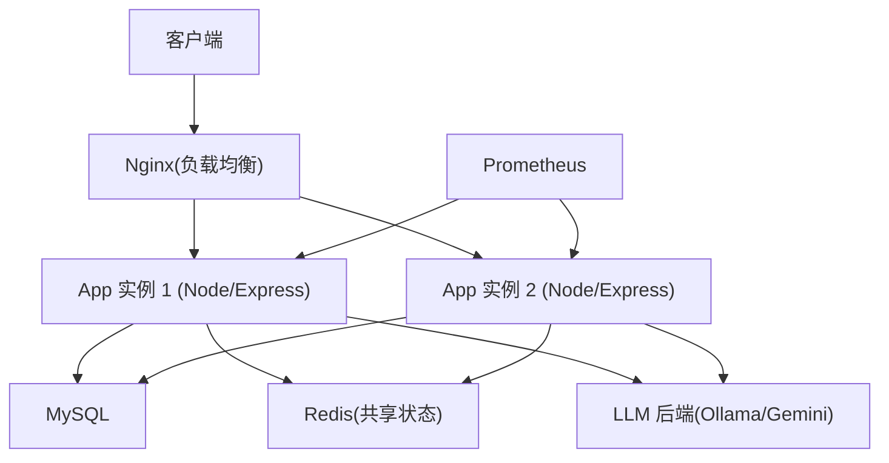
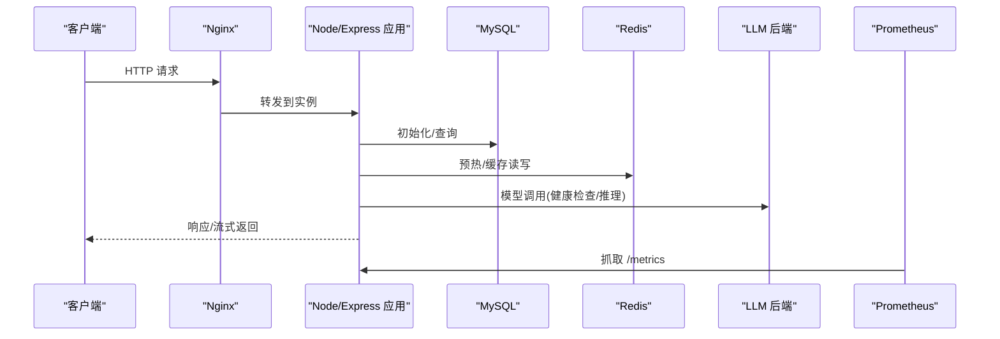
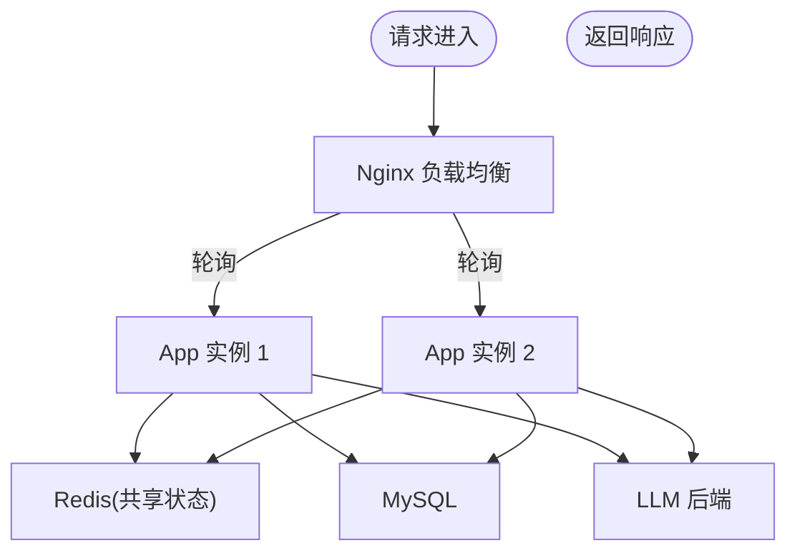
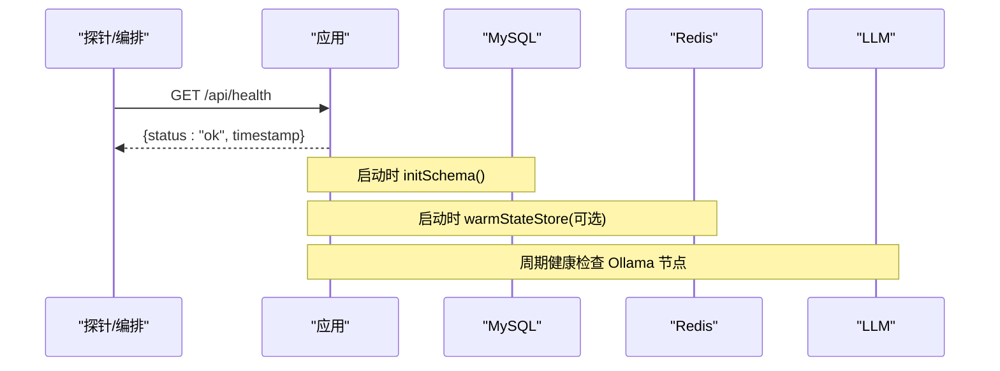
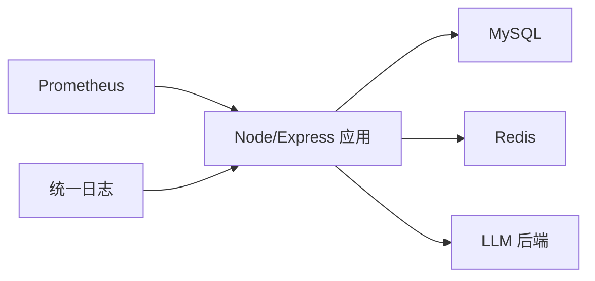

# 进程管理

<cite>
**本文引用的文件**
- [server.ts](file://server.ts)
- [package.json](file://package.json)
- [Dockerfile](file://Dockerfile)
- [docker-compose.multi-instance.yml](file://docker-compose.multi-instance.yml)
- [deploy/nginx.multi-instance.conf](file://deploy/nginx.multi-instance.conf)
- [deploy/prometheus.yml](file://deploy/prometheus.yml)
- [server/infra/monitoring.ts](file://server/infra/monitoring.ts)
- [server/infra/logger.ts](file://server/infra/logger.ts)
</cite>

## 目录
1. [简介](#简介)
2. [项目结构](#项目结构)
3. [核心组件](#核心组件)
4. [架构总览](#架构总览)
5. [详细组件分析](#详细组件分析)
6. [依赖关系分析](#依赖关系分析)
7. [性能考虑](#性能考虑)
8. [故障排查指南](#故障排查指南)
9. [结论](#结论)
10. [附录](#附录)

## 简介
本文件面向“智能问数据分析系统”的进程管理与运维配置，聚焦以下目标：
- Node.js 进程管理策略（PM2 与 systemd 的配置建议）
- 多实例部署与负载均衡（Nginx、Docker Compose）
- 健康检查机制（HTTP 健康端点、数据库与 Redis 连接状态）
- 监控与日志（Prometheus 指标、日志级别与轮转建议）
- 故障恢复（自动重启、优雅关闭、依赖服务降级）
- 多实例协调（共享状态外置、无状态应用设计）

## 项目结构
系统以 Express 为后端入口，提供 /api/health 健康检查与 /metrics Prometheus 指标；通过 Dockerfile 定义容器化运行方式；通过 docker-compose.multi-instance.yml 编排多实例；通过 Nginx 配置实现多实例负载均衡。

图表来源
- [deploy/nginx.multi-instance.conf:1-35](file://deploy/nginx.multi-instance.conf#L1-L35)
- [docker-compose.multi-instance.yml:1-50](file://docker-compose.multi-instance.yml#L1-L50)
- [server.ts:187-193](file://server.ts#L187-L193)
- [deploy/prometheus.yml:16-24](file://deploy/prometheus.yml#L16-L24)

章节来源
- [server.ts:82-193](file://server.ts#L82-L193)
- [Dockerfile:18-47](file://Dockerfile#L18-L47)
- [docker-compose.multi-instance.yml:1-50](file://docker-compose.multi-instance.yml#L1-L50)
- [deploy/nginx.multi-instance.conf:1-35](file://deploy/nginx.multi-instance.conf#L1-L35)
- [deploy/prometheus.yml:1-57](file://deploy/prometheus.yml#L1-L57)

## 核心组件
- 进程启动与健康检查
  - 应用启动时初始化数据库 schema、预热 Redis（可选）、注册任务队列与清理调度器、启动 LLM 健康检查等。
  - 暴露 /api/health 用于健康探测；暴露 /metrics 供 Prometheus 抓取。
- 监控与可观测性
  - 内置 Prometheus 指标注册与 HTTP 接口耗时直方图；默认指标采集；可选 METRICS_TOKEN 保护。
- 日志
  - 统一日志出口 logger，支持 LOG_LEVEL 控制输出级别；测试环境静默非 error 日志。
- 多实例与负载均衡
  - 通过 Nginx 将请求轮询分发到多个 App 实例；SSE 长连接需关闭缓冲并放大超时；应用无状态，无需粘性会话。
- 容器化与运行
  - 多阶段构建，生产镜像仅包含运行时依赖；HEALTHCHECK 调用 /api/health；默认监听 0.0.0.0:3000。

章节来源
- [server.ts:98-131](file://server.ts#L98-L131)
- [server.ts:187-193](file://server.ts#L187-L193)
- [server/infra/monitoring.ts:16-18](file://server/infra/monitoring.ts#L16-L18)
- [server/infra/monitoring.ts:135-152](file://server/infra/monitoring.ts#L135-L152)
- [server/infra/logger.ts:1-41](file://server/infra/logger.ts#L1-L41)
- [Dockerfile:27-47](file://Dockerfile#L27-L47)

## 架构总览
下图展示从客户端到应用、再到外部依赖的完整链路，以及监控与日志的接入点。

图表来源
- [deploy/nginx.multi-instance.conf:1-35](file://deploy/nginx.multi-instance.conf#L1-L35)
- [server.ts:98-131](file://server.ts#L98-L131)
- [server.ts:187-193](file://server.ts#L187-L193)
- [deploy/prometheus.yml:16-24](file://deploy/prometheus.yml#L16-L24)

## 详细组件分析

### 进程管理策略（PM2 与 systemd）
说明：仓库未包含 PM2 或 systemd 配置文件，以下为基于当前代码结构的推荐实践。

- PM2 进程管理建议
  - 使用 cluster 模式：利用多核并行处理请求，结合无状态应用设计提升吞吐。
  - 内存限制：设置 max_memory_restart 避免 OOM；根据压测结果调整。
  - 自动重启：启用 restart_on_error，配合健康检查确保异常快速恢复。
  - 环境变量：通过 .env 或 PM2 ecosystem 注入 JWT_SECRET、REDIS_URL、MYSQL_* 等。
  - 日志：开启 PM2 日志轮转，按大小/时间分割，保留固定数量。
- systemd 服务配置建议
  - 开机自启：创建 service unit，ExecStart 指向 node dist/server.cjs。
  - 资源限制：使用 MemoryMax/CPUQuota 限制单实例资源，避免争用。
  - 重启策略：Restart=always，RestartSec 短延迟快速恢复。
  - 日志：配合 journald 收集标准输出；如需文件落盘，可在应用层输出至文件并由 logrotate 管理。

章节来源
- [package.json:6-24](file://package.json#L6-L24)
- [Dockerfile:27-47](file://Dockerfile#L27-L47)

### 多实例部署与负载均衡
- Nginx 负载均衡
  - upstream 定义 app1/app2 两个实例，轮询分发；对 /api/* 关闭缓冲、放大读/写超时以支持 SSE 长连接。
- Docker Compose 编排
  - 双副本 app1/app2，共享 Redis 作为状态外置；端口映射 3001/3002 供 Prometheus 抓取；Nginx 暴露 8080。
- 无状态设计
  - 应用不持有本地状态，所有共享数据（限流、缓存、任务队列）通过 Redis 共享，保证任意实例均可处理请求。

图表来源
- [deploy/nginx.multi-instance.conf:1-35](file://deploy/nginx.multi-instance.conf#L1-L35)
- [docker-compose.multi-instance.yml:1-50](file://docker-compose.multi-instance.yml#L1-L50)
- [server.ts:112-118](file://server.ts#L112-L118)

章节来源
- [deploy/nginx.multi-instance.conf:1-35](file://deploy/nginx.multi-instance.conf#L1-L35)
- [docker-compose.multi-instance.yml:1-50](file://docker-compose.multi-instance.yml#L1-L50)
- [server.ts:112-118](file://server.ts#L112-L118)

### 健康检查机制
- HTTP 健康端点
  - /api/health 返回 ok 状态与时间戳，供容器 HEALTHCHECK、K8s/编排平台探针使用。
- 数据库连接检查
  - 启动时执行 initSchema，失败会阻断启动；后续业务逻辑中如连接异常应走降级路径。
- Redis 连接状态监控
  - 启动时尝试预热 Redis（warmStateStore），超时告警但不阻断；限流与缓存走 fail-closed/fail-open 策略保障可用性。
- LLM 后端健康检查
  - 启动后周期性健康检查 Ollama 节点，摘除不可用节点并自动恢复。

图表来源
- [server.ts:98-118](file://server.ts#L98-L118)
- [server.ts:187-193](file://server.ts#L187-L193)

章节来源
- [server.ts:98-118](file://server.ts#L98-L118)
- [server.ts:187-193](file://server.ts#L187-L193)

### 监控与日志
- Prometheus 指标
  - 默认指标采集 + 自定义指标（NL2SQL 请求计数/耗时、缓存命中、LLM 调用耗时/token、SQL 执行耗时、HTTP 接口耗时）。
  - /metrics 端点可选 METRICS_TOKEN 保护；Prometheus 抓取 job 已配置。
- 日志
  - 统一 logger，LOG_LEVEL 控制输出级别；错误日志始终输出；测试环境静默非 error 日志。
- 日志轮转建议（通用实践）
  - 若应用输出到 stdout/stderr，由容器/编排平台收集并通过 logrotate 或云日志服务进行分割与保留。
  - 若写入文件，建议使用 logrotate 按大小/时间切割，保留最近 N 份，删除旧文件释放磁盘空间。

章节来源
- [server/infra/monitoring.ts:16-18](file://server/infra/monitoring.ts#L16-L18)
- [server/infra/monitoring.ts:80-88](file://server/infra/monitoring.ts#L80-L88)
- [server/infra/monitoring.ts:135-152](file://server/infra/monitoring.ts#L135-L152)
- [deploy/prometheus.yml:16-24](file://deploy/prometheus.yml#L16-L24)
- [server/infra/logger.ts:1-41](file://server/infra/logger.ts#L1-L41)

### 故障恢复策略
- 进程崩溃自动重启
  - 容器层面：HEALTHCHECK 失败触发重启；systemd 的 Restart=always；PM2 的 restart_on_error。
- 依赖服务降级处理
  - Redis 预热超时：限流 fail-closed、缓存 fail-open，直至连接恢复。
  - LLM 后端：健康检查摘除不可用节点，自动恢复接入。
- 优雅关闭流程
  - 建议在进程收到 SIGTERM/SIGINT 时停止接受新请求、等待进行中请求完成、关闭数据库/Redis/LLM 连接后再退出（可按需扩展）。

章节来源
- [Dockerfile:43-44](file://Dockerfile#L43-L44)
- [server.ts:112-118](file://server.ts#L112-L118)
- [server.ts:127-131](file://server.ts#L127-L131)

### 多实例协调与负载均衡
- 共享状态外置
  - 通过 Redis 承载限流、缓存、任务队列等共享状态，确保任意实例均可无缝处理请求。
- 负载均衡
  - Nginx 轮询分发；SSE 长连接关闭缓冲并放大超时，避免代理截断。
- 监控覆盖
  - Prometheus 每实例独立抓取，instance label 区分；仪表盘聚合口径不变。

章节来源
- [docker-compose.multi-instance.yml:1-50](file://docker-compose.multi-instance.yml#L1-L50)
- [deploy/nginx.multi-instance.conf:1-35](file://deploy/nginx.multi-instance.conf#L1-L35)
- [deploy/prometheus.yml:48-57](file://deploy/prometheus.yml#L48-L57)

## 依赖关系分析
- 应用对外部依赖
  - MySQL：数据库 schema 初始化与业务数据存取。
  - Redis：共享状态（限流、缓存、任务队列）。
  - LLM 后端：Ollama/Gemini 等，具备健康检查与自动摘除。
- 监控与日志
  - Prometheus：抓取 /metrics 与默认指标。
  - 日志：统一 logger，便于集中收集与轮转。

图表来源
- [server.ts:98-131](file://server.ts#L98-L131)
- [server/infra/monitoring.ts:16-18](file://server/infra/monitoring.ts#L16-L18)
- [server/infra/logger.ts:1-41](file://server/infra/logger.ts#L1-L41)

章节来源
- [server.ts:98-131](file://server.ts#L98-L131)
- [server/infra/monitoring.ts:16-18](file://server/infra/monitoring.ts#L16-L18)
- [server/infra/logger.ts:1-41](file://server/infra/logger.ts#L1-L41)

## 性能考虑
- 请求体大小限制
  - 报告导出、知识库导入、文件数据源导入等接口放宽至 10MB，其余接口维持 2MB，避免大请求阻塞。
- 指标桶与基数
  - 指标桶覆盖毫秒到分钟级耗时；严格限制高基数 label，避免指标爆炸。
- 长连接与代理
  - SSE 长连接需关闭缓冲并放大超时，防止代理提前断开。
- 资源隔离
  - 多实例部署下，通过容器/systemd/PM2 限制 CPU/内存，避免相互影响。

章节来源
- [server.ts:133-143](file://server.ts#L133-L143)
- [server/infra/monitoring.ts:28-35](file://server/infra/monitoring.ts#L28-L35)
- [server/infra/monitoring.ts:48-54](file://server/infra/monitoring.ts#L48-L54)
- [deploy/nginx.multi-instance.conf:12-25](file://deploy/nginx.multi-instance.conf#L12-L25)

## 故障排查指南
- 健康检查失败
  - 检查 /api/health 是否可达；确认容器 HEALTHCHECK 配置与探针间隔/重试次数。
- 指标不可用
  - 检查 /metrics 是否被 METRICS_TOKEN 保护；确认 Prometheus job 配置与网络连通。
- 日志过多或过少
  - 调整 LOG_LEVEL；在测试环境非 error 日志会被静默。
- 多实例不一致
  - 确认 Redis 连接一致；确认 JWT_SECRET 在所有实例相同；确认 Nginx upstream 列表正确。

章节来源
- [Dockerfile:43-44](file://Dockerfile#L43-L44)
- [server/infra/monitoring.ts:135-152](file://server/infra/monitoring.ts#L135-L152)
- [server/infra/logger.ts:12-18](file://server/infra/logger.ts#L12-L18)
- [docker-compose.multi-instance.yml:19-39](file://docker-compose.multi-instance.yml#L19-L39)

## 结论
本系统采用无状态应用设计，通过 Redis 共享状态、Nginx 负载均衡与 Prometheus 监控，实现了可扩展、可观测的多实例部署。健康检查与依赖健康探测保障了服务的稳定性。结合 PM2/systemd 的进程管理策略，可实现自动重启、资源限制与优雅关闭。日志统一出口与轮转建议有助于长期稳定运行与问题定位。

## 附录
- 环境变量要点
  - PORT/HOST：监听地址与端口（容器默认 0.0.0.0:3000）。
  - JWT_SECRET：生产环境必须设置，否则拒绝启动。
  - MYSQL_*/REDIS_URL/OLLAMA_URL：外部依赖连接信息。
  - LOG_LEVEL/METRICS_TOKEN：日志级别与指标访问令牌。
- 启动脚本
  - package.json scripts 提供 dev/build/start 命令；Dockerfile 指定 CMD 运行 dist/server.cjs。

章节来源
- [server.ts:84-96](file://server.ts#L84-L96)
- [docker-compose.multi-instance.yml:19-39](file://docker-compose.multi-instance.yml#L19-L39)
- [package.json:6-24](file://package.json#L6-L24)
- [Dockerfile:27-47](file://Dockerfile#L27-L47)