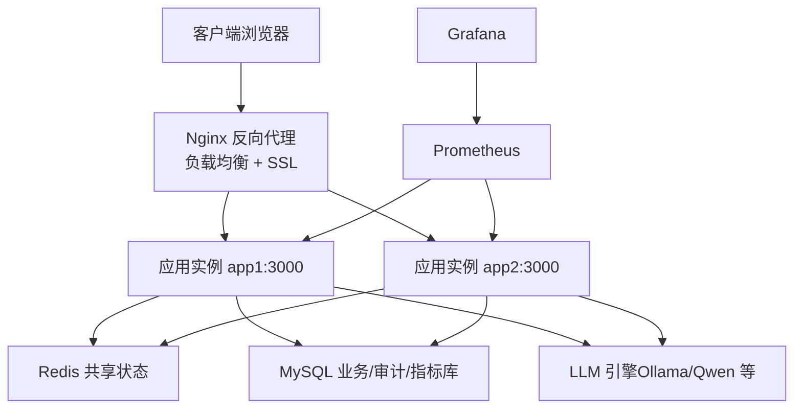
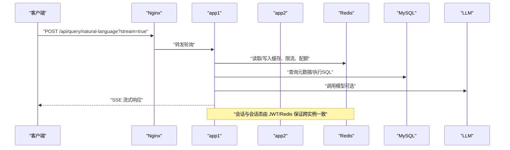
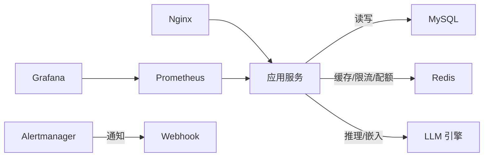

# 部署指南

<cite>
**本文引用的文件**
- [Dockerfile](file://Dockerfile)
- [docker-compose.multi-instance.yml](file://docker-compose.multi-instance.yml)
- [deploy/nginx.multi-instance.conf](file://deploy/nginx.multi-instance.conf)
- [server.ts](file://server.ts)
- [package.json](file://package.json)
- [.github/workflows/ci.yml](file://.github/workflows/ci.yml)
- [deploy/prometheus.yml](file://deploy/prometheus.yml)
- [deploy/alertmanager.yml](file://deploy/alertmanager.yml)
- [deploy/grafana/provisioning/datasources/prometheus.yml](file://deploy/grafana/provisioning/datasources/prometheus.yml)
- [deploy/alertmanager-entrypoint.sh](file://deploy/alertmanager-entrypoint.sh)
- [start.sh](file://start.sh)
- [docs/多实例部署指南.md](file://docs/多实例部署指南.md)
</cite>

## 目录
1. [简介](#简介)
2. [项目结构](#项目结构)
3. [核心组件](#核心组件)
4. [架构总览](#架构总览)
5. [详细组件分析](#详细组件分析)
6. [依赖关系分析](#依赖关系分析)
7. [性能与容量规划](#性能与容量规划)
8. [故障排查与恢复](#故障排查与恢复)
9. [结论](#结论)
10. [附录：检查清单与基准测试](#附录：检查清单与基准测试)

## 简介
本指南面向生产环境，提供智能问数据分析系统的完整部署方案。内容涵盖：
- Docker 镜像构建与容器编排（含多实例）
- 服务依赖管理（MySQL、Redis、LLM、Nginx）
- Nginx 反向代理配置（SSE 长连接、负载均衡、SSL 与域名绑定、静态资源托管）
- 生产环境优化（进程管理、上传大小、临时目录、安全头）
- CI/CD 流水线与自动化部署、回滚策略
- 监控告警（Prometheus/Grafana/Alertmanager）
- 部署检查清单、性能基准测试建议、故障恢复预案

## 项目结构
系统采用前后端一体化打包、Node.js 服务端暴露 REST API 与 SSE 流式接口，配合 MySQL 持久化、Redis 共享状态、Nginx 作为入口网关。多实例通过 Nginx 轮询分发，所有正确性相关状态外置至 Redis/MySQL，实现无状态扩展。

图示来源
- [docker-compose.multi-instance.yml:1-50](file://docker-compose.multi-instance.yml#L1-L50)
- [deploy/nginx.multi-instance.conf:1-35](file://deploy/nginx.multi-instance.conf#L1-L35)
- [deploy/prometheus.yml:1-57](file://deploy/prometheus.yml#L1-L57)

章节来源
- [Dockerfile:1-47](file://Dockerfile#L1-L47)
- [docker-compose.multi-instance.yml:1-50](file://docker-compose.multi-instance.yml#L1-L50)
- [deploy/nginx.multi-instance.conf:1-35](file://deploy/nginx.multi-instance.conf#L1-L35)
- [server.ts:1-304](file://server.ts#L1-L304)

## 核心组件
- 应用服务（Express + Vite 静态资源）：负责鉴权、路由、问数链路、报告导出、任务队列、可观测性指标暴露等。
- 共享状态层（Redis）：缓存、限流、配额、并发槽、OIDC state、Schema 上下文等。
- 持久化存储（MySQL）：用户、数据源、指标、审计日志、知识库等。
- 外部模型（LLM/Ollama）：文本生成、嵌入向量、语义检索。
- 网关（Nginx）：负载均衡、SSE 长连接支持、静态资源托管、可选 SSL 终止。
- 可观测性（Prometheus/Grafana/Alertmanager）：指标采集、可视化、告警通知。

章节来源
- [server.ts:82-193](file://server.ts#L82-L193)
- [docs/多实例部署指南.md:25-48](file://docs/多实例部署指南.md#L25-L48)
- [deploy/prometheus.yml:16-57](file://deploy/prometheus.yml#L16-L57)

## 架构总览
下图展示多实例部署下的请求路径、状态共享与监控链路。

图示来源
- [deploy/nginx.multi-instance.conf:1-35](file://deploy/nginx.multi-instance.conf#L1-L35)
- [server.ts:187-265](file://server.ts#L187-L265)
- [docs/多实例部署指南.md:77-85](file://docs/多实例部署指南.md#L77-L85)

## 详细组件分析

### Docker 镜像与运行基线
- 多阶段构建：构建期安装全部依赖并编译前端与后端产物；运行期仅安装生产依赖，减小镜像体积。
- 非 root 运行：使用内置 node 用户，降低权限风险。
- 健康检查：容器内以 Node fetch 探测 /api/health，便于编排平台判定就绪。
- 环境变量：HOST=0.0.0.0、PORT=3000，生产模式强制要求 JWT_SECRET。

章节来源
- [Dockerfile:1-47](file://Dockerfile#L1-L47)
- [server.ts:82-96](file://server.ts#L82-L96)

### 容器编排与多实例
- 使用 docker-compose 编排两个无状态应用副本、一个 Redis、一个 Nginx。
- 应用通过环境变量注入数据库、LLM、Redis 地址及密钥。
- Nginx 将流量轮询分发到 app1/app2，并对 /api/* 启用 SSE 所需参数。

章节来源
- [docker-compose.multi-instance.yml:1-50](file://docker-compose.multi-instance.yml#L1-L50)
- [deploy/nginx.multi-instance.conf:1-35](file://deploy/nginx.multi-instance.conf#L1-L35)

### Nginx 反向代理与 SSE
- upstream 定义 app1/app2 节点，开启失败重试与超时控制。
- /api/* 关闭缓冲、关闭缓存、放大读写超时，确保 SSE 长连接不被截断。
- 通用 location 透传 Host/X-Real-IP/X-Forwarded-For。
- 静态资源：生产模式下由应用直接提供 dist 静态文件；Nginx 也可用于单独托管静态资源（按需）。

章节来源
- [deploy/nginx.multi-instance.conf:1-35](file://deploy/nginx.multi-instance.conf#L1-L35)
- [server.ts:282-296](file://server.ts#L282-L296)

### SSL 证书与域名绑定（Nginx）
- 在 server 块中监听 443，加载证书与私钥，启用 HTTP/2。
- 将 http 请求 301 重定向到 https。
- 为不同域名配置 server_name，并将 /api/* 与 / 分别代理到上游。
- 若需额外静态资源托管，可在独立 location 指向磁盘目录并设置缓存头。

提示
- 证书文件路径与域名需按实际环境替换。
- 如需 HSTS，可在响应头中追加 Strict-Transport-Security（应用已设置生产 CSP/HSTS，Nginx 侧可按需叠加）。

章节来源
- [deploy/nginx.multi-instance.conf:9-34](file://deploy/nginx.multi-instance.conf#L9-L34)
- [server.ts:145-167](file://server.ts#L145-L167)

### 多实例状态共享与会话一致性
- 登录与会话：JWT 无状态签发与校验，要求全实例 JWT_SECRET 一致。
- 缓存与限流：Redis 键空间 qc:*、rl:*、uql:* 等，保证跨实例命中与限额一致。
- OIDC state：一次性 token 存储在 Redis，允许发起与回调落在不同实例。
- 进程内存缓存：embedding、schemaLinking、dataVersion 等为本地加速层，不影响正确性。

章节来源
- [docs/多实例部署指南.md:25-48](file://docs/多实例部署指南.md#L25-L48)
- [docs/多实例部署指南.md:66-75](file://docs/多实例部署指南.md#L66-L75)

### 数据同步与一致性
- 权威数据源：MySQL 承载用户、数据源、指标、审计、知识库等。
- 缓存层：Redis 作为读加速与分布式锁/计数载体，未命中时回退到数据库或降级策略。
- 版本与漂移：数据版本指纹缓存（进程内存，短 TTL）避免轮询风暴；漂移检测定时扫描。

章节来源
- [server.ts:120-131](file://server.ts#L120-L131)
- [docs/多实例部署指南.md:25-48](file://docs/多实例部署指南.md#L25-L48)

### 生产环境配置优化
- 进程管理：容器 CMD 启动 dist/server.cjs；建议使用 systemd/supervisor 或编排平台进行重启与存活探针。
- 文件上传：针对特定路由放宽 body 限制（如报告导出、知识库导入、文件数据源导入），其余接口保持默认限制。
- 临时目录：确保 Node 可写系统临时目录；如需自定义，结合操作系统挂载卷或环境变量。
- 安全头：生产模式自动设置 X-Content-Type-Options、X-Frame-Options、Referrer-Policy、HSTS、CSP。
- 健康检查：/api/health 返回 ok；容器 HEALTHCHECK 定期探测。

章节来源
- [server.ts:133-143](file://server.ts#L133-L143)
- [server.ts:145-167](file://server.ts#L145-L167)
- [server.ts:187-193](file://server.ts#L187-L193)
- [Dockerfile:41-46](file://Dockerfile#L41-L46)

### CI/CD 流水线与自动化部署
- 质量门禁：TypeScript 类型检查、ESLint、OpenAPI 一致性校验、进程内状态巡检、Vitest 单测。
- 评测集门禁：结构校验与阈值契约，prompt 变更触发提醒。
- 构建与发布：基于 package.json scripts 构建前端与后端产物；CI 成功后推送镜像并更新部署。
- 回滚策略：保留上一稳定镜像标签；灰度/蓝绿切换；快速回滚到上一个已知可用版本。

章节来源
- [.github/workflows/ci.yml:1-67](file://.github/workflows/ci.yml#L1-L67)
- [package.json:6-24](file://package.json#L6-L24)

### 监控与告警
- 指标暴露：/metrics 暴露 HTTP 耗时、问数状态、缓存命中率、LLM 时延/token、SQL 执行耗时等。
- 抓取配置：Prometheus 抓取应用、Node 导出器、Redis/MySQL 导出器、Alertmanager。
- 告警规则：Alertmanager 接收 webhook 通知，抑制级联告警（应用宕机时抑制下游指标异常）。
- 可视化：Grafana 自动配置 Prometheus 数据源，预置仪表盘（dashboard JSON 见 deploy/grafana/dashboards）。

章节来源
- [deploy/prometheus.yml:1-57](file://deploy/prometheus.yml#L1-L57)
- [deploy/alertmanager.yml:1-43](file://deploy/alertmanager.yml#L1-L43)
- [deploy/grafana/provisioning/datasources/prometheus.yml:1-11](file://deploy/grafana/provisioning/datasources/prometheus.yml#L1-L11)
- [server.ts:172-193](file://server.ts#L172-L193)

## 依赖关系分析
- 应用依赖：MySQL（持久化）、Redis（共享状态）、LLM（推理/嵌入）、Nginx（入口）。
- 可观测性依赖：Prometheus 抓取 /metrics；Grafana 消费 Prometheus；Alertmanager 接收告警。
- 编排依赖：docker-compose 编排 app×2、redis、nginx；各服务通过环境变量互联。

图示来源
- [docker-compose.multi-instance.yml:1-50](file://docker-compose.multi-instance.yml#L1-L50)
- [deploy/prometheus.yml:16-57](file://deploy/prometheus.yml#L16-L57)
- [deploy/alertmanager.yml:1-43](file://deploy/alertmanager.yml#L1-L43)

章节来源
- [docker-compose.multi-instance.yml:1-50](file://docker-compose.multi-instance.yml#L1-L50)
- [deploy/prometheus.yml:1-57](file://deploy/prometheus.yml#L1-L57)

## 性能与容量规划
- 水平扩展：增加 app 副本数量，Nginx 自动轮询；无需粘性会话。
- 长连接优化：Nginx 对 /api/* 关闭缓冲、放大超时，保障 SSE 流式问答。
- 缓存策略：Redis 命中提升 QPS；本地 embedding/schemaLinking 缓存减少远程调用。
- 资源隔离：容器限制 CPU/内存；Prometheus 指标粒度区分 instance，便于定位瓶颈。
- 压测建议：固定打单一实例或使用压测工具直连实例，避免缓存跨实例命中影响测量。

章节来源
- [deploy/nginx.multi-instance.conf:1-35](file://deploy/nginx.multi-instance.conf#L1-L35)
- [docs/多实例部署指南.md:77-85](file://docs/多实例部署指南.md#L77-L85)
- [docs/多实例部署指南.md:116-122](file://docs/多实例部署指南.md#L116-L122)

## 故障排查与恢复
- 启动失败：检查 JWT_SECRET、MYSQL_*、REDIS_URL、OLLAMA_URL 等环境变量；查看容器日志与健康检查输出。
- 无法访问：确认 Nginx 上游健康、端口映射、防火墙与安全组；验证 /api/health。
- 限流/配额异常：检查 Redis 连通性与键空间；必要时清理过期键或扩容 Redis。
- 缓存未命中：确认 Redis 键前缀与阈值配置一致；必要时预热或调整阈值。
- 告警风暴：利用 Alertmanager 抑制规则，优先恢复应用可用性。
- 回滚流程：停止新版本 → 切回旧版本镜像 → 验证健康 → 逐步放量。

章节来源
- [server.ts:91-96](file://server.ts#L91-L96)
- [server.ts:187-193](file://server.ts#L187-L193)
- [deploy/alertmanager.yml:38-43](file://deploy/alertmanager.yml#L38-L43)
- [docs/多实例部署指南.md:116-122](file://docs/多实例部署指南.md#L116-L122)

## 结论
本系统通过无状态设计与共享状态外置，实现了高可用的多实例部署。借助 Nginx 的负载均衡与 SSE 长连接支持、Redis/MySQL 的一致性保障、以及完善的监控告警体系，可满足企业级数据分析场景的生产需求。配合 CI/CD 与回滚策略，可实现持续交付与快速恢复。

## 附录：检查清单与基准测试

### 部署检查清单
- 基础环境
  - Node 版本与依赖安装成功
  - MySQL 可达且数据库/表初始化完成
  - Redis 连通且键空间可用
  - LLM 服务可达且模型已拉取
- 容器与编排
  - 镜像构建成功，健康检查通过
  - docker-compose 编排正常，Nginx 可访问
  - 环境变量注入正确（JWT_SECRET、MYSQL_*、REDIS_URL、OLLAMA_URL）
- 安全与合规
  - 生产模式启用安全头与 CSP/HSTS
  - 证书与域名绑定正确（如启用 HTTPS）
  - 最小权限运行（非 root）
- 监控与告警
  - /metrics 可抓取
  - Prometheus/Grafana/Alertmanager 正常
  - 关键告警规则生效
- 功能验证
  - 登录/鉴权正常
  - 问数流式响应正常（SSE）
  - 报告导出/导入正常
  - 任务队列与异步任务正常

章节来源
- [Dockerfile:41-46](file://Dockerfile#L41-L46)
- [server.ts:145-167](file://server.ts#L145-L167)
- [deploy/prometheus.yml:16-57](file://deploy/prometheus.yml#L16-L57)
- [deploy/alertmanager.yml:1-43](file://deploy/alertmanager.yml#L1-L43)

### 性能基准测试建议
- 目标指标
  - P95/P99 延迟、QPS、错误率、缓存命中率、LLM 调用成功率与时延
- 工具与方法
  - 使用压测脚本或专业工具（如 k6/JMeter）模拟并发用户
  - 固定打单一实例或直连实例，避免缓存跨实例命中影响测量
  - 观察 Prometheus 指标与 Grafana 仪表盘
- 调优要点
  - 放大 Nginx 超时与关闭缓冲（SSE）
  - 合理设置 Redis 与数据库连接池
  - 调整 LLM 并发与熔断阈值
  - 根据负载弹性扩缩容

章节来源
- [deploy/nginx.multi-instance.conf:1-35](file://deploy/nginx.multi-instance.conf#L1-L35)
- [docs/多实例部署指南.md:116-122](file://docs/多实例部署指南.md#L116-L122)
- [deploy/prometheus.yml:16-57](file://deploy/prometheus.yml#L16-L57)

### 自动化部署与回滚
- 自动化部署
  - CI 触发质量门禁与评测集门禁
  - 构建镜像并推送到仓库
  - 更新编排配置并滚动发布
- 回滚策略
  - 保留上一稳定镜像标签
  - 灰度/蓝绿切换，快速回滚到上一个版本
  - 健康检查失败自动回滚

章节来源
- [.github/workflows/ci.yml:1-67](file://.github/workflows/ci.yml#L1-L67)
- [package.json:6-24](file://package.json#L6-L24)

### 本地一键启动（开发）
- 使用 start.sh 拉起 MySQL、Redis（可选）、Ollama 与应用服务
- 自动等待依赖就绪并打开浏览器
- 首次登录默认账号与密码提示

章节来源
- [start.sh:1-138](file://start.sh#L1-L138)