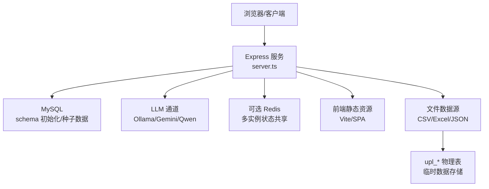
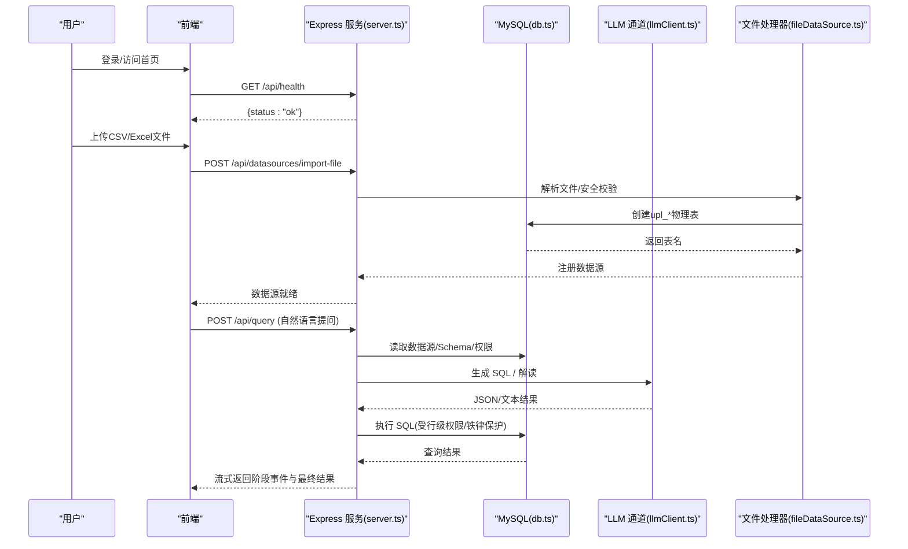
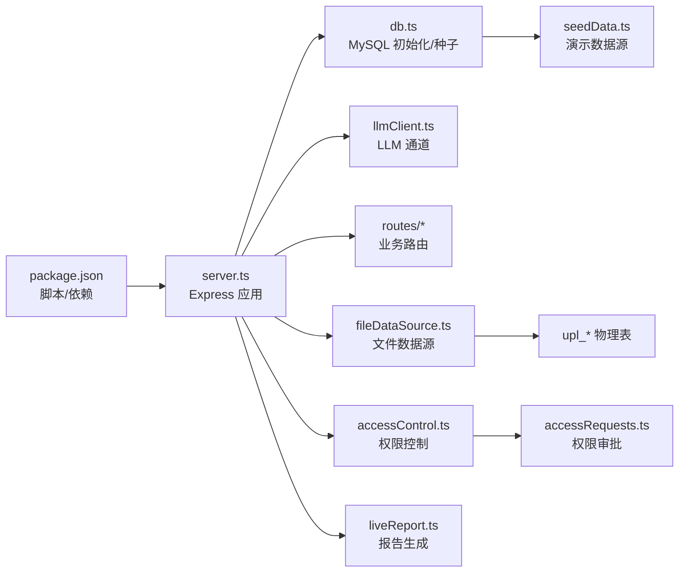

# 快速开始指南

<cite>
**本文引用的文件**
- [server.ts](file://server.ts)
- [Dockerfile](file://Dockerfile)
- [start.sh](file://start.sh)
- [package.json](file://package.json)
- [server/infra/db.ts](file://server/infra/db.ts)
- [server/llm/llmClient.ts](file://server/llm/llmClient.ts)
- [server/seedData.ts](file://server/seedData.ts)
- [docs/系统功能说明书.md](file://docs/系统功能说明书.md)
- [server/routes/datasources.ts](file://server/routes/datasources.ts)
- [server/query/fileDataSource.ts](file://server/query/fileDataSource.ts)
- [server/auth/accessControl.ts](file://server/auth/accessControl.ts)
- [server/auth/auth.ts](file://server/auth/auth.ts)
- [server/report/liveReport.ts](file://server/report/liveReport.ts)
</cite>

## 更新摘要
**变更内容**
- 新增Excel/CSV文件上传功能，为没有数据库环境的用户提供数据源替代方案
- 更新角色权限表，增加灵活的查询访问级别控制
- 强化报告生成能力，支持图表、洞察和决策简报的自动生成
- 优化用户体验，简化数据源配置流程

## 目录
1. [简介](#简介)
2. [项目结构](#项目结构)
3. [核心组件](#核心组件)
4. [架构总览](#架构总览)
5. [详细组件分析](#详细组件分析)
6. [依赖关系分析](#依赖关系分析)
7. [性能与容量建议](#性能与容量建议)
8. [故障排查指南](#故障排查指南)
9. [结论](#结论)
10. [附录：环境变量清单](#附录环境变量清单)

## 简介
本指南面向首次部署智能问数据分析系统的用户，目标是在最短时间内完成环境准备、数据库与 LLM 配置、首次启动与基本配置，并通过一个自然语言查询示例体验核心能力。系统支持本地开发一键启动（脚本自动拉起 MySQL、Redis、Ollama），也支持 Docker 生产化部署；内置管理员账号与演示数据源，开箱即用。**特别支持Excel/CSV文件上传功能，即使没有数据库也能立即开始数据分析**。

## 项目结构
- 应用入口与路由挂载：server.ts
- 构建与运行脚本：start.sh、Dockerfile、package.json
- 数据库初始化与种子数据：server/infra/db.ts、server/seedData.ts
- LLM 统一通道与模型选择：server/llm/llmClient.ts
- 文件数据源处理：server/query/fileDataSource.ts
- 权限控制与访问管理：server/auth/accessControl.ts、server/auth/auth.ts
- 报告生成引擎：server/report/liveReport.ts
- 功能说明与使用流程：docs/系统功能说明书.md

**图表来源**
- [server.ts:82-198](file://server.ts#L82-L198)
- [server/infra/db.ts:52-70](file://server/infra/db.ts#L52-L70)
- [server/llm/llmClient.ts:235-271](file://server/llm/llmClient.ts#L235-L271)
- [server/query/fileDataSource.ts:1-18](file://server/query/fileDataSource.ts#L1-L18)

章节来源
- [server.ts:82-198](file://server.ts#L82-L198)
- [package.json:6-24](file://package.json#L6-L24)

## 核心组件
- 服务启动与健康检查：Express 应用、健康端点、安全头、请求日志、Prometheus 指标
- 数据库层：MySQL 连接池、建库建表、默认管理员与演示数据源种子
- LLM 通道：统一调用封装、引擎选择、熔断/重试/并发控制、可用模型目录
- 文件数据源：CSV/Excel/JSON文件上传解析、安全列过滤、类型推断、物理表创建
- 权限控制：角色基础访问控制、部门维度授权、灵活查询权限管理
- 报告生成：自动化图表生成、洞察分析、决策简报导出
- 一键启动：start.sh 自动检测并拉起依赖，打开浏览器

章节来源
- [server.ts:82-198](file://server.ts#L82-L198)
- [server/infra/db.ts:52-80](file://server/infra/db.ts#L52-L80)
- [server/llm/llmClient.ts:235-337](file://server/llm/llmClient.ts#L235-L337)
- [server/query/fileDataSource.ts:1-18](file://server/query/fileDataSource.ts#L1-L18)
- [server/auth/accessControl.ts:1-108](file://server/auth/accessControl.ts#L1-L108)
- [server/report/liveReport.ts:1-200](file://server/report/liveReport.ts#L1-L200)
- [start.sh:43-138](file://start.sh#L43-L138)

## 架构总览
系统采用前后端分离的 SPA 架构，后端基于 Express 提供 REST API，负责鉴权、数据源管理、NL2SQL 问数链路、报告生成等；通过统一 LLM 通道对接 Ollama/Gemini/Qwen；持久化存储为 MySQL，可选 Redis 用于多实例状态共享与缓存。**新增文件数据源支持，允许用户上传CSV/Excel/JSON文件进行即时分析**。

**图表来源**
- [server.ts:187-265](file://server.ts#L187-L265)
- [server/infra/db.ts:52-80](file://server/infra/db.ts#L52-L80)
- [server/llm/llmClient.ts:449-525](file://server/llm/llmClient.ts#L449-L525)
- [server/routes/datasources.ts:484-564](file://server/routes/datasources.ts#L484-L564)

## 详细组件分析

### 环境与安装
- Node.js 要求
  - 运行时：Node.js 22（容器镜像）
  - 开发工具链：TypeScript、Vite、esbuild、tsx（见 scripts）
- 依赖服务
  - MySQL：端口 3306（必需）
  - Redis：端口 6379（可选，仅当配置 REDIS_URL 且指向本机时由脚本拉起）
  - Ollama：端口 11434（必需，若使用本地大模型）
- 一键启动
  - 执行 start.sh，将自动检查并拉起 MySQL、Redis、Ollama，安装依赖，启动服务并打开浏览器
  - 默认监听 http://localhost:3000，健康端点 /api/health
- Docker 部署
  - 构建镜像后暴露 3000 端口，HEALTHCHECK 探测 /api/health
  - 生产模式强制要求设置 JWT_SECRET，否则拒绝启动

章节来源
- [package.json:6-24](file://package.json#L6-L24)
- [start.sh:43-138](file://start.sh#L43-L138)
- [Dockerfile:18-46](file://Dockerfile#L18-L46)
- [server.ts:82-96](file://server.ts#L82-L96)

### 数据库配置
- 连接参数
  - MYSQL_HOST/MYSQL_PORT/MYSQL_USER/MYSQL_PASSWORD/MYSQL_DATABASE
  - 未显式指定时使用默认值并自动创建数据库
- 连接池容量
  - 按 EXPECTED_CONCURRENT_USERS 或 APP_POOL_MAX 计算，上限 50，下限 10
- 初始化与种子
  - 启动时自动建库建表，写入默认管理员账号（可强制首次改密）
  - 首次为空时写入演示数据源（demo/postgresql/csv 类型）

章节来源
- [server/infra/db.ts:16-28](file://server/infra/db.ts#L16-L28)
- [server/infra/db.ts:35-70](file://server/infra/db.ts#L35-L70)
- [server/infra/db.ts:755-798](file://server/infra/db.ts#L755-L798)
- [server/seedData.ts:60-100](file://server/seedData.ts#L60-L100)

### 文件数据源（新增功能）
**更新** 新增Excel/CSV/JSON文件上传功能，为没有数据库环境的用户提供即开即用的数据分析能力。

- 支持的格式
  - CSV：逗号分隔值文件，自动识别数据类型
  - Excel：xlsx格式，支持多工作表
  - JSON：结构化数据文件
- 安全机制
  - 文件大小限制：最大10MB
  - 行列限制：最多2万行、100列
  - 敏感列自动剔除：与查询守卫相同的敏感词检测
  - 列名安全化：中文/保留字自动转换为合法标识符
- 数据处理流程
  - 文件上传 → Base64编码传输 → 服务端解析 → 类型推断 → 安全校验 → 物理表创建
  - 物理表命名：upl_ + 数据源ID后缀，确保隔离性
  - 元数据登记：自动创建数据源记录，支持后续问数和报表生成
- 使用场景
  - 临时数据分析：无需配置数据库即可开始
  - 数据样本测试：快速验证分析思路
  - 小批量数据：适合个人或小团队的数据探索

章节来源
- [server/routes/datasources.ts:484-564](file://server/routes/datasources.ts#L484-L564)
- [server/query/fileDataSource.ts:1-18](file://server/query/fileDataSource.ts#L1-L18)
- [src/components/datasource/DataSourceManager.tsx:462-492](file://src/components/datasource/DataSourceManager.tsx#L462-L492)

### LLM 服务配置
- 引擎选择优先级
  - 请求级覆盖 > 阶段级路由 > AI_ENGINE > 密钥存在性 > ollama
- 可用引擎
  - Ollama（本地）、Gemini（需 GEMINI_API_KEY）、Qwen 百炼（需 QWEN_API_KEY）
- 模型与超时
  - LLM_MODEL、QWEN_MODEL、GEMINI 固定模型名
  - QWEN_TIMEOUT_MS、自适应超时开关 LLM_ADAPTIVE_TIMEOUT
- 韧性机制
  - 重试次数 LLM_RETRY_MAX、并发上限 LLM_MAX_CONCURRENT
  - 熔断阈值 LLM_BREAKER_FAILS、冷却期 LLM_BREAKER_COOLDOWN_MS
- 模型目录
  - /api/system/models 返回当前部署可用的模型列表（Ollama 实时拉取已安装模型）

章节来源
- [server/llm/llmClient.ts:235-337](file://server/llm/llmClient.ts#L235-L337)
- [server/llm/llmClient.ts:61-83](file://server/llm/llmClient.ts#L61-L83)
- [server/llm/llmClient.ts:449-525](file://server/llm/llmClient.ts#L449-L525)
- [server.ts:195-209](file://server.ts#L195-L209)

### 权限与访问控制（更新）
**更新** 增强权限控制系统，支持更灵活的查询访问级别和部门维度授权。

- 角色体系
  - ADMIN：完全管理员权限，可管理所有功能
  - ANALYST：分析师权限，可进行数据分析和报告生成
  - VIEWER：只读用户，只能查看和分析数据
- 数据源访问控制（ACL）
  - 部门维度授权：按部门名称精确控制数据源访问
  - 个人授权：支持为特定用户授予访问权限
  - 灵活组合：部门和用户可以同时授权，满足复杂组织架构需求
- 权限检查流程
  - 管理员始终拥有访问权限
  - 非管理员需要匹配ACL配置中的部门或个人ID
  - ACL为空表示不限制，全员可访问
- 审批机制
  - 支持用户申请数据源访问权限
  - 管理员审批后自动并入个人授权
  - 完整的审计日志记录

章节来源
- [server/auth/accessControl.ts:1-108](file://server/auth/accessControl.ts#L1-L108)
- [server/auth/auth.ts:1-127](file://server/auth/auth.ts#L1-L127)
- [server/routes/accessRequests.ts:87-110](file://server/routes/accessRequests.ts#L87-L110)

### 报告生成能力（更新）
**更新** 强化报告生成功能，支持图表、洞察和决策简报的自动生成。

- 双阶段生成流程
  - 阶段一：LLM生成查询计划，确定需要的数据和图表类型
  - 阶段二：执行查询并生成高管摘要、洞察和建议
- 报告内容
  - 核心KPI卡片：关键业务指标的可视化展示
  - 多维图表：时间趋势、类别对比、结构占比等多种图表类型
  - 战略洞察：AI生成的业务洞察和行动建议
  - 高管摘要：200字精炼的业务状况总结
- 模板系统
  - 预置模板：综合经营分析、销售分析、营销效果等
  - 自定义模板：支持用户定义报告结构和样式
  - 模板复用：团队内共享报告模板
- 导出功能
  - PDF导出：高清矢量PDF文档，适合正式汇报
  - 在线查看：支持浏览器内直接查看和交互

章节来源
- [server/report/liveReport.ts:1-200](file://server/report/liveReport.ts#L1-L200)
- [server/report/simulatedReport.ts:38-58](file://server/report/simulatedReport.ts#L38-L58)
- [src/components/reports/ReportGenerator.tsx:383-705](file://src/components/reports/ReportGenerator.tsx#L383-L705)

### 首次启动与基本配置
- 启动方式
  - 本地：./start.sh（自动拉起依赖、安装依赖、启动服务）
  - Docker：docker run 传入必要环境变量（JWT_SECRET、数据库、初始管理员等）
- 登录与角色
  - 默认管理员 admin/admin123，首次登录强制修改密码
  - 角色：ADMIN/ANALYST/VIEWER，功能按角色裁剪
- 数据源连接
  - **新增**：在「数据源与 Schema」中上传CSV/Excel/JSON文件，无需数据库即可开始分析
  - 传统方式：添加真实数据源（MySQL/PostgreSQL/Greenplum/CSV/Excel/JSON/API）
  - 可开启"数据自省"以允许问数阶段执行探查 SQL
- 权限与安全
  - 行级权限 scope.rowFilters 注入到执行 SQL
  - 铁律规则（最高优先级）注入到提示词，约束口径与禁区
  - 部门维度ACL控制数据源访问权限
- 模型配置
  - 在输入框旁选择模型（来自 /api/system/models），不同模型缓存隔离

章节来源
- [start.sh:116-138](file://start.sh#L116-L138)
- [server/infra/db.ts:755-778](file://server/infra/db.ts#L755-L778)
- [docs/系统功能说明书.md:24-37](file://docs/系统功能说明书.md#L24-L37)
- [docs/系统功能说明书.md:99-124](file://docs/系统功能说明书.md#L99-L124)
- [server.ts:195-209](file://server.ts#L195-L209)

### 第一个查询示例
- 步骤
  1) 登录系统（admin/admin123，首次登录后修改密码）
  2) **新增**：上传CSV/Excel文件作为数据源，或使用内置演示数据源
  3) 顶部选择数据源
  4) 在输入框用中文提问，例如："各渠道的销售金额是多少？"
  5) 提交后观察流式阶段事件（理解/自省/执行/分析），最终得到 SQL、图表与洞察
  6) **新增**：使用报告生成功能，自动生成包含图表和洞察的决策简报
- 说明
  - 支持歧义澄清、语义缓存、few-shot 样例注入、推导过程回放
  - 可在输入框旁切换模型，不同模型结果缓存隔离
  - 支持多种图表类型和报告模板

章节来源
- [docs/系统功能说明书.md:42-70](file://docs/系统功能说明书.md#L42-L70)
- [server.ts:187-198](file://server.ts#L187-L198)

## 依赖关系分析

**图表来源**
- [package.json:26-45](file://package.json#L26-L45)
- [server.ts:21-64](file://server.ts#L21-L64)
- [server/infra/db.ts:52-80](file://server/infra/db.ts#L52-L80)
- [server/seedData.ts:60-100](file://server/seedData.ts#L60-L100)
- [server/query/fileDataSource.ts:1-18](file://server/query/fileDataSource.ts#L1-L18)
- [server/auth/accessControl.ts:1-108](file://server/auth/accessControl.ts#L1-L108)
- [server/report/liveReport.ts:1-200](file://server/report/liveReport.ts#L1-L200)

章节来源
- [package.json:26-45](file://package.json#L26-L45)
- [server.ts:21-64](file://server.ts#L21-L64)

## 性能与容量建议
- 数据库连接池
  - 根据 EXPECTED_CONCURRENT_USERS 估算 APP_POOL_MAX，上限 50，下限 10
- LLM 并发与超时
  - 合理设置 LLM_MAX_CONCURRENT、LLM_RETRY_MAX、LLM_BREAKER_* 避免打爆推理进程
  - 启用 LLM_ADAPTIVE_TIMEOUT 动态调整超时，提升稳定性
- 中间表清理
  - 启动时清理一次过期中间表，之后每小时定时清理，防止膨胀
- 文件数据源优化
  - 文件大小限制10MB，行列限制2万行×100列，避免内存溢出
  - upl_*物理表定期清理，避免存储空间浪费
- Prometheus 监控
  - /metrics 暴露接口耗时直方图，便于观测与告警

章节来源
- [server/infra/db.ts:35-43](file://server/infra/db.ts#L35-L43)
- [server/llm/llmClient.ts:61-83](file://server/llm/llmClient.ts#L61-L83)
- [server.ts:120-131](file://server.ts#L120-L131)
- [server.ts:172-183](file://server.ts#L172-L183)

## 故障排查指南
- 启动失败
  - 检查 .env.local 是否存在并正确配置；生产环境必须设置 JWT_SECRET
  - 查看 start.sh 输出的最近日志与 /api/health 是否可达
- 数据库问题
  - 确认 MySQL 端口 3306 可达；检查 MYSQL_* 环境变量
  - 首次启动会建库建表与写入种子数据，关注日志中的 [DB] 输出
- LLM 不可用
  - 确认 Ollama 端口 11434 可达并已安装模型；或配置 GEMINI_API_KEY/QWEN_API_KEY
  - 查看 /api/system/models 是否能列出可用模型
- 文件上传问题
  - 检查文件格式是否为CSV/Excel/JSON，大小不超过10MB
  - 确认文件内容完整，Base64编码正确
  - 查看是否有敏感列被自动剔除
- 权限与认证
  - 默认管理员首次登录强制改密；如被锁定请检查 must_change_password 标记
  - 行级权限与铁律规则可能导致查询被拒绝，检查 scope 与 iron rules
  - 部门ACL配置错误可能导致无法访问数据源

章节来源
- [Dockerfile:15-16](file://Dockerfile#L15-L16)
- [start.sh:43-54](file://start.sh#L43-L54)
- [server/infra/db.ts:755-778](file://server/infra/db.ts#L755-L778)
- [server/llm/llmClient.ts:235-337](file://server/llm/llmClient.ts#L235-L337)
- [server/routes/datasources.ts:484-564](file://server/routes/datasources.ts#L484-L564)
- [docs/系统功能说明书.md:24-37](file://docs/系统功能说明书.md#L24-L37)

## 结论
通过 start.sh 或 Docker 快速拉起依赖与服务，配置 MySQL、LLM 与基础权限后即可体验自然语言问数。**新增的文件数据源功能让没有数据库环境的用户也能立即开始数据分析**，只需上传CSV/Excel文件即可。系统内置演示数据源与管理员账号，开箱即用；结合行级权限、铁律规则、部门ACL控制和可观测性能力，满足企业级安全与运维需求。**增强的报告生成功能支持自动生成包含图表、洞察和决策建议的完整分析报告**。

## 附录：环境变量清单
- 应用与环境
  - NODE_ENV、HOST、PORT、JWT_SECRET（生产必填）
- 数据库
  - MYSQL_HOST、MYSQL_PORT、MYSQL_USER、MYSQL_PASSWORD、MYSQL_DATABASE
  - EXPECTED_CONCURRENT_USERS、APP_POOL_MAX
- Redis（可选）
  - REDIS_URL（仅本机地址时由脚本拉起）
- LLM
  - AI_ENGINE、LLM_MODEL
  - GEMINI_API_KEY、QWEN_API_KEY、QWEN_MODEL、QWEN_TIMEOUT_MS
  - LLM_RETRY_MAX、LLM_MAX_CONCURRENT、LLM_BREAKER_FAILS、LLM_BREAKER_COOLDOWN_MS、LLM_ADAPTIVE_TIMEOUT
- 其他
  - ADMIN_USERNAME、ADMIN_PASSWORD（容器示例）

章节来源
- [Dockerfile:29-44](file://Dockerfile#L29-L44)
- [server/infra/db.ts:16-28](file://server/infra/db.ts#L16-L28)
- [server/llm/llmClient.ts:61-83](file://server/llm/llmClient.ts#L61-L83)
- [server/llm/llmClient.ts:235-337](file://server/llm/llmClient.ts#L235-L337)