# 技术架构概览

<cite>
**本文引用的文件**
- [server.ts](file://server.ts)
- [package.json](file://package.json)
- [Dockerfile](file://Dockerfile)
- [docker-compose.multi-instance.yml](file://docker-compose.multi-instance.yml)
- [deploy/nginx.multi-instance.conf](file://deploy/nginx.multi-instance.conf)
- [deploy/prometheus.yml](file://deploy/prometheus.yml)
- [src/main.tsx](file://src/main.tsx)
- [src/App.tsx](file://src/App.tsx)
- [server/llm/llmClient.ts](file://server/llm/llmClient.ts)
- [server/query/liveQuery.ts](file://server/query/liveQuery.ts)
- [server/knowledge/knowledgeBase.ts](file://server/knowledge/knowledgeBase.ts)
- [server/auth/auth.ts](file://server/auth/auth.ts)
- [server/infra/db.ts](file://server/infra/db.ts)
- [server/infra/stateStore.ts](file://server/infra/stateStore.ts)
- [server/utils/fallback/fallbackPipeline.ts](file://server/utils/fallback/fallbackPipeline.ts)
- [server/query/ironRules.ts](file://server/query/ironRules.ts)
- [server/llm/expertPersona.ts](file://server/llm/expertPersona.ts)
- [server/utils/abTest.ts](file://server/utils/abTest.ts)
- [server/driftDetector.ts](file://server/driftDetector.ts)
- [server/routes/tasks.ts](file://server/routes/tasks.ts)
- [server/infra/taskQueue.ts](file://server/infra/taskQueue.ts)
- [server/query/sseReplayBuffer.ts](file://server/query/sseReplayBuffer.ts)
- [server/routes/opsDrift.ts](file://server/routes/opsDrift.ts)
- [server/routes/fallbackApproval.ts](file://server/routes/fallbackApproval.ts)
- [server/utils/activeLearning.ts](file://server/utils/activeLearning.ts)
- [docs/training-ppt/assets/runtime.js](file://docs/training-ppt/assets/runtime.js)
- [docs/training-ppt/assets/base.css](file://docs/training-ppt/assets/base.css)
- [docs/training-ppt/index.html](file://docs/training-ppt/index.html)
- [docs/training-ppt/assets/fonts/fonts.css](file://docs/training-ppt/assets/fonts/fonts.css)
- [docs/training-ppt/assets/fonts/LICENSE-noto-serif-sc.txt](file://docs/training-ppt/assets/fonts/LICENSE-noto-serif-sc.txt)
</cite>

## 更新摘要
**变更内容**
- 系统架构从 v0.5.3 重大演进至 v0.9.46，业务逻辑层从 19 个路由模块扩展到 27 个
- 新增 Fallback 对抗训练机制、铁律规则库、专家角色库等核心能力
- 实现异步任务处理框架、SSE 断线续传、知识库漂移检测、运行监控与 A/B 测试
- 增强培训演示系统，包含六色视觉系统和彩虹卡片样式
- **新增字体主题系统**：支持现代黑体与典雅宋体双主题切换，内置离线字体支持
- **版本更新**：培训演示系统更新至 v0.9.46，包含改进的导航元素和增强的培训功能

## 目录
1. [简介](#简介)
2. [项目结构](#项目结构)
3. [核心组件](#核心组件)
4. [架构总览](#架构总览)
5. [详细组件分析](#详细组件分析)
6. [依赖关系分析](#依赖关系分析)
7. [性能与扩展性](#性能与扩展性)
8. [故障排查指南](#故障排查指南)
9. [结论](#结论)
10. [附录：部署拓扑与配置要点](#附录部署拓扑与配置要点)

## 简介
本系统为"智能问数据分析系统"，采用前后端分离与微服务化设计思想，提供自然语言到 SQL 的端到端数据问答、可视化报表生成、知识库增强（RAG）、权限控制与可观测能力。前端基于 React 19 + Vite，后端基于 Express.js + TypeScript，统一使用 TypeScript 进行全栈开发，确保类型一致性与可维护性。系统通过 LLM 集成层支持多后端（本地 Ollama、云端 Gemini、通义千问等），并内置查询处理引擎、知识库管理、权限控制、任务队列与监控告警等关键模块。

**最新更新**：系统架构发生重大演进，从 v0.5.3 升级到 v0.9.46，新增了 Fallback 对抗训练、铁律规则、专家角色库、异步任务处理、SSE 断线续传、漂移检测、运行监控、A/B 测试等核心能力，同时增强了培训材料，引入了完整的六色视觉系统和彩虹卡片样式。**最新增强**：培训演示系统新增了完整的字体主题切换功能，支持现代黑体与典雅宋体两种排版风格，并提供离线字体支持和 T 键快速切换。

## 项目结构
- 前端（src）：React 19 应用，包含路由、页面组件、状态管理与工具库；入口在 main.tsx，根组件 App.tsx 负责鉴权守卫与懒加载。
- 后端（server）：Express 服务，按职责拆分 routes、业务模块（query、knowledge、llm、auth、report 等）与基础设施（infra）。
- 部署（deploy、Dockerfile、compose）：提供多实例编排、Nginx 负载均衡、Prometheus/Grafana 监控采集。
- 脚本与文档（scripts、docs）：OpenAPI 同步、评测、容量规划与部署指南等。
- **培训材料（docs/training-ppt）**：增强的培训演示系统，包含六色视觉系统、彩虹卡片样式、字体主题切换功能和改进的导航元素。

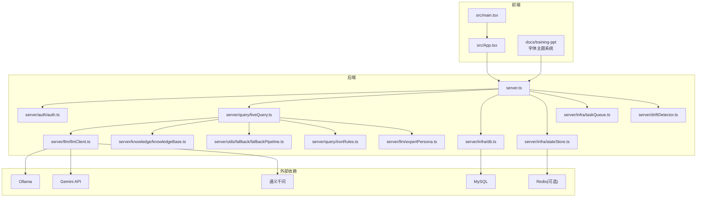

**图表来源**
- [server.ts:82-296](file://server.ts#L82-L296)
- [src/main.tsx:1-27](file://src/main.tsx#L1-L27)
- [src/App.tsx:19-104](file://src/App.tsx#L19-L104)
- [server/llm/llmClient.ts:1-200](file://server/llm/llmClient.ts#L1-L200)
- [server/query/liveQuery.ts:1-200](file://server/query/liveQuery.ts#L1-L200)
- [server/knowledge/knowledgeBase.ts:1-200](file://server/knowledge/knowledgeBase.ts#L1-L200)
- [server/infra/db.ts:1-200](file://server/infra/db.ts#L1-L200)
- [server/infra/stateStore.ts:1-200](file://server/infra/stateStore.ts#L1-L200)

**章节来源**
- [server.ts:82-296](file://server.ts#L82-L296)
- [package.json:1-76](file://package.json#L1-L76)

## 核心组件
- 认证与授权（Auth）：JWT 签发/校验、角色守卫、强制改密流程、用户上下文注入。
- LLM 集成层：统一调用通道，支持多后端、熔断/重试/并发控制、阶段级模型路由、用量统计。
- 查询处理引擎：双阶段（SQL 生成 + 解读）编排，安全执行、澄清/拒答、模板匹配、中间表清洗链、SSE 流式进度。
- 知识库管理（RAG）：文档切块、向量/关键词检索、阈值过滤、提示词注入。
- **Fallback 对抗训练**：三层策略降级（rule_based → simpler_prompt → human_approval），自动记录失败样本用于对抗训练。
- **铁律规则库**：管理员登记的数据源强制规则，最高优先级约束 SQL 生成，支持导入导出。
- **专家角色库**：基于关键词匹配的专家角色路由，支持内置角色与自定义角色，60s 内存缓存。
- **异步任务处理**：MySQL 任务队列 + 内置 worker，支持长任务、心跳检测、孤儿任务恢复。
- **SSE 断线续传**：重放缓冲机制，支持 Last-Event-ID 语义，断线后自动续传已完成阶段。
- **知识库漂移检测**：低基数维度列取值快照比对，自动发现枚举列变化并产生漂移事件。
- **A/B 测试框架**：为每次 fallback 决策分配实验组别，持续监控各策略效果对比。
- 状态存储（StateStore）：内存/Redis 双实现，提供缓存、限流、分布式锁、窗口计数。
- 数据库持久化（DB）：连接池、建库建表、种子数据、审计日志。
- 可观测性：请求日志、Prometheus 指标、健康检查、漂移检测与清理调度。
- **培训演示系统**：增强的培训材料系统，包含六色视觉系统、彩虹卡片样式、字体主题切换功能和演讲者模式。

**章节来源**
- [server/auth/auth.ts:1-127](file://server/auth/auth.ts#L1-L127)
- [server/llm/llmClient.ts:1-200](file://server/llm/llmClient.ts#L1-L200)
- [server/query/liveQuery.ts:1-200](file://server/query/liveQuery.ts#L1-L200)
- [server/knowledge/knowledgeBase.ts:1-200](file://server/knowledge/knowledgeBase.ts#L1-L200)
- [server/utils/fallback/fallbackPipeline.ts:1-159](file://server/utils/fallback/fallbackPipeline.ts#L1-L159)
- [server/query/ironRules.ts:1-265](file://server/query/ironRules.ts#L1-L265)
- [server/llm/expertPersona.ts:1-329](file://server/llm/expertPersona.ts#L1-L329)
- [server/infra/taskQueue.ts:1-347](file://server/infra/taskQueue.ts#L1-L347)
- [server/query/sseReplayBuffer.ts:35-131](file://server/query/sseReplayBuffer.ts#L35-L131)
- [server/driftDetector.ts:1-285](file://server/driftDetector.ts#L1-L285)
- [server/utils/abTest.ts:1-41](file://server/utils/abTest.ts#L1-L41)

## 架构总览
系统采用前后端分离与模块化后端架构：
- 前端通过 React 19 构建 SPA，由 Vite 在开发期热更新，生产期静态资源由 Express 托管。
- 后端以 Express 为中心，集中注册路由与中间件（鉴权、CSP、请求日志、指标采集），并按领域拆分子路由。
- LLM 作为外部能力通过统一通道接入，具备韧性（重试、熔断、并发限制、自适应超时）与多后端切换。
- **新增 Fallback 机制**：三层策略降级，自动记录失败样本用于对抗训练，提升系统鲁棒性。
- **新增专家角色系统**：基于关键词匹配的智能角色路由，支持内置角色与自定义角色管理。
- **新增异步任务框架**：MySQL 任务队列 + 内置 worker，支持长任务处理与心跳检测。
- **新增 SSE 断线续传**：重放缓冲机制，支持 Last-Event-ID 语义，提升用户体验。
- **新增知识库漂移检测**：自动发现枚举列变化，及时提醒知识文档可能过时。
- **新增 A/B 测试框架**：为 fallback 决策分配实验组别，持续监控策略效果对比。
- 状态与缓存通过 StateStore 抽象，默认内存实现，生产可切换 Redis 实现以支持多实例共享。
- 数据库使用 MySQL，启动时自动初始化 schema 与种子数据。
- **培训演示系统**：独立的培训材料系统，提供六色视觉体验、彩虹卡片样式、字体主题切换功能和版本显示为 v0.9.46。

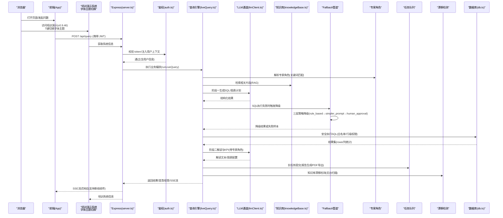

**图表来源**
- [server.ts:133-265](file://server.ts#L133-L265)
- [server/auth/auth.ts:66-113](file://server/auth/auth.ts#L66-L113)
- [server/query/liveQuery.ts:189-200](file://server/query/liveQuery.ts#L189-L200)
- [server/llm/llmClient.ts:121-200](file://server/llm/llmClient.ts#L121-L200)
- [server/knowledge/knowledgeBase.ts:106-166](file://server/knowledge/knowledgeBase.ts#L106-L166)
- [server/utils/fallback/fallbackPipeline.ts:47-159](file://server/utils/fallback/fallbackPipeline.ts#L47-L159)
- [server/llm/expertPersona.ts:196-212](file://server/llm/expertPersona.ts#L196-L212)
- [server/infra/taskQueue.ts:120-138](file://server/infra/taskQueue.ts#L120-L138)
- [server/driftDetector.ts:157-220](file://server/driftDetector.ts#L157-L220)
- [server/infra/db.ts:52-70](file://server/infra/db.ts#L52-L70)
- [docs/training-ppt/assets/runtime.js:36-37](file://docs/training-ppt/assets/runtime.js#L36-L37)

## 详细组件分析

### 认证与授权模块
- 功能：JWT 签发/校验、角色守卫、强制改密拦截、用户上下文注入至 LLM 用量埋点。
- 关键点：
  - 生产环境强制要求 JWT_SECRET，否则拒绝启动。
  - 鉴权后回查 users 表，确保禁用/角色变更即时生效。
  - 对 must_change_password 用户限制访问非 auth 接口。

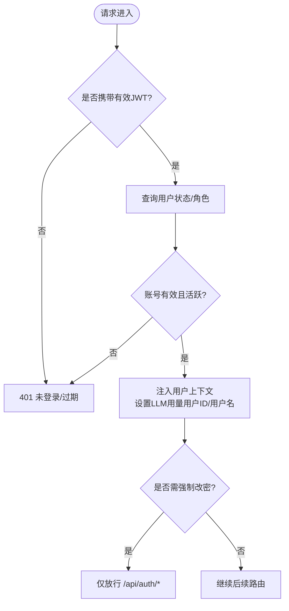

**图表来源**
- [server/auth/auth.ts:66-113](file://server/auth/auth.ts#L66-L113)
- [server.ts:91-96](file://server.ts#L91-L96)

**章节来源**
- [server/auth/auth.ts:1-127](file://server/auth/auth.ts#L1-L127)
- [server.ts:91-96](file://server.ts#L91-L96)

### LLM 集成层
- 功能：统一封装 Ollama/Gemini/Qwen 调用，提供重试、熔断、并发信号量、自适应超时、阶段级模型路由、用量统计。
- 关键点：
  - 主引擎失败自动切换到备用引擎（故障转移）。
  - 每引擎并发上限可控，避免打爆本地推理进程。
  - 支持 SQL 生成与数据分析两阶段的快速模型路由。

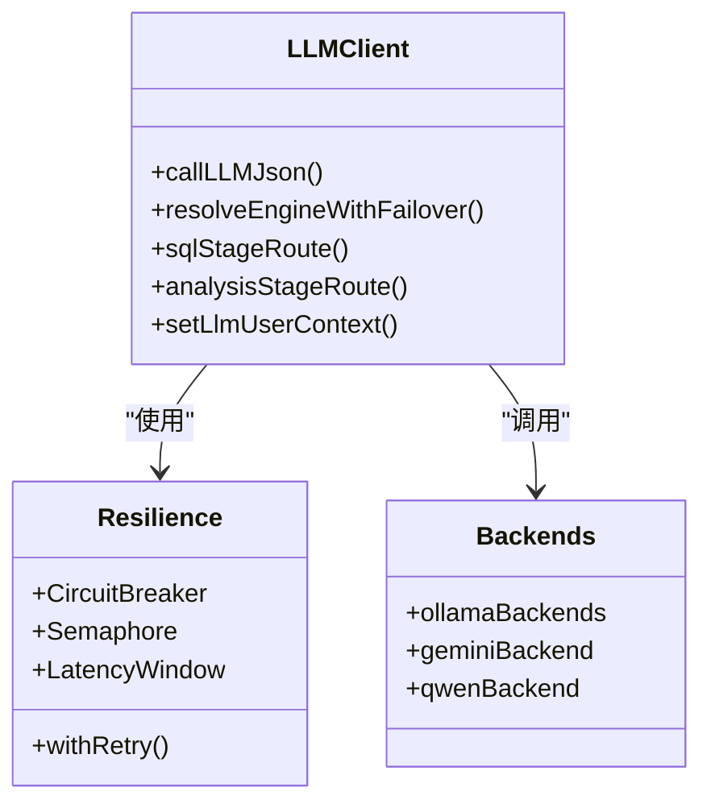

**图表来源**
- [server/llm/llmClient.ts:1-200](file://server/llm/llmClient.ts#L1-L200)

**章节来源**
- [server/llm/llmClient.ts:1-200](file://server/llm/llmClient.ts#L1-L200)

### 查询处理引擎
- 功能：双阶段编排（SQL 生成 + 解读），并行构建七路上下文（few-shot、知识库 RAG、外部知识、指标、反例、对话沉淀、铁律规则），模板命中走确定性拼装，复杂问题多候选并行择优，安全执行层（SELECT-only、白名单、行级权限、超时），失败回喂 LLM 自纠错。
- 关键点：
  - 澄清/拒答仅在首轮首个候选接受，计划模式跳过澄清。
  - 深度分析启用中间表清洗链，防止中间表膨胀。
  - SSE 阶段进度回调，便于前端展示理解/执行/分析阶段。

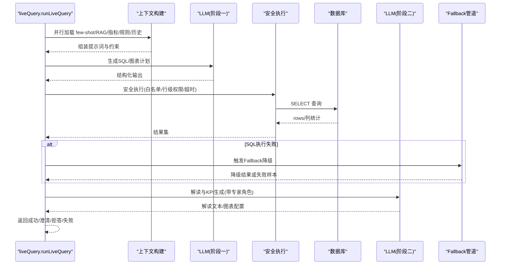

**图表来源**
- [server/query/liveQuery.ts:1-200](file://server/query/liveQuery.ts#L1-L200)
- [server/utils/fallback/fallbackPipeline.ts:47-159](file://server/utils/fallback/fallbackPipeline.ts#L47-L159)

**章节来源**
- [server/query/liveQuery.ts:1-200](file://server/query/liveQuery.ts#L1-L200)

### 知识库管理系统（RAG）
- 功能：文档切块、向量/关键词检索、阈值过滤、高价值口径/指南类文档优先保留槽位、提示词注入。
- 关键点：
  - 向量相似度低于阈值不注入，避免无关知识稀释注意力。
  - 单文档最多入选块数限制，防止长字典占满槽位。
  - 降级策略：无 embedding 时走 bigram 关键词检索。

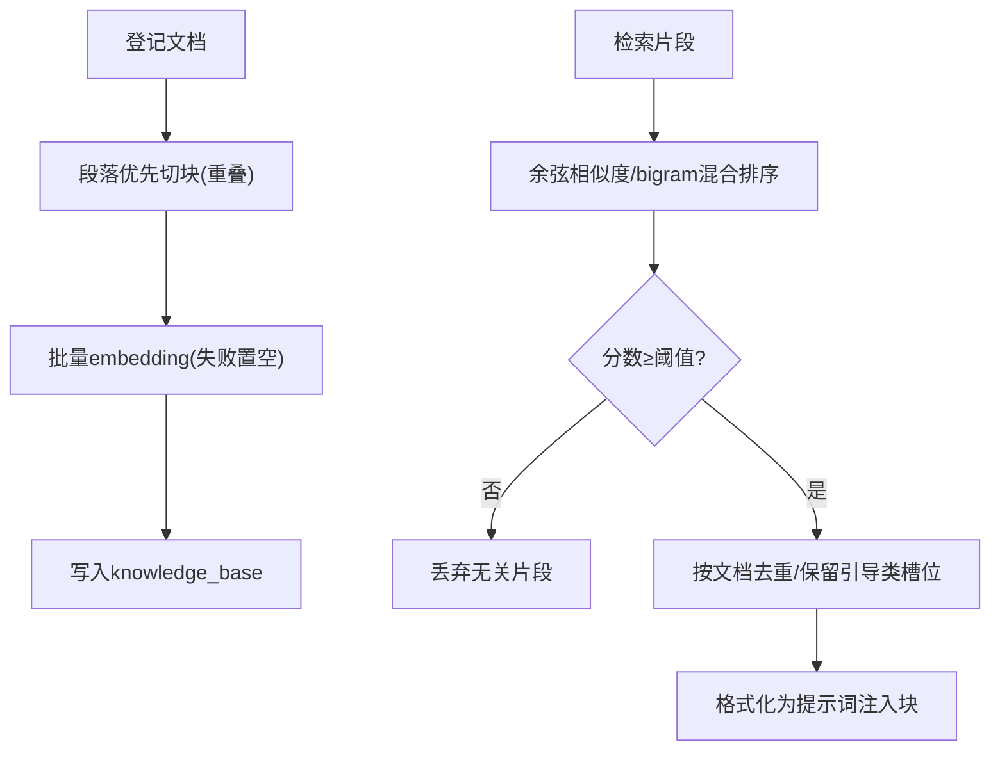

**图表来源**
- [server/knowledge/knowledgeBase.ts:43-166](file://server/knowledge/knowledgeBase.ts#L43-L166)

**章节来源**
- [server/knowledge/knowledgeBase.ts:1-200](file://server/knowledge/knowledgeBase.ts#L1-L200)

### Fallback 对抗训练机制（新增）
- 功能：三层策略降级（rule_based → simpler_prompt → human_approval），自动记录失败样本用于对抗训练。
- 关键点：
  - 错误分类：语法错误、语义错误、权限拒绝、未知错误。
  - 失败样本自动保存为 Hard Negative，供后续人工审核与 Few-Shot 学习。
  - 支持 Group B 策略：从已审核 few-shot 示例库检索相似问题的修正 SQL。

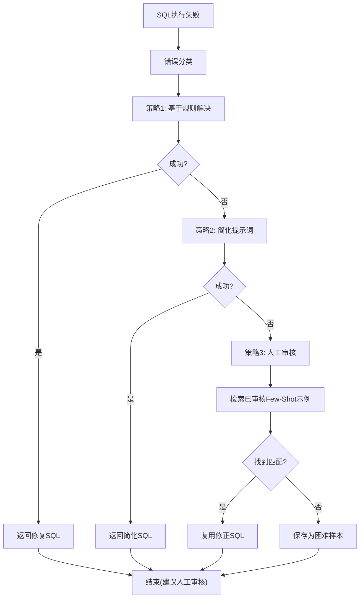

**图表来源**
- [server/utils/fallback/fallbackPipeline.ts:47-159](file://server/utils/fallback/fallbackPipeline.ts#L47-L159)

**章节来源**
- [server/utils/fallback/fallbackPipeline.ts:1-159](file://server/utils/fallback/fallbackPipeline.ts#L1-L159)

### 铁律规则库（新增）
- 功能：管理员登记的数据源强制规则，最高优先级约束 SQL 生成，支持导入导出。
- 关键点：
  - 每个数据源最多 100 条规则，标题唯一性保证。
  - 规则文本直接注入 prompt，生成结果仍过安全执行层校验。
  - 支持 skip/overwrite 冲突处理策略，dryRun 模式预览。

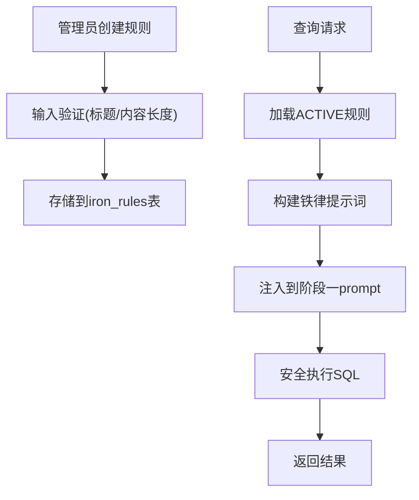

**图表来源**
- [server/query/ironRules.ts:44-80](file://server/query/ironRules.ts#L44-L80)

**章节来源**
- [server/query/ironRules.ts:1-265](file://server/query/ironRules.ts#L1-L265)

### 专家角色库（新增）
- 功能：基于关键词匹配的智能角色路由，支持内置角色与自定义角色，60s 内存缓存。
- 关键点：
  - 内置 5 个专家角色（风险、客户、财务、不良资产、默认金融分析师）。
  - 按 sortOrder 升序进行关键词匹配，第一个命中生效。
  - 库不可用时回退到代码内置常量路由，保证可用性。

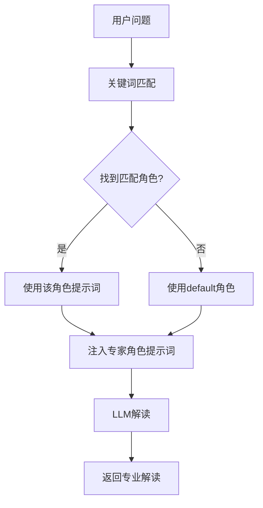

**图表来源**
- [server/llm/expertPersona.ts:196-212](file://server/llm/expertPersona.ts#L196-L212)

**章节来源**
- [server/llm/expertPersona.ts:1-329](file://server/llm/expertPersona.ts#L1-L329)

### 异步任务处理框架（新增）
- 功能：MySQL 任务队列 + 内置 worker，支持长任务、心跳检测、孤儿任务恢复。
- 关键点：
  - 任务类型：报告生成、PDF 导出等长耗时操作。
  - 并发控制：worker 并发上限、用户任务上限、心跳超时检测。
  - 崩溃恢复：RUNNING 任务心跳超时自动回 PENDING 重跑。

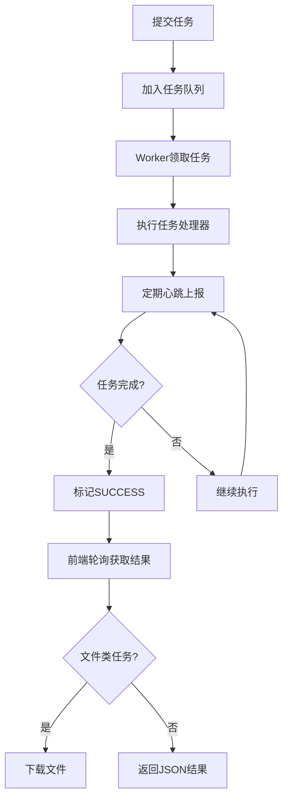

**图表来源**
- [server/infra/taskQueue.ts:120-138](file://server/infra/taskQueue.ts#L120-L138)
- [server/routes/tasks.ts:27-86](file://server/routes/tasks.ts#L27-L86)

**章节来源**
- [server/infra/taskQueue.ts:1-347](file://server/infra/taskQueue.ts#L1-L347)
- [server/routes/tasks.ts:1-86](file://server/routes/tasks.ts#L1-L86)

### SSE 断线续传（新增）
- 功能：重放缓冲机制，支持 Last-Event-ID 语义，断线后自动续传已完成阶段。
- 关键点：
  - 同一 traceId 序号单调递增，终态事件不再接收新事件。
  - 支持订阅增量事件，断线重连时回放存量事件。
  - TTL 清扫：终态缓冲 10 分钟，进行中缓冲 30 分钟。

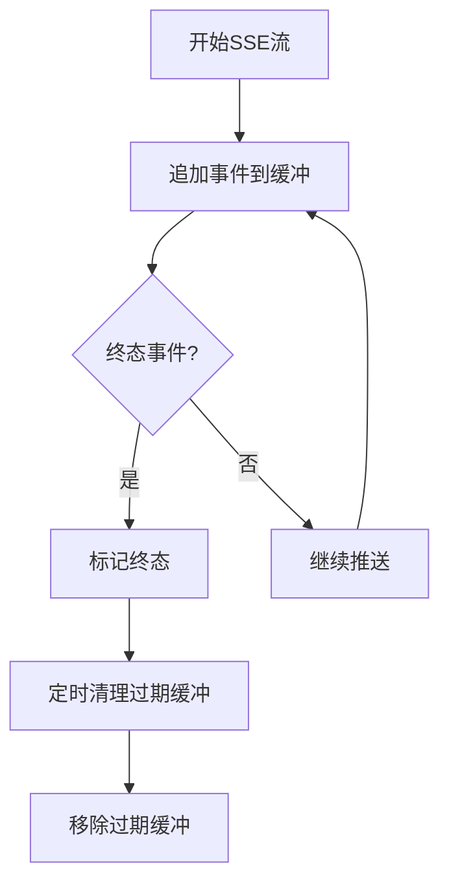

**图表来源**
- [server/query/sseReplayBuffer.ts:41-131](file://server/query/sseReplayBuffer.ts#L41-L131)

**章节来源**
- [server/query/sseReplayBuffer.ts:35-131](file://server/query/sseReplayBuffer.ts#L35-L131)

### 知识库漂移检测（新增）
- 功能：低基数维度列取值快照比对，自动发现枚举列变化并产生漂移事件。
- 关键点：
  - 自动发现候选枚举列：字符串列且排除编号/名称/日期类。
  - 取值读取走安全执行层，仅读取枚举值元数据。
  - 支持手动登记观察列与周期扫描。

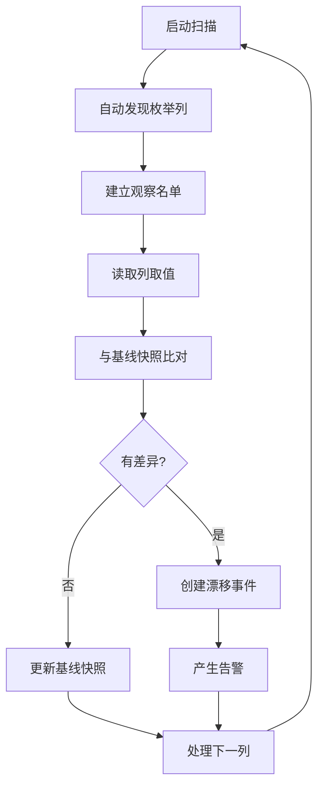

**图表来源**
- [server/driftDetector.ts:157-220](file://server/driftDetector.ts#L157-L220)

**章节来源**
- [server/driftDetector.ts:1-285](file://server/driftDetector.ts#L1-L285)

### A/B 测试框架（新增）
- 功能：为每次 fallback 决策分配实验组别，持续监控各策略效果对比。
- 关键点：
  - Group A：Rule-Based 策略，Group B：Human Approval + Few-Shot。
  - 基于 DJB2 Hash 的确定性分组，保证流量可控分配。
  - 支持统计数据查询与实验记录管理。

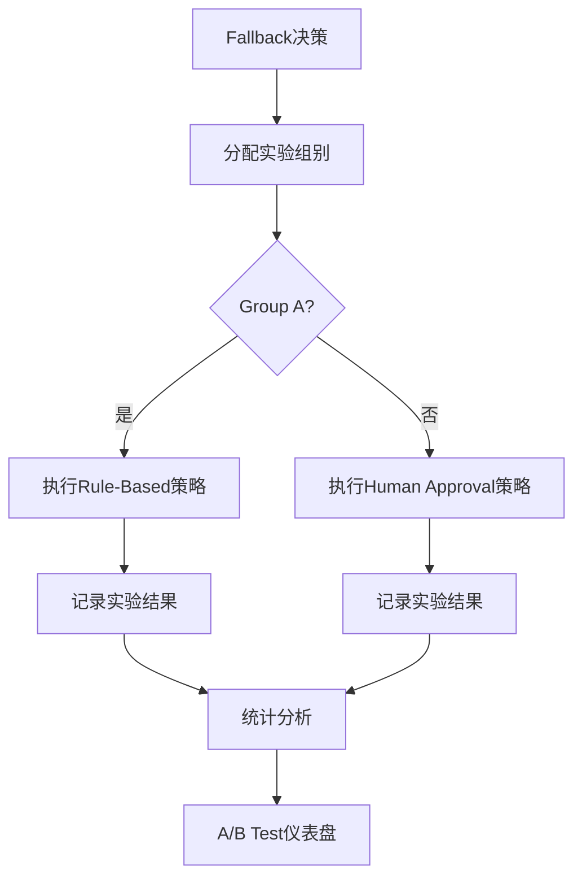

**图表来源**
- [server/utils/abTest.ts:12-41](file://server/utils/abTest.ts#L12-L41)

**章节来源**
- [server/utils/abTest.ts:1-41](file://server/utils/abTest.ts#L1-L41)

### 状态存储与多实例共享
- 功能：统一 StateStore 抽象，提供 get/setEx/getDel/deleteByPrefix/incrWindow/acquireLock/releaseLock。
- 关键点：
  - 默认 MemoryStateStore（单机零依赖），生产可通过 REDIS_URL 切换 RedisStateStore。
  - 启动预热 Redis 连接，消除冷启动抖动。
  - 原子锁与窗口计数用于限流、配额与并发控制。

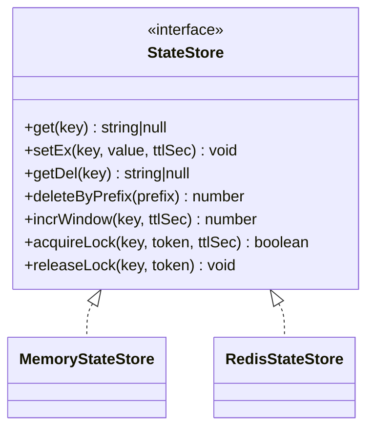

**图表来源**
- [server/infra/stateStore.ts:10-23](file://server/infra/stateStore.ts#L10-L23)
- [server/infra/stateStore.ts:32-98](file://server/infra/stateStore.ts#L32-L98)
- [server/infra/stateStore.ts:105-163](file://server/infra/stateStore.ts#L105-L163)

**章节来源**
- [server/infra/stateStore.ts:1-200](file://server/infra/stateStore.ts#L1-L200)

### 数据库持久化
- 功能：连接池、建库建表、初始种子、审计日志、权限申请与下载审批表。
- 关键点：
  - 启动时 initSchema 自动创建数据库与表，兼容存量迁移。
  - 连接池容量公式化，按预期并发动态计算。
  - 审计日志记录问数全链路（含被拒绝请求）。

**章节来源**
- [server/infra/db.ts:1-200](file://server/infra/db.ts#L1-L200)

### 前端应用
- 功能：React 19 应用，懒加载大组件，鉴权守卫与角色路由，主题与错误边界。
- 关键点：
  - 入口 main.tsx 注入 API 鉴权能力（获取 token、未授权跳转、强制改密标记）。
  - App.tsx 根据角色与标签页渲染不同视图，SSO 回跳处理。

**章节来源**
- [src/main.tsx:1-27](file://src/main.tsx#L1-L27)
- [src/App.tsx:19-104](file://src/App.tsx#L19-L104)

### 培训演示系统（增强）
- 功能：增强的培训演示系统，提供六色视觉系统、彩虹卡片样式、字体主题切换功能和改进的导航元素。
- 关键点：
  - **六色视觉系统**：定义了完整的色彩令牌系统，包括主色调（蓝、青、琥珀、紫、玫红、天蓝）及其深浅变体。
  - **彩虹卡片样式**：网格内的卡片顶部边框按六色循环着色，提升视觉层次感。
  - **字体主题系统**：支持现代黑体与典雅宋体两种排版风格，通过 T 键快速切换。
  - **离线字体支持**：内置 Noto Serif SC 字体，支持离线环境下优雅宋体显示。
  - **改进的导航元素**：七大入口色块导航，每个入口都有独特的颜色标识。
  - **版本显示**：运行时版本显示为 NL2SQL Pro v0.9.46，包含最新的培训功能。
  - **演讲者模式**：支持四磁吸卡布局（当前页、下一页、逐字稿、计时器）。

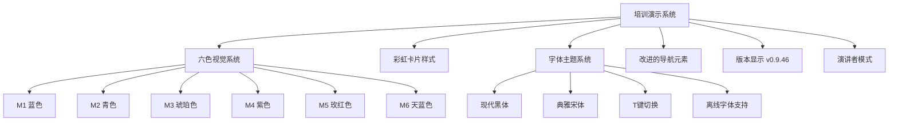

**图表来源**
- [docs/training-ppt/assets/base.css:18-23](file://docs/training-ppt/assets/base.css#L18-L23)
- [docs/training-ppt/assets/base.css:231-237](file://docs/training-ppt/assets/base.css#L231-L237)
- [docs/training-ppt/assets/base.css:239-257](file://docs/training-ppt/assets/base.css#L239-L257)
- [docs/training-ppt/assets/runtime.js:36-37](file://docs/training-ppt/assets/runtime.js#L36-L37)
- [docs/training-ppt/assets/runtime.js:81-115](file://docs/training-ppt/assets/runtime.js#L81-L115)

**章节来源**
- [docs/training-ppt/assets/base.css:1-593](file://docs/training-ppt/assets/base.css#L1-L593)
- [docs/training-ppt/assets/runtime.js:1-328](file://docs/training-ppt/assets/runtime.js#L1-L328)
- [docs/training-ppt/index.html:1-200](file://docs/training-ppt/index.html#L1-L200)

## 依赖关系分析
- 技术栈选择原因：
  - React 19：现代前端框架，配合 Vite 提升开发与构建体验，支持 Suspense 与懒加载。
  - Express.js：轻量、生态成熟，适合快速搭建 REST/SSE 服务，易于中间件扩展。
  - TypeScript：前后端统一语言，提升类型安全与可维护性，减少运行时错误。
- 外部依赖：
  - MySQL：持久化用户、数据源、审计与知识库等。
  - Redis（可选）：多实例共享状态（缓存、限流、锁）。
  - LLM 后端：Ollama（本地）、Gemini、通义千问（云端），通过统一通道接入。

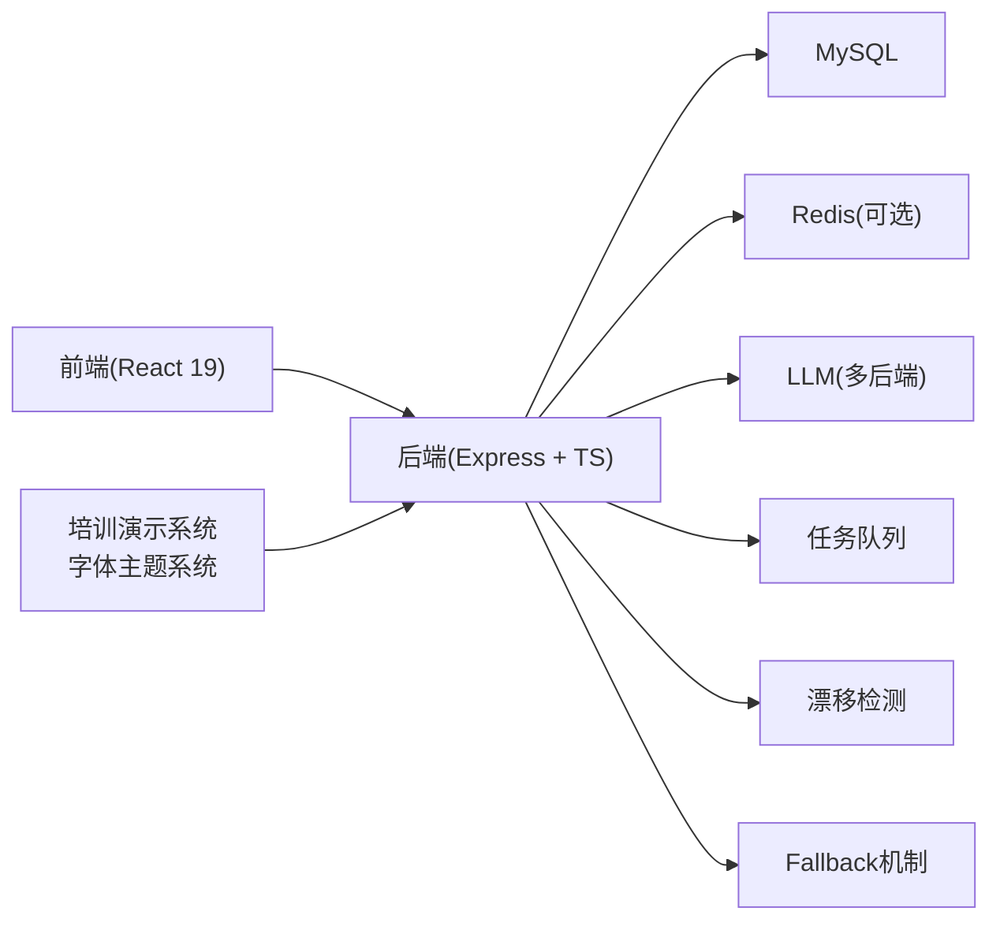

**图表来源**
- [package.json:26-45](file://package.json#L26-L45)
- [server.ts:82-296](file://server.ts#L82-L296)

**章节来源**
- [package.json:1-76](file://package.json#L1-L76)

## 性能与扩展性
- 性能特性：
  - LLM 调用韧性：重试、熔断、并发信号量、自适应超时，降低外部依赖抖动影响。
  - 查询安全执行：白名单、行级权限、超时控制，避免慢查询拖垮服务。
  - 知识库检索阈值过滤与分块优化，减少无效提示词注入。
  - 中间表清洗链定时清理，防止中间表膨胀。
  - **新增性能优化**：SSE 断线续传减少重复执行，专家角色缓存提升匹配速度，任务队列隔离长耗时操作。
- 扩展性考虑：
  - 无状态应用副本：通过 Nginx 轮询分发，水平扩展简单。
  - 共享状态外置：Redis 实现 StateStore，支持多实例共享缓存与限流。
  - 多 LLM 后端：主引擎故障自动切换，保障可用性。
  - 监控告警：Prometheus 抓取应用指标，结合 Grafana 仪表盘与 Alertmanager 告警。
  - **新增扩展能力**：Fallback 机制提升系统鲁棒性，异步任务框架支持横向扩展，漂移检测保障知识库时效性。
  - **培训系统扩展**：独立的培训演示系统，支持多窗口同步、演讲者模式和字体主题切换。

**章节来源**
- [server/llm/llmClient.ts:61-107](file://server/llm/llmClient.ts#L61-L107)
- [server/query/liveQuery.ts:1-200](file://server/query/liveQuery.ts#L1-L200)
- [server/knowledge/knowledgeBase.ts:27-41](file://server/knowledge/knowledgeBase.ts#L27-L41)
- [server.ts:120-131](file://server.ts#L120-L131)

## 故障排查指南
- 常见问题定位：
  - 未登录/过期：检查 JWT 是否携带且有效，服务端是否配置 JWT_SECRET。
  - 强制改密：用户 must_change_password 标志未清除，仅放行 /api/auth/*。
  - LLM 调用失败：查看熔断状态、重试次数、后端健康检查；必要时切换备用引擎。
  - 知识库检索无效：检查 embedding 是否可用、阈值配置、文档切块与标题关键词。
  - 数据库连接异常：确认 initSchema 是否成功、连接池容量是否合理。
  - 多实例状态不一致：确认 Redis 是否可达、TTL 是否正确、锁是否释放。
  - **新增故障排查**：
    - Fallback 机制失效：检查三层策略执行日志，确认失败样本是否正确记录。
    - 专家角色不生效：验证关键词匹配逻辑，检查角色缓存是否及时失效。
    - 任务队列堆积：监控 worker 并发度，检查心跳超时配置，确认孤儿任务恢复机制。
    - SSE 断线续传失败：验证 traceId 归属校验，检查缓冲 TTL 配置，确认 Last-Event-ID 头传递。
    - 漂移检测误报：调整枚举列识别规则，检查取值读取权限，确认基线快照更新逻辑。
    - A/B 测试数据异常：验证分组算法，检查实验记录写入，确认统计数据聚合逻辑。
  - **培训系统问题**：检查版本显示是否正确（应为 v0.9.46）、六色系统是否正常加载、彩虹卡片样式是否生效、字体主题切换功能是否正常工作。
- 可观测性：
  - 健康检查：/api/health 与容器 HEALTHCHECK。
  - 指标采集：/metrics 暴露 Prometheus 指标，结合 Grafana 看板。
  - 审计日志：query_audit_log 记录问数全链路。

**章节来源**
- [server/auth/auth.ts:66-113](file://server/auth/auth.ts#L66-L113)
- [server/llm/llmClient.ts:121-161](file://server/llm/llmClient.ts#L121-L161)
- [server/knowledge/knowledgeBase.ts:106-166](file://server/knowledge/knowledgeBase.ts#L106-L166)
- [server/infra/db.ts:52-70](file://server/infra/db.ts#L52-L70)
- [server/infra/stateStore.ts:169-200](file://server/infra/stateStore.ts#L169-L200)
- [server.ts:187-193](file://server.ts#L187-L193)

## 结论
本系统以 React 19 + Express.js + TypeScript 为核心技术栈，构建了前后端分离、模块化与可扩展的智能问数据分析平台。通过 LLM 集成层、查询处理引擎、知识库 RAG、权限控制与可观测能力，实现了从自然语言到数据洞察的完整闭环。系统在韧性、安全性与可观测性方面做了充分设计，支持多实例水平扩展与多 LLM 后端切换，满足企业级应用场景需求。

**最新更新亮点**：系统架构从 v0.5.3 重大演进至 v0.9.46，新增了 Fallback 对抗训练、铁律规则、专家角色库、异步任务处理、SSE 断线续传、漂移检测、运行监控、A/B 测试等核心能力，显著提升了系统的鲁棒性、智能化水平和用户体验。**最新增强**：培训演示系统新增了完整的字体主题切换功能，支持现代黑体与典雅宋体两种排版风格，提供离线字体支持和 T 键快速切换，为企业培训和知识传递提供了更好的工具支持。

## 附录：部署拓扑与配置要点
- 多实例部署：
  - 使用 docker-compose.multi-instance.yml 编排多个 app 实例、Redis、Nginx。
  - Nginx 关闭代理缓冲并放大读超时，适配 SSE 长连接。
- 容器化：
  - Dockerfile 多阶段构建，运行期仅安装生产依赖，非 root 用户运行，健康检查指向 /api/health。
- 监控：
  - deploy/prometheus.yml 配置抓取应用、节点、Redis、MySQL、Alertmanager 指标。
  - Grafana 仪表盘提供业务、基础设施、LLM 与总览视图。
- **新增部署要点**：
  - 任务队列：配置 worker 并发度、心跳超时、任务执行超时等环境变量。
  - SSE 断线续传：调整缓冲 TTL 配置，确保断线重连时的数据完整性。
  - 漂移检测：配置枚举列识别规则，设置周期扫描间隔。
  - A/B 测试：启用 AB_TEST_ENABLED 环境变量，配置流量分配比例。
  - **培训系统部署**：独立的培训演示系统，支持六色视觉系统、彩虹卡片样式、字体主题切换功能和版本显示为 v0.9.46。

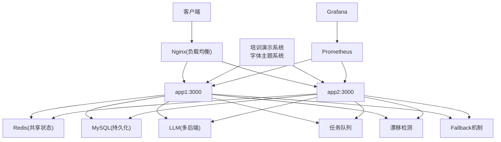

**图表来源**
- [docker-compose.multi-instance.yml:1-50](file://docker-compose.multi-instance.yml#L1-L50)
- [deploy/nginx.multi-instance.conf:1-35](file://deploy/nginx.multi-instance.conf#L1-L35)
- [Dockerfile:1-47](file://Dockerfile#L1-L47)
- [deploy/prometheus.yml:1-57](file://deploy/prometheus.yml#L1-L57)

**章节来源**
- [docker-compose.multi-instance.yml:1-50](file://docker-compose.multi-instance.yml#L1-L50)
- [deploy/nginx.multi-instance.conf:1-35](file://deploy/nginx.multi-instance.conf#L1-L35)
- [Dockerfile:1-47](file://Dockerfile#L1-L47)
- [deploy/prometheus.yml:1-57](file://deploy/prometheus.yml#L1-L57)