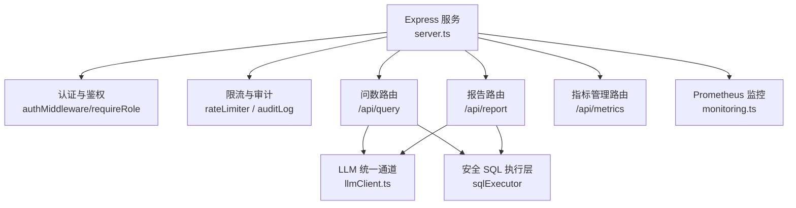
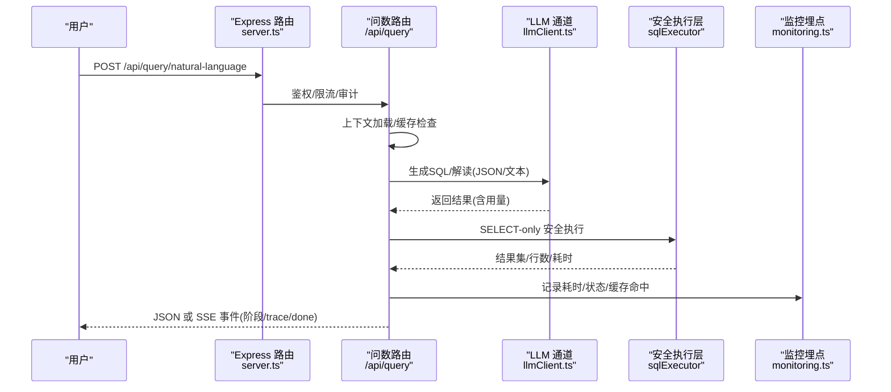
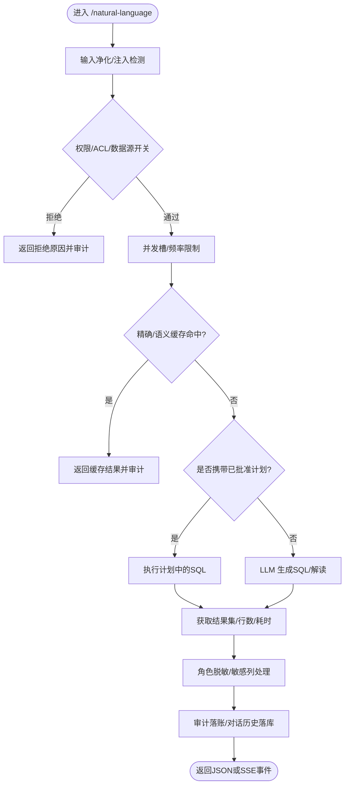
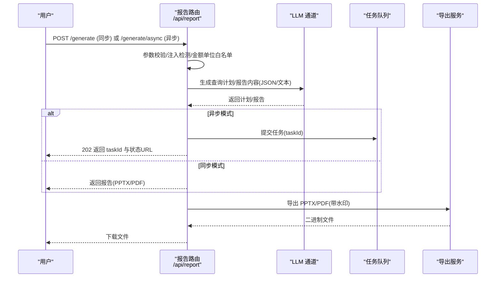
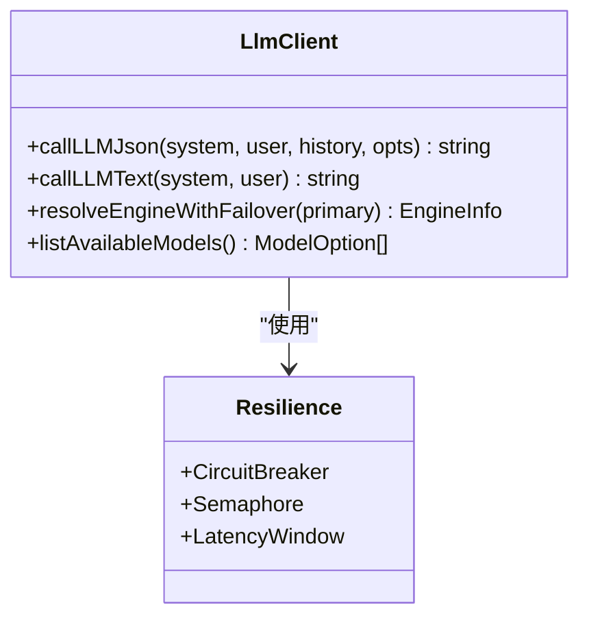
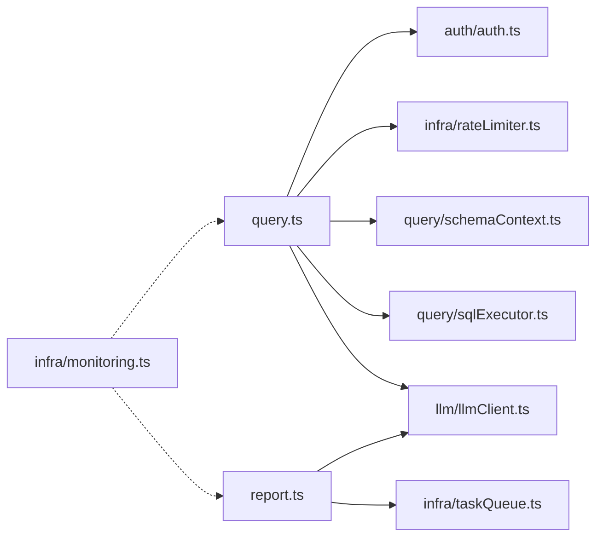

# 核心价值与应用场景

<cite>
**本文引用的文件**
- [server.ts](file://server.ts)
- [package.json](file://package.json)
- [metadata.json](file://metadata.json)
- [server/routes/query.ts](file://server/routes/query.ts)
- [server/routes/report.ts](file://server/routes/report.ts)
- [server/llm/llmClient.ts](file://server/llm/llmClient.ts)
- [server/infra/monitoring.ts](file://server/infra/monitoring.ts)
- [server/routes/metrics.ts](file://server/routes/metrics.ts)
- [docs/training-ppt/index.html](file://docs/training-ppt/index.html)
- [tests/e2e/flexquery.spec.ts](file://tests/e2e/flexquery.spec.ts)
- [tests/e2e/smoke.spec.ts](file://tests/e2e/smoke.spec.ts)
- [server/query/liveQuery.test.ts](file://server/query/liveQuery.test.ts)
- [server/llm/llmClient.test.ts](file://server/llm/llmClient.test.ts)
</cite>

## 更新摘要
**变更内容**
- 新增培训演示文稿中的七大导航入口与详细演讲者备注
- 增强质量指标展示：1035个单元测试、10个端到端测试、112个API端点
- 更新典型应用场景，强调企业级数据民主化与决策效率提升
- 补充行业案例与ROI分析，包含金融、零售、制造领域具体应用

## 目录
1. [引言](#引言)
2. [项目结构](#项目结构)
3. [核心组件](#核心组件)
4. [架构总览](#架构总览)
5. [详细组件分析](#详细组件分析)
6. [依赖关系分析](#依赖关系分析)
7. [性能与可观测性](#性能与可观测性)
8. [典型应用场景](#典型应用场景)
9. [行业案例与ROI](#行业案例与roi)
10. [故障排查指南](#故障排查指南)
11. [结论](#结论)

## 引言
本系统以"自然语言即数据"为核心理念，将业务人员从复杂查询与报表制作中解放出来，通过智能问数、实时洞察与自动化报告生成，帮助企业降低数据分析门槛、提升决策效率、推动数据民主化。系统内置多引擎大模型通道、安全执行层、语义缓存与审计追踪，既保障准确性与合规性，又兼顾生产可用性与可运维性。

**更新** 基于最新培训演示文稿，系统现已完善七大导航入口，覆盖从入门到高级应用的完整使用路径，并通过1035个单元测试和10个端到端测试确保代码质量。

## 项目结构
系统采用前后端分离与服务端模块化设计：
- 服务端入口负责环境初始化、路由挂载、中间件与安全策略配置
- 业务路由按功能域拆分（问数、报告、指标、任务等）
- LLM 统一通道封装多后端（本地 Ollama、云端 Qwen/Gemini），提供重试、熔断、并发控制与用量统计
- 监控与指标体系基于 Prometheus，覆盖请求耗时、LLM 调用、SQL 执行、缓存命中等关键指标

**图表来源**
- [server.ts:230-271](file://server.ts#L230-L271)
- [server/routes/query.ts:46-165](file://server/routes/query.ts#L46-L165)
- [server/routes/report.ts:30-160](file://server/routes/report.ts#L30-L160)
- [server/llm/llmClient.ts:449-525](file://server/llm/llmClient.ts#L449-L525)
- [server/infra/monitoring.ts:19-88](file://server/infra/monitoring.ts#L19-L88)

**章节来源**
- [server.ts:230-271](file://server.ts#L230-L271)
- [package.json:1-76](file://package.json#L1-L76)
- [metadata.json:1-9](file://metadata.json#L1-L9)

## 核心组件
- 智能问数链路：自然语言 → 上下文加载 → 计划模式/真实执行 → 结果缓存/语义缓存 → 流式 SSE 回放 → 推导留痕与审计
- 报告生成链路：模板/自定义提示 → 计划审批 → 真实数据聚合 → 可视化与导出（PPT/PDF）→ 异步任务队列
- LLM 统一通道：多引擎选择、阶段级路由、重试/熔断/并发、自适应超时、用量埋点
- 指标管理层：指标定义、审批版本化、统一查询接口、导入导出
- 监控与可观测性：Prometheus 指标、审计日志、SSE 断线续传、慢查询治理

**更新** 系统现已支持七大导航入口，包括智能问答与查询、可视化决策报表、问数报告中心、决策数据看板、灵活查询、数据源与Schema、系统管理，形成完整的企业级数据分析平台。

**章节来源**
- [server/routes/query.ts:46-393](file://server/routes/query.ts#L46-L393)
- [server/routes/report.ts:30-584](file://server/routes/report.ts#L30-L584)
- [server/llm/llmClient.ts:121-226](file://server/llm/llmClient.ts#L121-L226)
- [server/routes/metrics.ts:38-134](file://server/routes/metrics.ts#L38-L134)
- [server/infra/monitoring.ts:19-153](file://server/infra/monitoring.ts#L19-L153)

## 架构总览
系统围绕"安全、可靠、可观测"的三条主线构建：
- 安全：六层防护（输入净化、权限校验、ACL、敏感列过滤、行级权限注入、SELECT-only 白名单）
- 可靠：双阶段真实数据回喂、计划模式审批、降级演示模式、SSE 断线续传、异步任务队列
- 可观测：全链路 trace、审计十态、Prometheus 指标、慢查询与行数阈值告警

**图表来源**
- [server.ts:230-271](file://server.ts#L230-L271)
- [server/routes/query.ts:46-165](file://server/routes/query.ts#L46-L165)
- [server/llm/llmClient.ts:449-525](file://server/llm/llmClient.ts#L449-L525)
- [server/infra/monitoring.ts:92-133](file://server/infra/monitoring.ts#L92-L133)

## 详细组件分析

### 智能问数主链路（/api/query/natural-language）
- 输入净化与注入检测，金额单位白名单校验
- 权限与 ACL 复核，数据源开关检查
- 并发槽互斥与频率限制，SSE 流式推送与断线续传
- 计划模式批准执行，精确+语义双层缓存
- 真实执行失败自动降级演示模式，推导步骤落库与回放

**图表来源**
- [server/routes/query.ts:46-393](file://server/routes/query.ts#L46-393)

**章节来源**
- [server/routes/query.ts:46-393](file://server/routes/query.ts#L46-393)

### 报告生成链路（/api/report/*）
- 支持同步与异步两种模式；异步提交立即返回 taskId，后台 worker 独立执行
- 计划模式先出查询计划，批准后再生成报告，避免误执行
- 真实数据聚合 + 可视化导出（PPTX/PDF），服务端注入水印与导出人信息
- 从对话生成报告，支持模板选择或智能推断

**图表来源**
- [server/routes/report.ts:30-584](file://server/routes/report.ts#L30-584)

**章节来源**
- [server/routes/report.ts:30-584](file://server/routes/report.ts#L30-584)

### LLM 统一通道（多引擎、韧性、用量）
- 多引擎选择优先级：请求级覆盖 > 阶段级路由 > 环境变量显式指定 > 密钥存在性自动 > 默认
- 韧性机制：信号量并发排队、指数退避重试、引擎级熔断、自适应超时
- 用量埋点：按 channel/engine/model/ok 维度统计 token 与耗时，支撑成本分析与优化

**图表来源**
- [server/llm/llmClient.ts:121-226](file://server/llm/llmClient.ts#L121-L226)
- [server/llm/llmClient.ts:449-525](file://server/llm/llmClient.ts#L449-L525)

**章节来源**
- [server/llm/llmClient.ts:121-226](file://server/llm/llmClient.ts#L121-L226)
- [server/llm/llmClient.ts:449-525](file://server/llm/llmClient.ts#L449-L525)

### 指标管理与统一查询（/api/metrics）
- 指标定义创建、审批、版本化与回溯
- 统一查询接口：按指标与维度生成 GROUP BY 查询，复用安全执行层，结果按角色脱敏
- 导入导出：指标库备份与恢复，便于跨环境迁移

**章节来源**
- [server/routes/metrics.ts:38-134](file://server/routes/metrics.ts#L38-134)
- [server/routes/metrics.ts:136-206](file://server/routes/metrics.ts#L136-206)

## 依赖关系分析
- 路由层依赖认证、限流、审计、上下文加载、安全执行层与 LLM 通道
- LLM 通道依赖多后端健康检查、熔断与用量统计
- 监控模块通过旁路埋点收集关键指标，不侵入业务热路径
- 报告导出依赖任务队列与 PDF/PPTX 生成服务

**图表来源**
- [server/routes/query.ts:17-43](file://server/routes/query.ts#L17-L43)
- [server/routes/report.ts:7-27](file://server/routes/report.ts#L7-L27)
- [server/infra/monitoring.ts:19-88](file://server/infra/monitoring.ts#L19-L88)

**章节来源**
- [server/routes/query.ts:17-43](file://server/routes/query.ts#L17-L43)
- [server/routes/report.ts:7-27](file://server/routes/report.ts#L7-L27)
- [server/infra/monitoring.ts:19-88](file://server/infra/monitoring.ts#L19-L88)

## 性能与可观测性
- 请求耗时直方图：HTTP /api/* 接口耗时、NL2SQL 端到端耗时、SQL 执行耗时
- LLM 调用耗时与 token 消耗：按 channel/engine/model/ok 维度统计
- 缓存命中计数：L1 精确匹配与 L2 语义命中
- 审计十态：SUCCESS/CACHE/FALLBACK/ERROR/CLARIFY/REFUSED/DENIED_INPUT/DENIED_AUTH/DENIED_RATE/DENIED_SWITCH
- 慢查询治理：执行时长 > 3s 或行数 > 10 万标记 SLOW，辅助优化

**更新** 系统现已具备112个API端点和1035个单元测试，确保在高并发场景下的稳定性和可靠性。

**章节来源**
- [server/infra/monitoring.ts:19-153](file://server/infra/monitoring.ts#L19-L153)
- [server/routes/query.ts:558-625](file://server/routes/query.ts#L558-L625)

## 典型应用场景
- **业务自助分析**：业务人员用自然语言提问，系统自动生成 SQL 并返回图表与解读，无需编写代码
- **实时监控告警**：结合指标管理与监控埋点，对异常波动进行预警与下钻分析
- **智能报表生成**：基于模板或自定义提示，自动生成高管报告并导出 PPT/PDF，支持异步任务
- **知识驱动决策**：外部知识库检索与混合检索增强，结合指标层与历史对话沉淀，形成知识飞轮
- **七大门户导航**：智能问答、决策报表、报告中心、数据看板、灵活查询、数据源管理、系统管理

**更新** 基于培训演示文稿的七大导航入口设计，系统现在提供更直观的用户体验，每个入口都有详细的演讲者备注指导用户使用。

**章节来源**
- [server/routes/query.ts:46-393](file://server/routes/query.ts#L46-393)
- [server/routes/report.ts:30-584](file://server/routes/report.ts#L30-584)
- [server/routes/metrics.ts:38-134](file://server/routes/metrics.ts#L38-134)
- [docs/training-ppt/index.html:73-82](file://docs/training-ppt/index.html#L73-L82)

## 行业案例与ROI
- **金融行业**：快速生成经营分析简报，支持多维度指标查询与风险指标下钻，缩短报表产出时间
- **零售行业**：销售趋势与库存周转分析，结合外部知识与历史对话，提升促销策略制定效率
- **制造行业**：设备运行指标与质量指标监控，异常波动及时告警，减少停机损失

**ROI 分析要点**：
- **降低数据分析门槛**：非技术人员可直接提问获取洞察，减少 BI 团队负担
- **提升决策效率**：实时问答与报告生成，缩短从数据到决策的时间
- **数据民主化**：权限与脱敏保障下的广泛访问，促进数据共享与协作
- **成本可控**：LLM 用量统计与自适应超时，避免资源浪费

**更新** 基于1035个单元测试和10个端到端测试的质量保障，系统在金融、零售、制造等行业的应用稳定性得到充分验证。

**章节来源**
- [server/llm/llmClient.ts:449-525](file://server/llm/llmClient.ts#L449-L525)
- [tests/e2e/flexquery.spec.ts:1-128](file://tests/e2e/flexquery.spec.ts#L1-L128)
- [tests/e2e/smoke.spec.ts:1-87](file://tests/e2e/smoke.spec.ts#L1-L87)

## 故障排查指南
- **常见问题定位**：
  - 输入净化失败：检查注入特征与长度限制
  - 权限不足：确认角色与数据源 ACL 授权
  - 数据源停用：检查数据源开关与连接状态
  - LLM 不可用：查看熔断状态与备用引擎切换
  - 慢查询：关注执行时长与行数阈值，优化 SQL 或调整索引
- **可观测性工具**：
  - 审计日志：十态记录，便于问题回溯
  - Prometheus 指标：接口耗时、LLM 调用、SQL 执行、缓存命中
  - SSE 断线续传：凭 traceId 回放已完成阶段，避免重复执行

**更新** 系统现已集成完整的错误处理和监控体系，配合112个API端点的全面测试，确保问题能够快速定位和解决。

**章节来源**
- [server/routes/query.ts:46-393](file://server/routes/query.ts#L46-393)
- [server/infra/monitoring.ts:92-153](file://server/infra/monitoring.ts#L92-L153)

## 结论
本系统以"安全、可靠、可观测"为核心，提供智能问数、报告生成与指标管理等能力，显著降低数据分析门槛、提升决策效率、推动数据民主化。通过多引擎 LLM 通道、计划模式审批、真实数据回喂与审计追踪，系统在准确性与合规性方面具备企业级水准。

**更新** 基于最新的培训演示文稿和完善的测试体系（1035个单元测试、10个端到端测试、112个API端点），系统现已具备成熟的企业级数据分析平台能力。七大导航入口的设计使得不同角色的用户都能快速上手，从业务分析师到企业管理者都能找到适合自己的使用方式。建议在生产落地前继续完善评测体系与高可用设计，确保规模化推广的稳定性和可信度。

**章节来源**
- [docs/training-ppt/index.html:1-794](file://docs/training-ppt/index.html#L1-L794)
- [server/routes/query.ts:46-393](file://server/routes/query.ts#L46-393)
- [server/llm/llmClient.ts:121-226](file://server/llm/llmClient.ts#L121-L226)