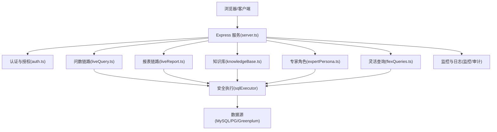
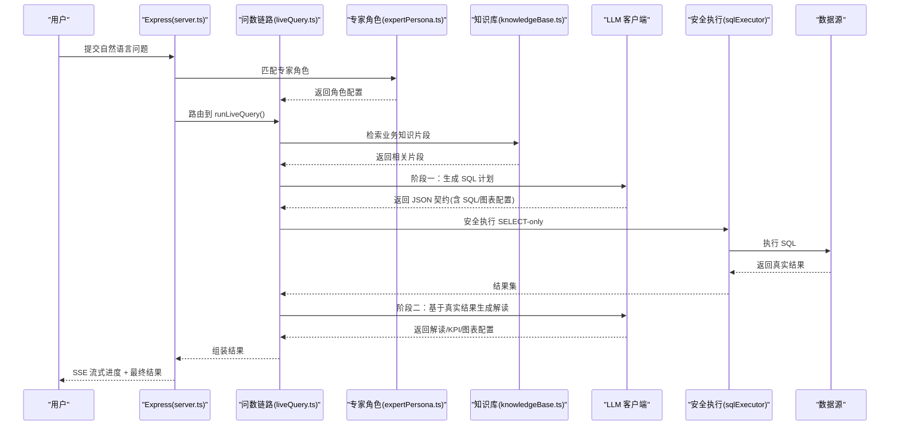
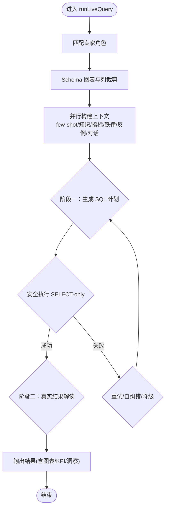
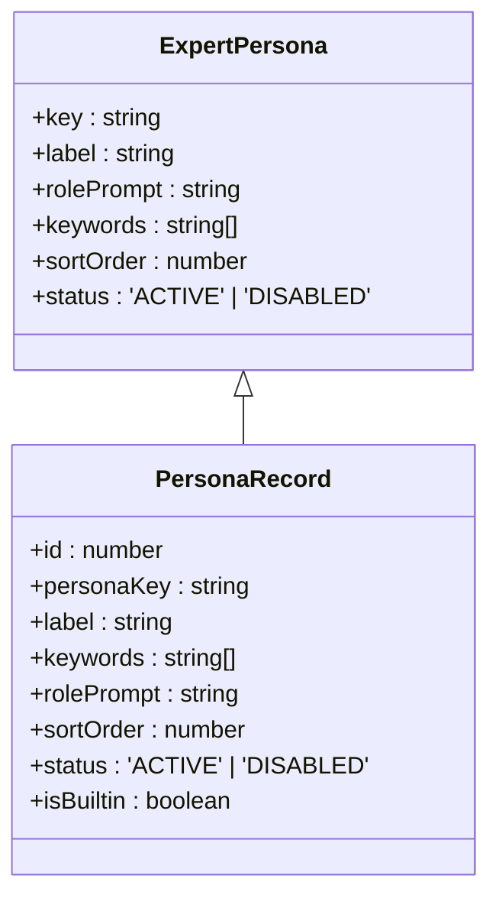
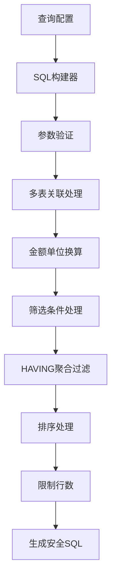
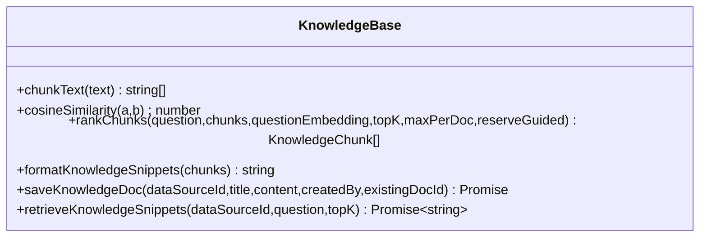
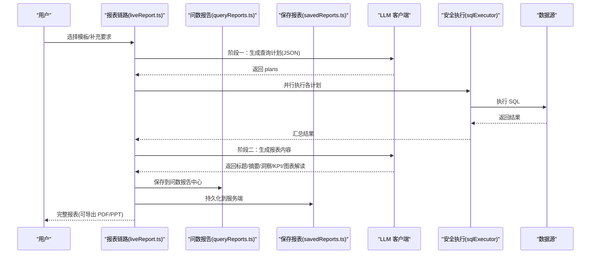
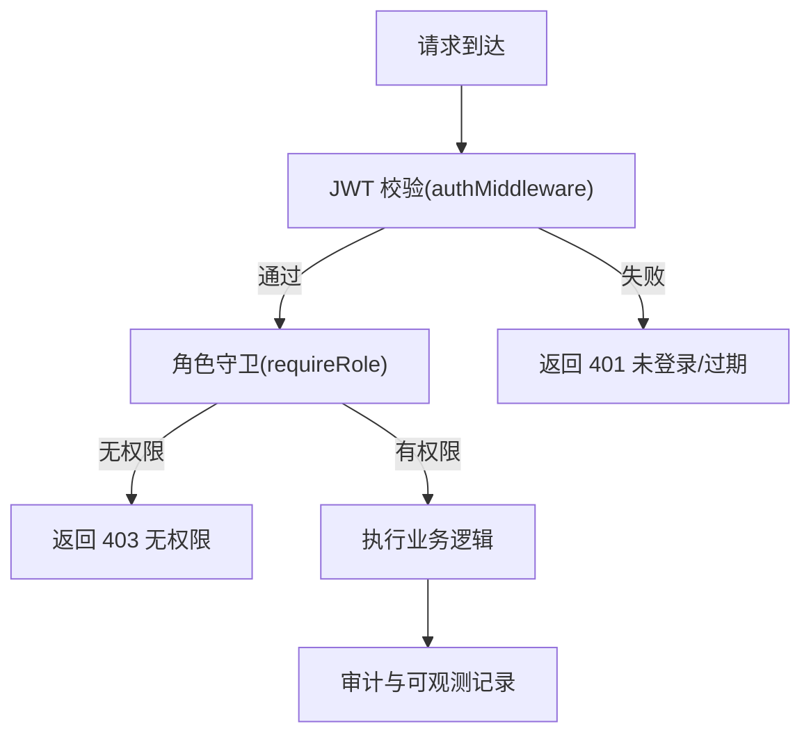
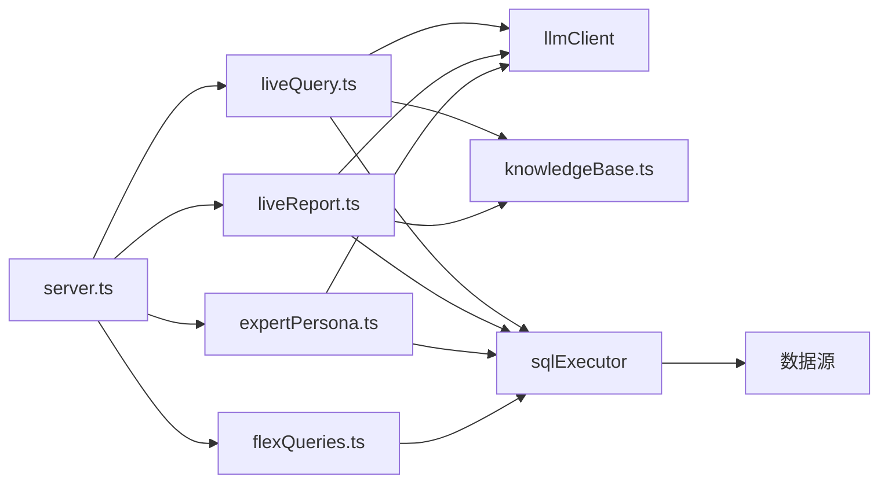

# 系统介绍与特性

<cite>
**本文引用的文件**
- [server.ts](file://server.ts)
- [README.md](file://README.md)
- [package.json](file://package.json)
- [liveQuery.ts](file://server/query/liveQuery.ts)
- [knowledgeBase.ts](file://server/knowledge/knowledgeBase.ts)
- [liveReport.ts](file://server/report/liveReport.ts)
- [auth.ts](file://server/auth/auth.ts)
- [expertPersona.ts](file://server/llm/expertPersona.ts)
- [expertPersonas.ts](file://server/routes/expertPersonas.ts)
- [flexQueries.ts](file://server/routes/flexQueries.ts)
- [flexQueryBuilder.ts](file://src/utils/flexQueryBuilder.ts)
- [queryReports.ts](file://server/routes/queryReports.ts)
- [savedReports.ts](file://server/routes/savedReports.ts)
- [ExpertPersonasPanel.tsx](file://src/components/admin/ExpertPersonasPanel.tsx)
</cite>

## 更新摘要
**变更内容**
- 新增专家角色（Expert Personas）功能，支持按关键词匹配不同分析视角
- 增强灵活查询（Flexible Query）能力，支持多表关联、金额单位换算和固定报表管理
- 完善报告管理系统，支持问数报告中心和服务端持久化
- 培训时长从60分钟延长至75分钟，以涵盖新增功能的完整演示
- 版本升级至v0.9.46，包含显著的内容扩展和视觉增强

## 目录
1. [引言](#引言)
2. [项目结构](#项目结构)
3. [核心组件](#核心组件)
4. [架构总览](#架构总览)
5. [详细组件分析](#详细组件分析)
6. [依赖关系分析](#依赖关系分析)
7. [性能与可扩展性](#性能与可扩展性)
8. [故障排查指南](#故障排查指南)
9. [结论](#结论)
10. [附录：目标用户、价值主张与应用场景](#附录目标用户价值主张与应用场景)

## 引言
本系统为企业级"智能问数据分析平台"，以自然语言为入口，自动理解语义、匹配数据表结构、生成并执行 SQL，将真实查询结果转化为图表、KPI 与洞察解读，并可一键产出高管决策简报。系统通过双阶段 NL2SQL（先生成 SQL，再基于真实结果生成解读）、知识库 RAG、语义指标层、铁律规则、行级权限与安全执行等能力，显著降低数据分析门槛，提升决策效率，实现智能化数据洞察。

**更新** v0.9.46版本新增了专家角色系统、增强的灵活查询功能和完善的报告管理能力，培训时长相应延长至75分钟以确保新功能得到充分展示。

## 项目结构
- 前端：React + Vite + TypeScript + Tailwind CSS + Recharts + Zustand
- 后端：Express + Node.js（tsx 开发 / esbuild 打包），内置多路由模块
- 数据：MySQL（元数据库）、可选 Redis（限流/缓存/状态外置）
- AI：Ollama（本地）/ 通义千问百炼 / Gemini API；node-sql-parser 用于解析与校验
- 部署：Docker 多阶段构建，健康检查与生产安全加固

**图示来源**
- [server.ts:82-265](file://server.ts#L82-L265)
- [auth.ts:66-127](file://server/auth/auth.ts#L66-L127)
- [liveQuery.ts:189-749](file://server/query/liveQuery.ts#L189-L749)
- [liveReport.ts:350-493](file://server/report/liveReport.ts#L350-L493)
- [knowledgeBase.ts:207-239](file://server/knowledge/knowledgeBase.ts#L207-L239)
- [expertPersona.ts:1-329](file://server/llm/expertPersona.ts#L1-L329)
- [flexQueries.ts:1-203](file://server/routes/flexQueries.ts#L1-L203)

**章节来源**
- [README.md:49-179](file://README.md#L49-L179)
- [package.json:1-76](file://package.json#L1-L76)
- [server.ts:82-265](file://server.ts#L82-L265)

## 核心组件
- 智能问数（NL2SQL）：双阶段生成、歧义澄清、数据自省、few-shot 样例注入、embedding 圈表、自学习闭环、计划模式、报告模式、深度分析中间表链、降级兜底
- **新增** 专家角色系统：按问题关键词自动匹配专业分析视角（风险、客户、财务、不良资产等）
- **增强** 灵活查询：支持多表JOIN、金额单位换算、固定报表管理和查询历史持久化
- 数据治理：多源接入、Scope 白名单与敏感列过滤、行级权限、语义指标层、知识库、SQL 样例库、技能库、数据血缘
- 分析与呈现：可视化决策报表、问数报告中心、决策看板、深浅色主题
- 企业级安全：RBAC 三角色、八层纵深防御、密钥保护、审计与可观测

**章节来源**
- [README.md:7-47](file://README.md#L7-L47)
- [expertPersona.ts:1-329](file://server/llm/expertPersona.ts#L1-L329)
- [flexQueries.ts:1-203](file://server/routes/flexQueries.ts#L1-L203)

## 架构总览
系统采用前后端分离的 Express 服务作为统一入口，按业务域拆分路由：认证、数据源、知识库、问数、对话历史、报表、模板、看板、任务队列、运维指标等。问数与报表两条主链路共享同一套安全执行层、语义资产（指标/知识/铁律）与 LLM 通道，保证口径一致与可维护性。

**更新** v0.9.46版本新增了专家角色路由和灵活查询路由，进一步完善了系统的功能架构。

**图示来源**
- [server.ts:223-265](file://server.ts#L223-L265)
- [liveQuery.ts:189-749](file://server/query/liveQuery.ts#L189-L749)
- [expertPersona.ts:196-212](file://server/llm/expertPersona.ts#L196-L212)
- [knowledgeBase.ts:207-239](file://server/knowledge/knowledgeBase.ts#L207-L239)

## 详细组件分析

### 智能问数（NL2SQL）主链路
- 双阶段编排：阶段一生成 SQL 与图表配置；阶段二基于真实结果生成解读与 KPI
- 上下文并行构建：few-shot 样例、知识库 RAG、外部知识库、语义指标、点踩反例、个人对话沉淀、铁律规则
- 复杂问题支持：复杂度评估与中间表清洗链（ait_*），失败不阻断主链路
- 容错与自纠错：EXPLAIN 防线拦截、最多 3 次重试、Self-Consistency 多数表决择优
- 实时反馈：SSE 阶段进度（understanding → introspecting → executed → analyzing）

**图示来源**
- [liveQuery.ts:189-749](file://server/query/liveQuery.ts#L189-L749)
- [expertPersona.ts:196-212](file://server/llm/expertPersona.ts#L196-L212)

**章节来源**
- [liveQuery.ts:189-749](file://server/query/liveQuery.ts#L189-L749)

### 专家角色系统（新增功能）
- **关键词匹配机制**：按问题文本对 ACTIVE 角色做关键词包含匹配，首个命中生效
- **内置专业角色**：风险、客户、财务、不良资产、默认金融分析师等5个预设角色
- **角色优先级**：sortOrder 控制匹配顺序，具体职能角色优先于宽泛领域
- **持久化管理**：角色配置存储于 expert_personas 表，支持CRUD操作和状态管理
- **缓存优化**：60秒内存缓存，写操作即时失效，保证配置实时更新

**图示来源**
- [expertPersona.ts:23-43](file://server/llm/expertPersona.ts#L23-L43)
- [expertPersonas.ts:1-70](file://server/routes/expertPersonas.ts#L1-L70)

**章节来源**
- [expertPersona.ts:1-329](file://server/llm/expertPersona.ts#L1-L329)
- [expertPersonas.ts:1-70](file://server/routes/expertPersonas.ts#L1-L70)
- [ExpertPersonasPanel.tsx:1-420](file://src/components/admin/ExpertPersonasPanel.tsx#L1-L420)

### 灵活查询增强（v0.9.24+）
- **多表关联支持**：INNER JOIN 和 LEFT JOIN，支持跨表字段引用
- **金额单位换算**：自动识别金额列并按选定单位进行换算（亿元/百万元/万元/元）
- **固定报表管理**：团队共享查询模板，支持保存、删除和权限控制
- **查询历史持久化**：个人行为记录服务端存储，支持去重和上限控制
- **SQL构建器**：纯函数构建安全SQL，防止注入攻击

**图示来源**
- [flexQueries.ts:1-203](file://server/routes/flexQueries.ts#L1-L203)
- [flexQueryBuilder.ts:163-312](file://src/utils/flexQueryBuilder.ts#L163-L312)

**章节来源**
- [flexQueries.ts:1-203](file://server/routes/flexQueries.ts#L1-L203)
- [flexQueryBuilder.ts:1-312](file://src/utils/flexQueryBuilder.ts#L1-L312)

### 知识库管理（RAG）
- 文档切块与 embedding 批量化入库，支持向量相似度与 bigram 关键词双路检索
- 阈值过滤与高价值文档优先保留，避免无关知识稀释注意力
- 检索片段格式化后注入阶段一 prompt，约束口径/术语/枚举写法，不放开表列白名单

**图示来源**
- [knowledgeBase.ts:43-166](file://server/knowledge/knowledgeBase.ts#L43-L166)
- [knowledgeBase.ts:170-239](file://server/knowledge/knowledgeBase.ts#L170-L239)

**章节来源**
- [knowledgeBase.ts:1-239](file://server/knowledge/knowledgeBase.ts#L1-L239)

### 报表生成（可视化决策报表）
- 双阶段：阶段一生成 2-4 条聚合查询计划；阶段二基于真实结果生成高管摘要、洞察、KPI 与各图解读
- 与问数链路共享语义资产与安全执行层，确保口径一致
- 支持计划模式（批准后复用 planId）、金额单位口径一致性校验、文案中文化兜底

**更新** 新增问数报告中心和服务端持久化功能，支持报告的集中管理和团队协作。

**图示来源**
- [liveReport.ts:350-493](file://server/report/liveReport.ts#L350-L493)
- [queryReports.ts:1-150](file://server/routes/queryReports.ts#L1-L150)
- [savedReports.ts:1-259](file://server/routes/savedReports.ts#L1-L259)

**章节来源**
- [liveReport.ts:1-493](file://server/report/liveReport.ts#L1-L493)
- [queryReports.ts:1-150](file://server/routes/queryReports.ts#L1-L150)
- [savedReports.ts:1-259](file://server/routes/savedReports.ts#L1-L259)

### 企业级安全与鉴权
- RBAC 三角色：管理员/分析师/只读，前后端双重守卫
- JWT 签发与校验，登录态回查用户状态，强制改密策略
- 八层纵深防御：输入防护→鉴权→限流→Schema 白名单→敏感过滤→只读执行→审计→可观测

**图示来源**
- [auth.ts:66-127](file://server/auth/auth.ts#L66-L127)

**章节来源**
- [auth.ts:1-127](file://server/auth/auth.ts#L1-L127)

## 依赖关系分析
- 服务入口 server.ts 注册所有路由，集中处理健康检查、CSP、限流、监控、任务队列、中间表清理等基础设施
- 问数与报表两条链路均依赖：
  - LLM 客户端（统一通道，支持多后端与快速模型路由）
  - 安全执行层（SELECT-only、白名单、行级权限、超时控制）
  - 知识库与语义指标（保障口径一致）
  - **新增** 专家角色系统（提供专业分析视角）
  - **新增** 灵活查询引擎（支持复杂查询场景）
- 存储与缓存：MySQL（元数据/知识/对话/报表）、Redis（可选，限流/缓存/状态外置）

**图示来源**
- [server.ts:223-265](file://server.ts#L223-L265)
- [liveQuery.ts:189-749](file://server/query/liveQuery.ts#L189-L749)
- [liveReport.ts:350-493](file://server/report/liveReport.ts#L350-L493)
- [expertPersona.ts:1-329](file://server/llm/expertPersona.ts#L1-L329)
- [flexQueries.ts:1-203](file://server/routes/flexQueries.ts#L1-L203)

**章节来源**
- [server.ts:82-265](file://server.ts#L82-L265)

## 性能与可扩展性
- 并发与资源：连接池按场景分级配额排队（chain/export），多查询并行执行，墙钟时间由"逐条相加"降为"最慢一条"
- 提示词预算：知识库片段与对话历史按 token 预算截断，防止溢出
- 模型路由：简单单表问题走快速模型，复杂问题使用主模型；分析阶段支持快速模型路由以提升吞吐
- 缓存与自愈：语义缓存、SSE 重放缓冲、中间表 TTL 清理、LLM 健康检查摘除节点
- **新增** 专家角色缓存：60秒内存缓存，写操作即时失效，平衡性能与实时性
- **新增** 灵活查询持久化：查询历史和固定报表服务端存储，减少重复计算
- 可观测性：Prometheus 指标、请求日志、审计落账、漂移检测

## 故障排查指南
- 常见错误定位：
  - LLM 调用失败：查看阶段一/二调用日志与降级路径
  - EXPLAIN 防线拦截：根据拦截原因收窄条件或调整过滤
  - 知识库检索为空：确认 embedding 可用性与阈值设置
  - 报表部分查询失败：检查各计划 SQL 与权限/白名单
  - **新增** 专家角色匹配失败：检查关键词配置和角色状态
  - **新增** 灵活查询构建失败：验证JOIN条件和字段映射
- 建议操作：
  - 开启推导留痕（onTrace）查看每步耗时与输入输出摘要
  - 使用"计划模式"先批准 SQL 再执行，便于定位问题
  - 切换快速/主模型对比准确率与延迟
  - 检查 Redis 连接与限流/缓存状态
  - **新增** 验证专家角色配置和灵活查询权限

**章节来源**
- [liveQuery.ts:337-628](file://server/query/liveQuery.ts#L337-L628)
- [liveReport.ts:237-320](file://server/report/liveReport.ts#L237-L320)
- [expertPersona.ts:250-329](file://server/llm/expertPersona.ts#L250-L329)
- [flexQueries.ts:154-203](file://server/routes/flexQueries.ts#L154-L203)

## 结论
本系统以"自然语言即入口"的方式重构数据分析流程，通过双阶段 NL2SQL、知识库 RAG、语义指标层、铁律规则与企业级安全机制，有效解决传统数据分析门槛高、口径不一致、执行风险大等痛点。面向数据分析师、业务人员与技术开发者，提供从即时问答到高管报表的一体化能力，显著降低门槛、提高决策效率、实现智能化数据洞察。

**更新** v0.9.46版本的重大升级包括专家角色系统、增强的灵活查询功能和完善的报告管理能力，使系统能够更好地满足企业级数据分析需求。培训时长延长至75分钟，确保新功能得到充分展示和实践。

## 附录：目标用户、价值主张与应用场景
- 目标用户
  - 数据分析师：快速完成复杂分析、沉淀可复用模板与技能
  - 业务人员：用中文提问获取图表与洞察，减少沟通成本
  - 技术开发者：集成 API 与 SDK，扩展企业数据应用
  - **新增** 企业管理者：通过专家角色获得专业视角的分析解读
- 核心价值主张
  - 降低数据分析门槛：自然语言直达数据，零代码查询
  - 提高决策效率：实时分析、一键报表、下钻明细
  - 实现智能化洞察：AI 驱动解读、KPI 自动计算、趋势预警
  - **新增** 专业化分析：专家角色提供多维度专业视角
  - **新增** 灵活查询：拖拽式复杂查询，无需编写SQL
- 主要应用场景
  - 经营日报/周报自动生成
  - 销售/库存/财务指标实时监控
  - 临时性 ad-hoc 分析需求快速响应
  - 高管决策简报一键导出（PDF/PPT）
  - **新增** 专业领域深度分析（风险、客户、财务等）
  - **新增** 团队共享查询模板和固定报表
- 成功案例说明
  - 某企业通过知识库与语义指标层统一口径，报表生成准确率显著提升，管理层决策周期缩短
  - 通过 few-shot 与自学习闭环，团队 SQL 样例库持续优化，问答成功率稳步提升
  - **新增** 专家角色系统帮助金融机构实现专业化风险分析和客户洞察
  - **新增** 灵活查询功能让业务人员能够自主创建复杂报表，减少对IT部门的依赖

[本节为概念性内容，无需特定文件引用]