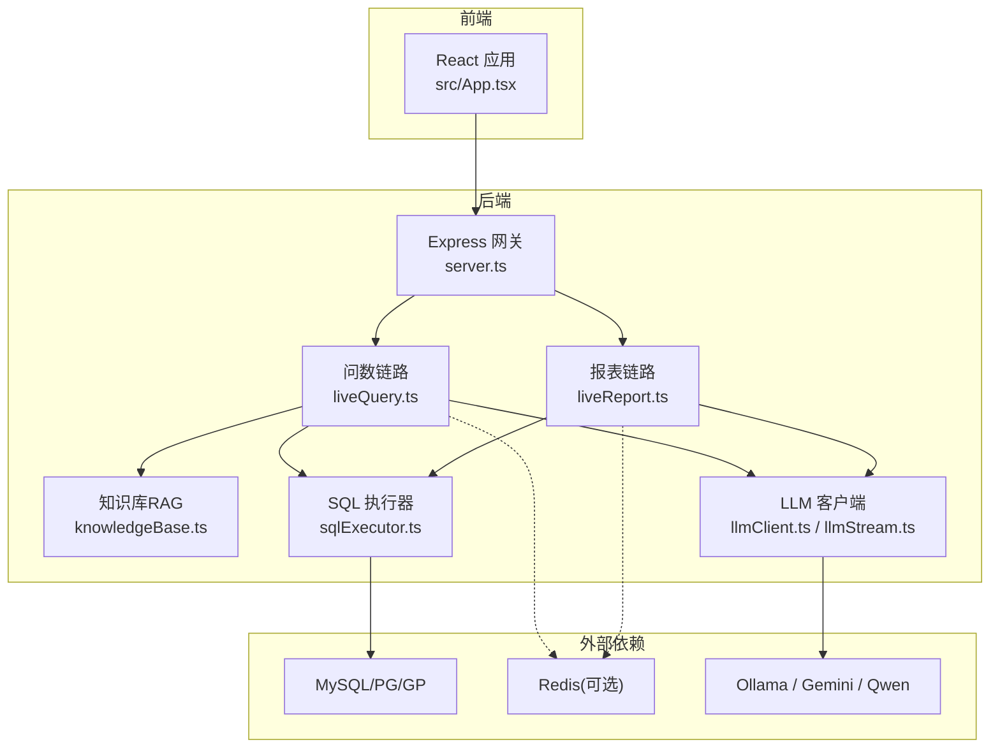
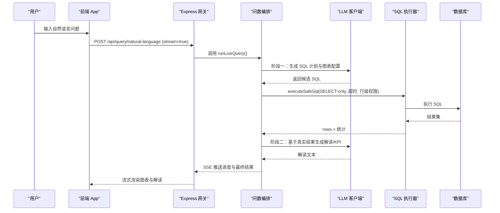
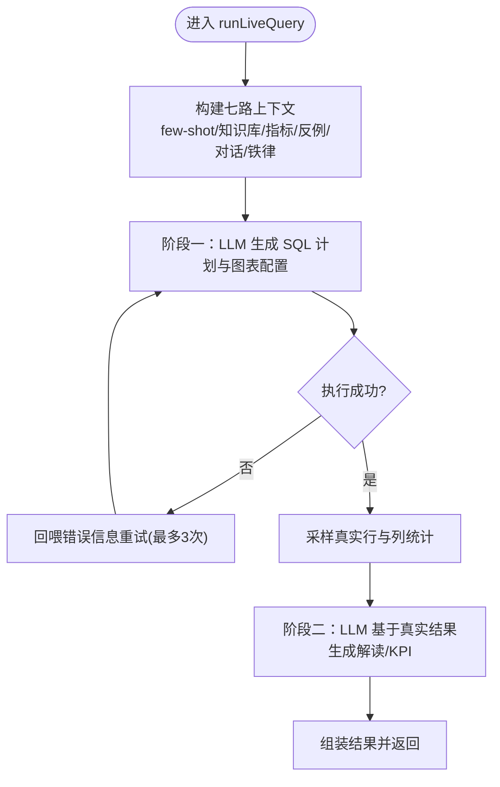
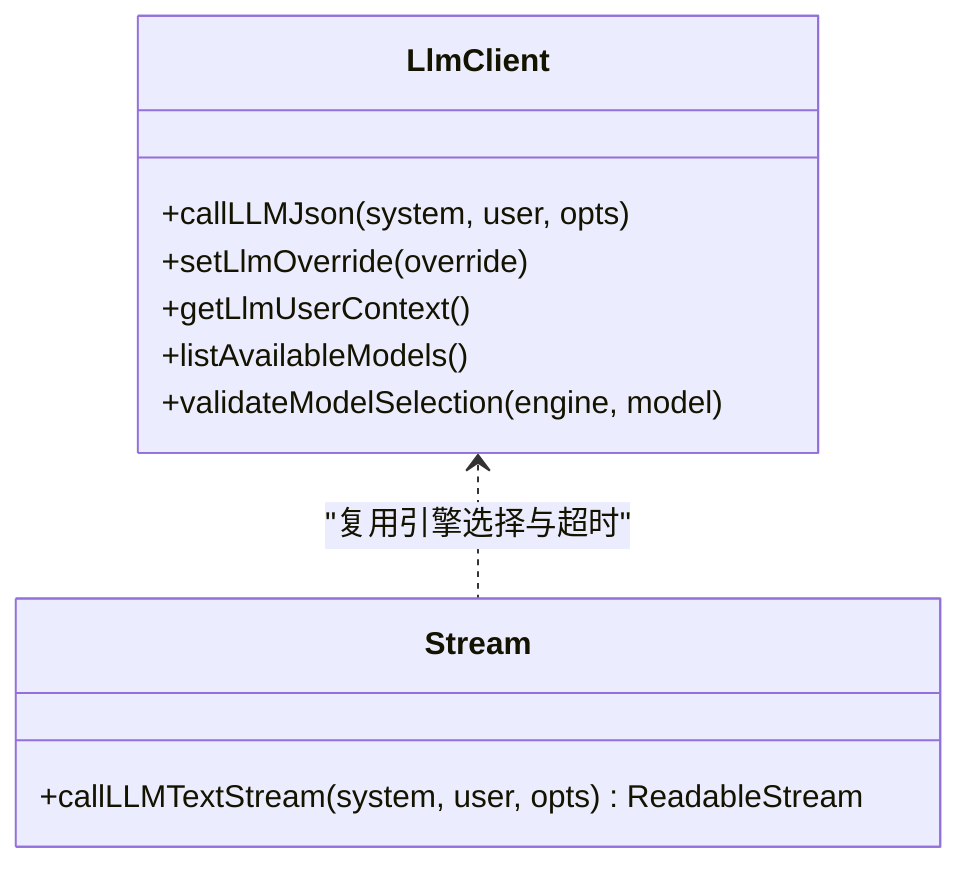
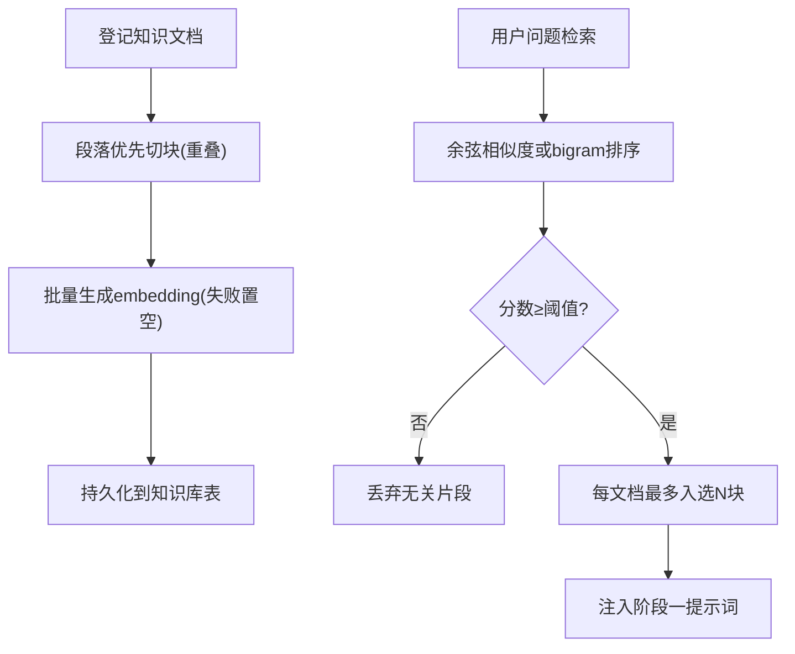
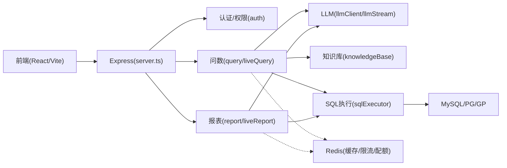
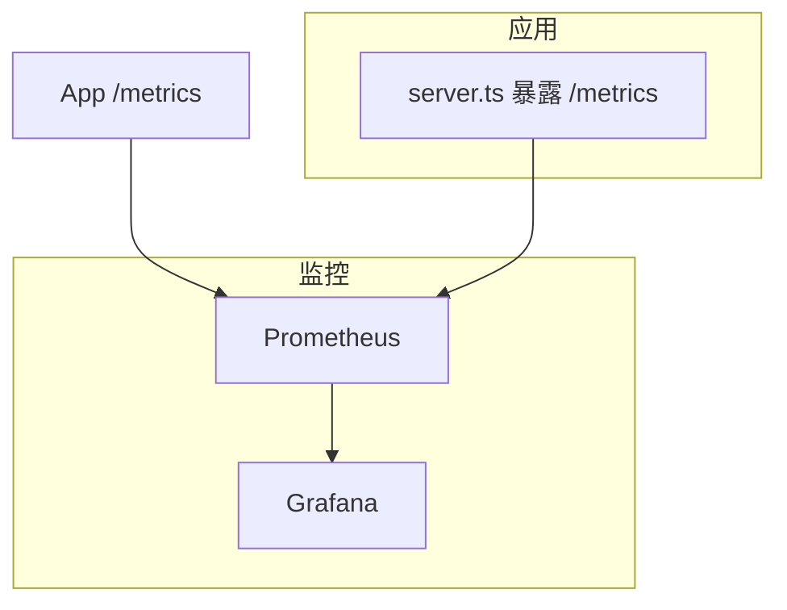

# 项目概述

<cite>
**本文引用的文件**
- [server.ts](file://server.ts)
- [package.json](file://package.json)
- [src/App.tsx](file://src/App.tsx)
- [server/query/liveQuery.ts](file://server/query/liveQuery.ts)
- [server/query/liveQueryPrompts.ts](file://server/query/liveQueryPrompts.ts)
- [server/llm/llmClient.ts](file://server/llm/llmClient.ts)
- [server/llm/llmStream.ts](file://server/llm/llmStream.ts)
- [server/knowledge/knowledgeBase.ts](file://server/knowledge/knowledgeBase.ts)
- [server/report/liveReport.ts](file://server/report/liveReport.ts)
- [server/query/sqlExecutor.ts](file://server/query/sqlExecutor.ts)
- [Dockerfile](file://Dockerfile)
- [deploy/prometheus.yml](file://deploy/prometheus.yml)
- [docs/多实例部署指南.md](file://docs/多实例部署指南.md)
- [docker-compose.multi-instance.yml](file://docker-compose.multi-instance.yml)
</cite>

## 目录
1. [简介](#简介)
2. [项目结构](#项目结构)
3. [核心组件](#核心组件)
4. [架构总览](#架构总览)
5. [关键组件详解](#关键组件详解)
6. [依赖关系分析](#依赖关系分析)
7. [性能与可观测性](#性能与可观测性)
8. [企业级特性](#企业级特性)
9. [故障排查指南](#故障排查指南)
10. [结论](#结论)

## 简介
本系统是一个面向企业的“智能问数据分析”平台，核心目标是将自然语言问题自动转化为安全、可审计的 SQL 查询，并结合知识库与指标口径生成图表与洞察，支撑实时查询、知识管理与报表生成。系统通过多 LLM 引擎（Ollama、Gemini、Qwen）统一接入，提供高可用、可扩展的企业级能力：RBAC 权限控制、行级数据权限、SSE 流式响应、缓存与限流、异步任务队列、审计与监控等。

技术价值主张：
- 以自然语言驱动的数据分析，降低使用门槛，提升决策效率
- 将业务语义（指标、口径、术语）沉淀为可复用的知识资产
- 通过多引擎集成与熔断降级，保障稳定性与成本可控
- 全链路可观测、可审计，满足企业合规要求

## 项目结构
- 前端：React + Vite，模块化路由与懒加载，角色守卫与权限控制
- 后端：Express 服务，统一入口 server.ts 挂载各业务路由；query、report、knowledge、auth、infra 等分层清晰
- 数据库：MySQL/PostgreSQL/Greenplum 等多库支持，连接池按场景隔离
- AI 层：统一 LLM 客户端，支持 Ollama/Gemini/Qwen 多后端与流式输出
- 运维：Docker 多阶段构建、Prometheus/Grafana 监控、多实例编排

**图示来源**
- [server.ts:82-299](file://server.ts#L82-L299)
- [server/query/liveQuery.ts:1-120](file://server/query/liveQuery.ts#L1-L120)
- [server/report/liveReport.ts:1-120](file://server/report/liveReport.ts#L1-L120)
- [server/llm/llmClient.ts:258-337](file://server/llm/llmClient.ts#L258-L337)
- [server/query/sqlExecutor.ts:686-726](file://server/query/sqlExecutor.ts#L686-L726)

**章节来源**
- [server.ts:82-299](file://server.ts#L82-L299)
- [package.json:1-76](file://package.json#L1-L76)

## 核心组件
- 自然语言转 SQL 双阶段编排：阶段一生成 SQL 计划与图表配置，阶段二基于真实结果生成解读与 KPI
- 多 LLM 引擎统一接入：Ollama/Gemini/Qwen 自动选择、健康检查、熔断与回退
- 知识库 RAG：管理员登记口径与术语，检索片段注入提示词，增强 SQL 准确性
- 安全执行层：SELECT-only、表白名单、行级权限、超时保护、EXPLAIN 自纠错
- 报表生成：模板化主题，并行生成多条聚合查询，统一中文化兜底
- 认证与权限：JWT、RBAC、部门授权、访问申请审批流
- 可观测与运维：Prometheus 指标、Grafana 仪表盘、SSE 流式进度、异步任务队列

**章节来源**
- [server/query/liveQuery.ts:1-200](file://server/query/liveQuery.ts#L1-L200)
- [server/llm/llmClient.ts:258-337](file://server/llm/llmClient.ts#L258-L337)
- [server/knowledge/knowledgeBase.ts:1-200](file://server/knowledge/knowledgeBase.ts#L1-L200)
- [server/report/liveReport.ts:1-200](file://server/report/liveReport.ts#L1-L200)
- [server/query/sqlExecutor.ts:686-726](file://server/query/sqlExecutor.ts#L686-L726)
- [server/routes/auth.ts:1-46](file://server/routes/auth.ts#L1-L46)

## 架构总览
系统采用前后端分离与分层架构：前端 React 负责交互与可视化；Express 作为 API 网关与安全中间件链；业务链路分为问数与报表两条主线，共享 LLM、知识库与安全执行层；外部依赖包括 MySQL/PG/GP、Redis（可选）、多种 LLM 引擎。

**图示来源**
- [server.ts:185-242](file://server.ts#L185-L242)
- [server/query/liveQuery.ts:183-200](file://server/query/liveQuery.ts#L183-L200)
- [server/llm/llmStream.ts:31-65](file://server/llm/llmStream.ts#L31-L65)
- [server/query/sqlExecutor.ts:686-726](file://server/query/sqlExecutor.ts#L686-L726)

## 关键组件详解

### 自然语言转 SQL 核心原理
- 双阶段编排：阶段一仅生成 SQL 与图表配置，不编造数据；阶段二基于真实采样结果生成解读与 KPI
- 上下文增强：few-shot 样例、知识库 RAG、外部知识库、语义指标、点踩反例、对话历史、铁律规则
- 多候选并行与择优：复杂问题并行生成多个候选，多数表决择优；歧义澄清与拒答竞速返回
- 安全执行：SELECT-only、表白名单、行级权限、超时保护；失败回喂 LLM 重试，EXPLAIN 收窄条件自纠错

**图示来源**
- [server/query/liveQuery.ts:183-200](file://server/query/liveQuery.ts#L183-L200)
- [server/query/liveQueryPrompts.ts:12-52](file://server/query/liveQueryPrompts.ts#L12-L52)

**章节来源**
- [server/query/liveQuery.ts:1-200](file://server/query/liveQuery.ts#L1-L200)
- [server/query/liveQueryPrompts.ts:12-52](file://server/query/liveQueryPrompts.ts#L12-L52)

### 多 LLM 引擎集成优势
- 统一客户端：Ollama/Gemini/Qwen 抽象为同一接口，支持请求级模型覆盖与用户上下文埋点
- 健康检查与熔断：Ollama 节点健康检查，异常自动摘除；熔断器防止雪崩
- 流式输出：SSE token-by-token 推送，提升首屏体验
- 模型目录与校验：动态列出可用模型，严格校验引擎与模型名合法性

**图示来源**
- [server/llm/llmClient.ts:196-337](file://server/llm/llmClient.ts#L196-L337)
- [server/llm/llmStream.ts:31-65](file://server/llm/llmStream.ts#L31-L65)

**章节来源**
- [server/llm/llmClient.ts:196-337](file://server/llm/llmClient.ts#L196-L337)
- [server/llm/llmStream.ts:31-65](file://server/llm/llmStream.ts#L31-L65)

### 知识库管理（RAG）
- 管理员登记业务知识（指标口径、术语、计算规则），切块存储并生成 embedding
- 检索时优先向量相似度，阈值过滤无关片段；不可用时降级为 bigram 关键词检索
- 高价值文档（口径/指南类）保留槽位，避免被字段字典淹没
- 检索片段注入阶段一提示词，强制遵循权威口径与术语

**图示来源**
- [server/knowledge/knowledgeBase.ts:43-166](file://server/knowledge/knowledgeBase.ts#L43-L166)
- [server/knowledge/knowledgeBase.ts:168-197](file://server/knowledge/knowledgeBase.ts#L168-L197)

**章节来源**
- [server/knowledge/knowledgeBase.ts:1-200](file://server/knowledge/knowledgeBase.ts#L1-L200)

### 报表生成
- 模板化主题：阶段一生成 2-4 条聚合查询计划，注入 Schema 备注、指标口径、铁律规则与知识库片段
- 并行执行：多条计划过安全执行层，至少一条成功继续；阶段二汇总真实结果生成高管摘要、洞察与 KPI
- 中文化兜底：英文标识符替换为中文，确保文案可读性

**章节来源**
- [server/report/liveReport.ts:1-200](file://server/report/liveReport.ts#L1-L200)

### 前端与路由组织
- React 应用：Header/Sidebar 导航，Tab 路由与角色守卫（VIEWER/ADMIN），懒加载大组件减少首屏体积
- Express 网关：统一注册鉴权、限流、CSP/HSTS、审计日志、Prometheus 指标；按模块拆分路由

**章节来源**
- [src/App.tsx:1-104](file://src/App.tsx#L1-L104)
- [server.ts:82-299](file://server.ts#L82-L299)

## 依赖关系分析
- 前端依赖 React、Recharts、Zustand 等，构建工具 Vite，开发期通过 Vite 中间件热更新
- 后端依赖 Express、mysql2/pg、ioredis、prom-client、jsonwebtoken 等
- 数据库连接池按场景隔离（交互式/导出/链式），超时与最大连接数受控
- Redis 用于缓存、限流、配额、OIDC state、计划一次性消费等共享状态

**图示来源**
- [package.json:26-45](file://package.json#L26-L45)
- [server/query/sqlExecutor.ts:686-726](file://server/query/sqlExecutor.ts#L686-L726)
- [server.ts:223-265](file://server.ts#L223-L265)

**章节来源**
- [package.json:26-45](file://package.json#L26-L45)
- [server/query/sqlExecutor.ts:686-726](file://server/query/sqlExecutor.ts#L686-L726)

## 性能与可观测性
- 指标采集：/metrics 暴露 HTTP 耗时、问数状态计数、缓存命中、LLM 时延/token、SQL 执行耗时
- 监控栈：Prometheus 抓取应用与基础设施（Node Exporter、Redis Exporter、MySQL Exporter），Grafana 仪表盘
- 多实例：无状态设计，共享状态外置至 Redis；LB 轮询分发，SSE 长连接需保持
- 容器化：多阶段构建，生产镜像最小化，健康检查探针

**图示来源**
- [deploy/prometheus.yml:1-57](file://deploy/prometheus.yml#L1-L57)
- [server.ts:172-193](file://server.ts#L172-L193)
- [Dockerfile:18-47](file://Dockerfile#L18-L47)

**章节来源**
- [deploy/prometheus.yml:1-57](file://deploy/prometheus.yml#L1-L57)
- [Dockerfile:18-47](file://Dockerfile#L18-L47)

## 企业级特性
- 认证与权限：JWT 签发/校验、RBAC 角色（ADMIN/VIEWER）、部门授权、访问申请审批流
- 数据安全：行级权限（AST 强制注入）、敏感列剔除、CSP/HSTS、生产 fail-fast 密钥校验
- 可审计：八态审计落账、操作日志、导出水印与下载审批
- 高可用：多实例水平扩展、滚动发布、熔断与降级、SSE 断线续传缓冲
- 容量规划：连接池与超时按场景控制、限流与并发配额、缓存命中率优化

**章节来源**
- [server/routes/auth.ts:1-46](file://server/routes/auth.ts#L1-L46)
- [docs/多实例部署指南.md:1-129](file://docs/多实例部署指南.md#L1-L129)
- [docker-compose.multi-instance.yml:1-49](file://docker-compose.multi-instance.yml#L1-L49)

## 故障排查指南
- 启动失败：生产环境未设置 JWT_SECRET 会拒绝启动；检查环境变量与数据库连通性
- 登录异常：确认 OIDC 回调与 state 一致性；检查 Redis 是否可达（多实例必需）
- 问数失败：查看阶段一/二重试次数与错误诊断；确认 SELECT-only 与表白名单；检查 EXPLAIN 自纠错建议
- 报表生成慢：评估并行查询数量与超时；检查连接池与数据库负载
- 监控告警：关注 Prometheus 指标中的异常率与时延；核对 Nginx 代理长连接配置

**章节来源**
- [server.ts:91-96](file://server.ts#L91-L96)
- [server.ts:273-280](file://server.ts#L273-L280)
- [docs/多实例部署指南.md:77-123](file://docs/多实例部署指南.md#L77-L123)

## 结论
本系统以“自然语言 → 安全 SQL → 可视化洞察”为主线，结合知识库与多 LLM 引擎，为企业提供高效、可靠、可审计的智能数据分析能力。通过清晰的架构分层、完善的安全与可观测体系、以及多实例水平扩展能力，能够满足企业级在生产环境的稳定性与合规要求。开发者可基于现有模块快速扩展新数据源、新报表模板与新业务场景。