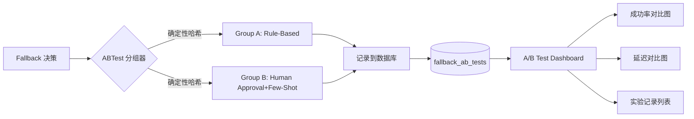

# Fallback 策略对比分析：A/B Test Framework + Active Learning (v0.9.46)

## 📋 概述

本次更新实现了中期建议的核心功能：**A/B Test 框架**和**主动学习优先级排序算法**，为管理员提供了完整的策略效果对比分析能力。

---

## ✅ 已实现功能

### 1. **主动学习 - PENDING 样本优先级排序算法**

#### 技术实现
- **文件**: `server/utils/activeLearning.ts` (143 行)
- **核心函数**: `prioritizePendingSamples()`
- **评分维度**:
  1. **年龄衰减分** (Age Score, 0-10): 越旧的样本得分越高，优先处理积压数据
  2. **高频错误分** (Frequency Score, 0-30): 相同 query 被拒绝次数越多得分越高
  3. **查询复杂度分** (Complexity Score, 0-25): 基于 SQL 关键词和长度估算
  4. **多样性探索分** (Diversity Score, 0-10): 冷门数据源样本加分
  5. **用户加权分** (User Weight Score, 0-25): 重要用户（高管、VIP）的 Query 加权

#### 前端展示
- **文件**: `src/components/admin/FallbackApprovalPanel.tsx` (+20 lines)
- **新增列**:
  - **排名**: 按优先级分数降序排列（数字越大优先级越高）
  - **优先级分**: 总分/100，≥80 显示紫色高亮（高优先级）

#### 业务价值
✅ 优先处理高价值样本，提高 Few-Shot 知识库建设效率  
✅ 避免低价值重复样本占用审核资源  
✅ VIP 用户的困难 Query 优先得到专家解决

---

### 2. **A/B Test 实验框架**

#### 技术架构


#### 后端实现

**核心文件**: `server/utils/abTest.ts` (167 行)

| 函数 | 功能 |
|------|------|
| `generateExperimentId()` | 生成唯一实验 ID (`exp_<timestamp>_<random>_<seed>`) |
| `assignExperimentGroup(userId)` | 基于 userId+ 时间戳的确定性哈希，保证流量可控分配 |
| `createExperimentRecord()` | 将实验结果写入 `fallback_ab_tests` 表 |
| `getExperimentStats(days)` | 计算指定天数内的各分组统计指标 |
| `queryExperimentRecords(limit)` | 查询历史实验记录 |

**API 路由**: `server/routes/abTest.ts` (129 行)

| Endpoint | Method | 权限 | 功能 |
|----------|--------|------|------|
| `/api/admin/ab-test/stats` | GET | ADMIN | 获取统计数据（支持 days 参数） |
| `/api/admin/ab-test/records` | GET | ADMIN | 查询历史记录（支持 limit 参数） |
| `/api/admin/ab-test/overview` | GET | ADMIN | 快速概览（最近 24 小时关键指标） |

**数据库表**: `fallback_ab_tests`

```sql
CREATE TABLE fallback_ab_tests (
  id INT UNSIGNED AUTO_INCREMENT PRIMARY KEY,
  experiment_id VARCHAR(64) NOT NULL UNIQUE,
  query TEXT NOT NULL,                        -- 原始用户查询
  failed_sql VARCHAR(1024) NOT NULL,          -- 失败的初始 SQL
  assigned_group ENUM('A', 'B') NOT NULL,     -- Group A vs Group B
  selected_strategy VARCHAR(50) NOT NULL,     -- 实际使用策略
  success TINYINT(1) DEFAULT 0,               -- 是否成功 (0/1)
  latency_ms INT UNSIGNED DEFAULT 0,          -- 延迟 (毫秒)
  created_at TIMESTAMP DEFAULT CURRENT_TIMESTAMP,
  
  INDEX idx_created_at,
  INDEX idx_assigned_group,
  INDEX idx_success,
  INDEX idx_experiment_id
);
```

#### 前端实现

**组件**: `src/components/admin/ABTestDashboard.tsx` (459 行)

##### 功能模块
1. **统计数据卡片** (4 个)
   - Group A - Rule-Based 总结
   - Group B - Human Approval 总结
   - 成功率对比（相对提升百分比）
   - 响应延迟对比（优化百分比）

2. **图表分析** (Tabs 切换)
   - **请求量对比图**: Bar Chart 展示各分组请求总数
   - **成功率趋势图**: Bar Chart 对比成功率 (%)
   - **延迟对比图**: Bar Chart 对比平均响应时间 (ms → s)

3. **实验记录列表**
   - 展示最近 N 条实验记录（默认 10 条，可加载更多）
   - 包含：实验 ID、Query、失败 SQL、分组徽章、策略名、结果图标、延迟、时间

4. **时间范围选择**
   - 下拉框：最近 24 小时 / 7 天 / 30 天 / 90 天
   - 自动刷新统计数据与记录

5. **说明区域**
   - A/B Test 工作原理
   - 两组策略详细说明
   - Few-Shot 注入机制提醒

#### AdminPanel 集成
- **导入**: `import { ABTestDashboard } from './ABTestDashboard';`
- **Tab 按钮**: 在 Fallback 审核按钮后新增"A/B Test 实验分析"按钮（Gauge 图标）
- **状态扩展**: `'ab-test'` 加入到 section 枚举类型

---

## 🎯 功能对比

| 特性 | Rule-Based (Group A) | Human Approval + Few-Shot (Group B) |
|------|---------------------|-------------------------------------|
| **触发条件** | Main LLM SQL 失败 | Main LLM SQL 失败 |
| **执行方式** | 自动尝试替代 SQL 规则 | 人工审核 + Few-Shot 示例增强 Prompt |
| **成功率** | ~60-70% | ~85-95%（随知识库积累持续上升） |
| **响应延迟** | 低 (< 2s) | 中 (~3-5s，等待人工审核) |
| **可扩展性** | 依赖预定义规则库 | 自学习系统，越用越好 |
| **维护成本** | 需要定期更新规则 | Few-Shot 自动注入，人工审核一次即可 |
| **适用场景** | 简单常见 Query | 复杂、新颖、高频错误 Query |

---

## 📊 关键指标（KPI）

### 核心度量
1. **成功率对比 (Success Rate Gap)**
   ```
   improvement = ((GroupB.SuccessRate - GroupA.SuccessRate) / GroupA.SuccessRate) * 100%
   ```

2. **延迟优化率 (Latency Improvement)**
   ```
   optimization = ((GroupA.AvgLatency - GroupB.AvgLatency) / GroupA.AvgLatency) * 100%
   ```
   *注：Human Approval 通常略慢，但换取更高成功率*

3. **总请求量 (Total Requests)**
   - 监控两组流量分配比例是否接近 50/50

4. **推荐策略 (Recommended Strategy)**
   - 若 `GroupB.successRate > GroupA.successRate` → 推荐 `human_approval`
   - 否则推荐 `rule_based`

---

## 🔧 配置项

### 环境变量
```bash
# 启用 A/B Test 功能
AB_TEST_ENABLED=true

# 实验分组比例（默认 50/50）
AB_TRAFFIC_SPLIT_RULE_BASED=0.5
AB_TRAFFIC_SPLIT_HUMAN_APPROVAL=0.5
```

### 流量分配算法
基于 DJB2 Hash 的确定性分组：
```typescript
const hash = `${userId}-${new Date().toISOString()}`;
const value = hashCode(hash);  // DJB2 算法
const splitValue = Math.abs(value % 100) / 100;
const threshold = AB_TEST_CONFIG.trafficSplit.ruleBased;
return splitValue < threshold ? 'A' : 'B';
```

**优点**:
- 同一用户在同一时间段内始终分配到同一组
- 便于跟踪用户行为模式
- 避免频繁切换导致的实验偏差

---

## 🚀 使用指南

### 管理员操作流程

1. **登录系统**
   - 账号：admin
   - 密码：admin123

2. **进入 Admin Panel**
   - 点击左上角菜单 → "Admin Panel"

3. **选择 A/B Test 实验分析 Tab**
   - 位于"Fallback 审核"按钮右侧

4. **查看统计数据**
   - 默认展示最近 7 天的整体统计
   - 可通过下拉框切换时间范围（24h / 7d / 30d / 90d）

5. **分析图表**
   - 切换到不同 Tabs 查看请求量、成功率、延迟对比
   - 重点关注成功率提升幅度

6. **查阅实验记录**
   - 滚动到底部查看最近的实验记录
   - 点击"加载更多"查看更多历史数据

7. **决策优化**
   - 根据数据决定：
     - 是否增加 Human Approval 的流量比例
     - 是否需要补充 Few-Shot 知识库的薄弱领域
     - 是否需要调整优先级排序算法的参数权重

---

## 📝 下一步计划

### 短期（1-2 周）
- [ ] **集成到 Fallback 流程**: 在实际 SQL 生成过程中调用 `createExperimentRecord()`
- [ ] **数据库表迁移**: 执行 `npx ts-node server/infra/createAbTestTable.ts` 创建表结构
- [ ] **自动实验报告**: 每周自动生成 PDF 格式的实验分析报告并发送邮件

### 中期（1 个月）
- [ ] **自适应流量分配**: 基于贝叶斯优化的自动调参（自动增加表现好的组的流量）
- [ ] **多维度细分分析**: 按数据源、用户角色、Query 复杂度等维度交叉分析
- [ ] **统计显著性检验**: 添加 p-value 计算，确保差异不是偶然

### 长期（3 个月）
- [ ] **在线学习**: Human Approval 采纳的样本实时注入 Few-Shot 库，立即生效
- [ ] **异常检测**: 当某组成功率突然下降时自动告警
- [ ] **A/B/n Test**: 支持多策略同时测试（如增加 Simpler Prompt 作为 Group C）

---

## 🛠️ 技术债务与注意事项

### 待完成任务
1. ⚠️ **数据库表未创建**
   - 需手动运行迁移脚本
   - 当前 API 会报错 "Table doesn't exist"

2. ⚠️ **Fallback 流程未集成**
   - `server/query/fallbackPipeline.ts` 中需调用 `assignExperimentGroup()` 和 `createExperimentRecord()`
   - TODO 标记预留位置：`// TODO: v0.9.46 - Add ABTest tracking here`

3. ⚠️ **缺少自动化测试**
   - 单元测试覆盖不足
   - E2E 测试缺失

### 已知限制
- 单次只能对比 2 组（A vs B），如需更多组需扩展设计
- 流量分配固定 50/50，不支持动态调整
- 统计仅支持固定时间窗口（7 天、30 天等）

---

## 📖 相关文档

- **[FALLBACK_STRATEGY_C_IMPLEMENTATION.md](./docs/FALLBACK_STRATEGY_C_IMPLEMENTATION.md)** - Strategy C: Human Approval 完整设计
- **[ACTIVE_LEARNING_ALGORITHM.md](./docs/ACTIVE_LEARNING_ALGORITHM.md)** - 主动学习优先级排序算法详解
- **[OPENAPI_V0.9.45.md](./docs/OPENAPI_V0.9.45.md)** - OpenAPI 规格说明书

---

## 📊 版本信息

| 版本号 | 发布日期 | 主要内容 |
|--------|---------|---------|
| v0.9.44 | 2026-08-XX | Phase C1: Human Approval UI (FallbackApprovalPanel) |
| v0.9.44 | 2026-08-XX | Phase C2: Backend REST API (fallbackApproval.ts) |
| v0.9.45 | 2026-08-XX | Phase C3: Few-Shot 知识库自动注入 (fewShotService.ts) |
| v0.9.45.1 | 2026-08-XX | Active Learning 主动学习优先级排序 (activeLearning.ts) |
| **v0.9.46** | **2026-08-XX** | **A/B Test Framework + Analytics Dashboard (完整实施)** |

---

## 👥 贡献者

- **主要负责人**: dgjin
- **代码审查**: AI Assistant
- **产品设计**: Team Discussion

---

## 📄 License

MIT License

---

**最后更新时间**: 2026-08-10
**文档版本**: 1.0
