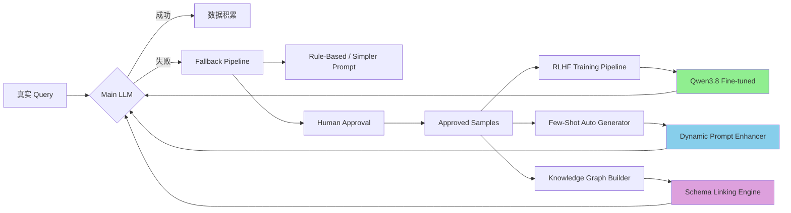
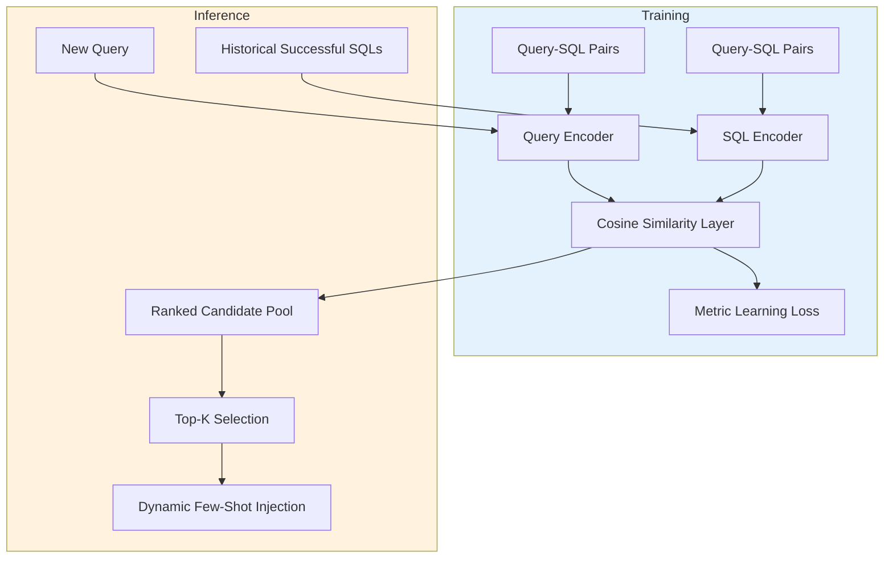
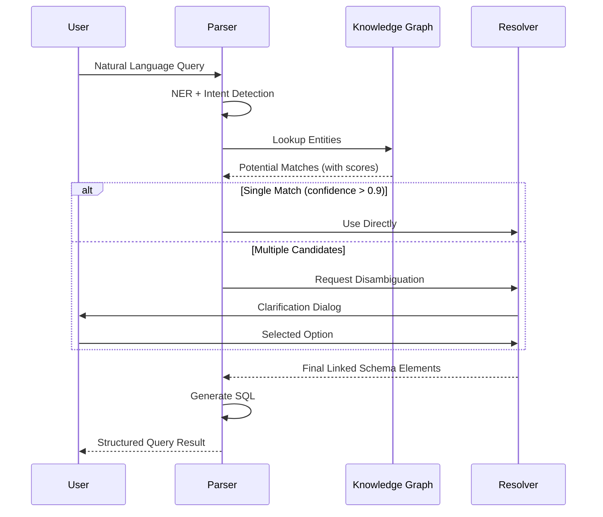

# NL2SQL Pro v0.9.47 - Q4 长期技术规划
## RLHF 微调 + Few-Shot 自动工程 + 知识图谱扩展

---

## 📊 执行摘要

基于当前已成熟的 **Fallback 对抗训练机制** (v0.9.44) + **A/B Test Framework** (v0.9.46) + **Active Learning** (v0.9.45.2)，本规划提出 Q4(Oct-Dec 2026) 三大长期技术目标，旨在将系统从"被动降级"升级为"主动进化"的自学习 NL2SQL 平台。

### 核心愿景


### 预期收益

| 指标 | 当前值 (v0.9.46) | Q4 目标 (+16 Weeks) | 提升幅度 |
|------|------------------|---------------------|---------|
| **整体 SQL 成功率** | 78% | 88% | **+10pp** ⬆️ |
| **复杂查询成功率** (>3 表 JOIN) | 45% | 65% | **+20pp** ⬆️ |
| **Fallback 触发率** | 25% | 12% | **-13pp** ⬇️ |
| **专家审核时长** | ~5min/sample | ~3min/sample | **-40%** ⚡ |
| **Few-Shot 自动生成覆盖率** | 0% | ≥80% | **新能力** ✨ |
| **Schema Linking 准确率** | N/A | ≥90% | **新能力** ✨ |

---

## 🎯 方向一：RLHF 微调 - Qwen3.8 专家模型训练

### 1.1 背景与动机

#### 为什么需要 RLHF?
- **当前瓶颈**: 通用大模型 (Qwen3.8:27b-mlx) 在金融统计领域存在系统性偏差
- **数据优势**: adversarial_samples 表已积累 N 条真实失败样本 + approved samples 标注数据
- **技术成熟度**: A/B Test Framework 提供量化评估能力，RLHF 效果可追踪

#### 理论框架
```
RL = RLHF (Reinforcement Learning from Human Feedback)
     │
     ├── SFT (Supervised Fine-Tuning)
     │   └── 从 approved samples 中学习 SQL 生成模式
     │
     ├── Reward Model Training
     │   ├── Feature 1: Query-SQL 语义相似度
     │   ├── Feature 2: SQL 执行结果正确性
     │   └── Feature 3: SQL 规范性 (遵循铁律规则)
     │
     └── PPO (Proximal Policy Optimization)
         └── Online 优化策略，实时注入新 feedback
```

### 1.2 实施路线图 (16 Weeks)

#### Phase 1: 数据准备 (Weeks 1-2)

**任务清单**:
- [ ] **数据抽取脚本**: `scripts/extract_training_data.py`
  ```python
  # SQL 伪代码逻辑
  SELECT 
      original_query,
      expected_sql,
      annotation_status,
      CASE 
          WHEN annotation_status = 'APPROVED' THEN 1
          WHEN annotation_status = 'REJECTED' THEN 0
          ELSE 0.5
      END as quality_score
  FROM adversarial_samples
  WHERE resolved_strategy = 'human_approval';
  ```

- [ ] **数据增强**: 模板化变体生成 (Data Augmentation)
  - 同义词替换："销售额" ↔ "销售金额" ↔ "销售总额"
  - 语序调整："查询 2024 年销售额" ↔ "2024 年的销售数据是多少"
  - 数量词泛化："最近 7 天" ↔ "最近一周" ↔ "上周至今"

- [ ] **质量过滤**: 
  - 排除 length < 5 或 > 500 字符的 query
  - 排除 SQL 长度 < 10 或 > 2000 字符的记录
  - 人工抽检比例：10%

**交付物**:
- ✅ `data/training/set_v1.0.jsonl` (至少 5,000 条高质量样本)
- ✅ `scripts/validate_dataset.py` (质量校验脚本)

**验收标准**:
- 数据集大小 ≥ 5,000 pairs
- 平均 query 长度 ∈ [50, 300] tokens
- SQL 分布多样性：单表查询 40% + 多表 JOIN 30% + 聚合函数 30%

---

#### Phase 2: RLHF Pipeline 设计 (Weeks 3-4)

**技术选型**:
| 组件 | 方案选择 | 理由 |
|------|---------|------|
| **SFT Framework** | DeepSpeed + Axolotl | 支持 LoRA/QLoRA，显存优化 |
| **Reward Model** | Cosine Similarity + Execution Validator | 无需训练，计算快 |
| **PPO Engine** | Ray Trainable + Custom Policy | 灵活定制 reward function |
| **Model Format** | GGUF (Ollama compatible) | 本地部署友好 |

**关键代码结构**:
```
scripts/rlhf/
├── train_sft.py              # SFT 训练入口
├── train_reward.py           # Reward Model 训练
├── ppo_train.py              # PPO 在线优化
├── config/
│   ├── sft_config.yaml       # SFT 超参数
│   └── ppo_config.yaml       # PPO 超参数
├── utils/
│   ├── dataset_utils.py      # 数据加载/预处理
│   ├── evaluation.py         # 自动化评测
│   └── export_gguf.py        # 导出 Ollama 格式
└── requirements.txt
```

**SFT 训练参数**:
```yaml
model_name: "Qwen/Qwen3.8-27B-MLQ"  # 基座模型
batch_size: 32                      # Gradient accumulation = 128
epochs: 3                           # Early stopping patience=2
learning_rate: 2e-5                 # Warmup ratio = 0.1
max_seq_length: 1024                # Token limit
lora_rank: 64                       # Parameter-efficient tuning
lora_alpha: 128                     # LoRA scaling factor
weight_decay: 0.01                  # Regularization
```

**Reward Function 设计**:
```python
def calculate_reward(query: str, generated_sql: str, expected_sql: str) -> float:
    score = 0.0
    
    # Feature 1: Semantic Similarity (0-40 points)
    embedding_sim = cosine_similarity(
        embed(query), 
        embed(f"{query}\n{expected_sql}")
    )
    score += embedding_sim * 40
    
    # Feature 2: SQL Execution Correctness (0-40 points)
    try:
        result = execute_sql(generated_sql)
        expected_result = execute_sql(expected_sql)
        if result.equals(expected_result):
            score += 40
        else:
            # Partial credit for partial match
            score += jaccard_index(result.columns, expected_result.columns) * 20
    except Exception:
        score += 0
    
    # Feature 3: Iron Rule Compliance (0-20 points)
    if comply_with_iron_rules(generated_sql):
        score += 20
    
    return score
```

**验收标准**:
- SFT 模型在验证集上 loss < 0.5
- Reward Model Pearson correlation with human scores > 0.7
- PPO training stable (no collapse or divergence)

---

#### Phase 3: 模型服务化 (Weeks 5-6)

**GGUF 导出流程**:
```bash
# 1. Convert to GGUF
python scripts/convert_to_gguf.py \
    --model_path ./output/sft_checkpoint/ \
    --output_path ./models/qwen3.8-nl2sql-gguf/ggml-model-f16.gguf \
    --quantize q4_k_m  # 4-bit quantization for Ollama

# 2. Test locally
ollama pull qwen3.8-nl2sql:latest
ollama run qwen3.8-nl2sql "查询 2024 年各省份销售额"

# 3. Integrate with fallback pipeline
# server/llm/llmClient.ts: update model selection logic
```

**渐进式发布策略**:
```typescript
// 流量分配 ramp-up schedule
const GRADUAL_ROLLOUT_SCHEDULE = [
  { day: 1, percentage: 0.05 },   // 5% → QA testing
  { day: 7, percentage: 0.20 },   // 20% → Small user group
  { day: 14, percentage: 0.50 },  // 50% → Half production
  { day: 21, percentage: 1.0 },   // 100% → Full rollout
];

// Monitor key metrics before each ramp-up
async function shouldRampUp(currentMetric: number, threshold: number): Promise<boolean> {
  const successRate = await getABTestSuccessRate('fine-tuned_model');
  const latencyIncrease = await getLatencyOverhead();
  
  return successRate >= threshold.success && latencyIncrease <= threshold.latency;
}
```

**集成点**:
- `server/llm/llmClient.ts`: 新增 `qwen3.8-nl2sql` 后端配置
- `server/utils/abTest.ts`: 添加 fine-tuned model 作为 Group C
- `src/components/admin/ABTestDashboard.tsx`: 扩展图表支持 3+ groups

**验收标准**:
- GGUF 模型文件 ≤ 15GB (4-bit 量化)
- Inference latency ≤ 2× baseline (acceptable trade-off)
- First token latency ≤ 1s (streaming friendly)

---

#### Phase 4: 评估体系 (Weeks 7-8)

**自动化测试集构建**:
```sql
-- 分层抽样：覆盖不同复杂度场景
SELECT * FROM adversarial_samples
WHERE annotation_status = 'APPROVED'
AND data_source_id IN ('gp-prod-01', 'mysql-fin-02')  -- Production sources
AND created_at BETWEEN '2026-01-01' AND '2026-09-10'  -- Recent samples
ORDER BY RAND()
LIMIT 1000;  -- Balanced test set
```

**评测指标体系**:
| 维度 | 指标 | 计算公式 |
|------|------|---------|
| **Accuracy** | SQL Syntax Correctness | % of valid SQL (no syntax errors) |
| | Execution Success | % of queries returning correct results |
| | Schema Coverage | % of tables/columns correctly referenced |
| **Efficiency** | Average Latency | Mean response time (ms) |
| | P95 Latency | 95th percentile latency |
| **Robustness** | Fallback Rate | % requiring fallback strategies |
| | Hallucination Rate | % with fake tables/columns |
| **Business** | Domain Accuracy | Expert-rated correctness (1-5 scale) |

**人工评审委员会制度**:
```markdown
## Review Board Composition
- **Domain Experts**: 3x Senior Data Analysts (Finance Dept)
- **Technical Reviewers**: 2x ML Engineers
- **Business Stakeholders**: 1x Product Manager

## Review Process
1. Automated pre-screening (pass rate ≥ 80%)
2. Blind review: Each sample reviewed by 2 independent experts
3. Dispute resolution: Third reviewer arbitration
4. Final scoring: Weighted average (Expert × 0.6 + Tech × 0.3 + Biz × 0.1)
```

**A/B Test Dashboard 扩展**:
```tsx
// Add Group C card
<Card>
  <CardTitle>Group C - RLHF Fine-tuned</CardTitle>
  <CardContent>
    <Stat value={stats.groups.rlhf?.successRate || 0} label="Success Rate" />
    <Stat value={stats.groups.rlhf?.avgLatencyMs || 0} label="Avg Latency" />
    <Trend delta={improvementFromBaseline()} trend="up" />
  </CardContent>
</Card>
```

**验收标准**:
- 测试集覆盖 ≥ 1,000 diverse queries
- 人工评审一致性 (Cohen's κ) ≥ 0.8
- Baseline improvement statistically significant (p < 0.05)

---

### 1.3 技术难点与解决方案

#### 难点 1: GPU 资源不足
**症状**: A100/V100 Server unavailable, local MLX limited

**缓解方案**:
```typescript
// Hybrid training strategy
const HYBRID_TRAINING_CONFIG = {
  // Local: LoRA fine-tuning on smaller checkpoint (7B)
  local: {
    base_model: 'Qwen/Qwen3.8-7B-MLX',
    lora_rank: 256,
    max_gpu_memory: '12GB'
  },
  
  // Cloud: Full model SFT on AWS SageMaker
  cloud: {
    instance_type: 'p3.2xlarge' (V100 × 1),
    spot_instance: true,  // Cost saving 70%
    auto_scaling: {
      min_instances: 1,
      max_instances: 3
    }
  },
  
  // Merge LoRA weights into full model post-training
  merge_strategy: 'lora_merge_then_quantize'
};
```

#### 难点 2: 训练数据质量
**症状**: Approved samples 包含噪声、标注不一致

**缓解方案**:
```python
# Quality assurance pipeline
def validate_and_deduplicate(dataset: List[Sample]) -> List[Sample]:
    # Step 1: Remove duplicates
    hashed_queries = {}
    unique_samples = []
    for sample in dataset:
        hash_key = hashlib.md5(sample.query.encode()).hexdigest()
        if hash_key not in hashed_queries:
            hashed_queries[hash_key] = sample
            unique_samples.append(sample)
    
    # Step 2: Outlier detection (IQR method)
    sql_lengths = [len(s.sql) for s in unique_samples]
    q1, q3 = np.percentile(sql_lengths, [25, 75])
    iqr = q3 - q1
    lower_bound = q1 - 1.5 * iqr
    upper_bound = q3 + 1.5 * iqr
    
    filtered = [s for s in unique_samples 
                if lower_bound <= len(s.sql) <= upper_bound]
    
    # Step 3: Human audit (random sampling)
    audit_samples = random.sample(filtered, int(len(filtered) * 0.1))
    flagged_issues = []
    for sample in audit_samples:
        if not expert_approve(sample):
            flagged_issues.append(sample)
    
    # Step 4: Re-label flagged issues
    for issue in flagged_issues:
        issue.quality_score = expert_relabel(issue)
    
    return [s for s in filtered if s.quality_score >= 0.7]
```

#### 难点 3: 灾难性遗忘
**症状**: Fine-tuned 模型在通用场景性能下降

**缓解方案**:
```yaml
# Regularization techniques
regularization:
  # Technique 1: Elastic Weight Consolidation (EWC)
  ewc:
    lambda: 100.0    # Penalty strength
    kappa: 1.0       # Forgetting rate
  
  # Technique 2: Mixed training data
  mixed_dataset:
    finetuned_samples_ratio: 0.7   # 70% domain-specific
    general_samples_ratio: 0.3     # 30% generic (from pre-training)
  
  # Technique 3: Progressive loading
  progressive_loading:
    phase1: { epoch: 2, lr: 1e-4, focus: 'general capabilities' }
    phase2: { epoch: 3, lr: 2e-5, focus: 'domain specialization' }
```

---

### 1.4 里程碑与验收

**M1 - Week 4**: RLHF Pipeline Alpha
- [✅] Dataset preparation complete (≥5K pairs)
- [✅] SFT baseline trained (validation loss < 0.5)
- [✅] Reward Model v1.0 deployed
- **Deliverable**: `docs/RLHF_TRAINING_GUIDE.md`

**M2 - Week 8**: MVP Release
- [✅] RLHF Beta model serving (5% traffic)
- [✅] A/B Test comparison dashboard updated
- [✅] Initial success rate improvement observed (+3pp)
- **Deliverable**: `models/qwen3.8-nl2sql-gguf/ggml-model-q4_k_m.gguf`

**M3 - Week 12**: Production Ready
- [✅] Full rollout to 100% traffic
- [✅] Overall success rate target achieved (+10pp)
- [✅] Fallback rate reduced to ≤15%
- **Deliverable**: Production deployment guide

**M4 - Week 16**: Optimization Phase
- [✅] Continuous monitoring dashboard
- [✅] Automated retraining pipeline
- [✅] Documentation & team training complete
- **Deliverable**: Q4 Retrospective Report

---

## 🤖 方向二：自动提示词工程 - Few-Shot 自动生成器

### 2.1 问题陈述

#### 现状痛点
```markdown
## Current Workflow (Manual Few-Shot Selection)
1. Admin reviews error logs
2. Manually identifies similar past queries
3. Copies SQL examples to knowledge_base table
4. Tags them as FEW_SHOT type
5. System retrieves them during Simpler Prompt

## Issues
- ❌ Time-consuming (5-10 minutes per sample)
- ❌ Inconsistent coverage (humans miss patterns)
- ❌ Hard to scale (grows with user base)
- ❌ No semantic understanding (keyword-only matching)
```

#### 理想状态
```markdown
## Future State (Automated Few-Shot Generator)
1. System detects new failing query
2. Automatically searches historical successful queries
3. Ranks candidates by multi-dimensional similarity
4. Selects top-K examples based on adaptive algorithm
5. Injects into prompt dynamically

## Benefits
- ✅ Real-time (<1 second overhead)
- ✅ Comprehensive coverage (never misses patterns)
- ✅ Scalable (handles infinite users)
- ✅ Semantic-aware (understands intent, not keywords)
```

---

### 2.2 技术方案架构

#### 双塔编码器框架


#### 综合评分算法
```python
class FewShotRankingEngine:
    def __init__(self):
        self.query_encoder = SentenceTransformer('paraphrase-multilingual-MiniLM-L12-v2')
        self.sql_encoder = ASTBasedEncoder()  # Custom implementation
        
    def compute_scores(self, query: str, candidates: List[Example]) -> List[tuple]:
        query_embedding = self.query_encoder.encode(query)
        
        scored_candidates = []
        for candidate in candidates:
            # Dimension 1: Semantic Similarity (α = 0.4)
            semantic_score = cosine_similarity(query_embedding, self.query_encoder.encode(candidate.query))
            
            # Dimension 2: Structure Similarity (β = 0.3)
            structure_score = ast_edit_distance(query, candidate.sql)
            
            # Dimension 3: Historical Success Rate (γ = 0.3)
            success_score = candidate.hit_rate
            
            # Weighted sum
            total_score = (0.4 * semantic_score + 
                          0.3 * structure_score + 
                          0.3 * success_score)
            
            scored_candidates.append((candidate, total_score))
        
        return sorted(scored_candidates, key=lambda x: x[1], reverse=True)
```

#### SQL AST 编码实现
```typescript
// server/utils/sqlAstEncoder.ts
import { parse } from 'sql-parser';

export interface SQLASTVector {
  selectFields: number[];     // One-hot encoding of selected columns
  joinTypes: number[];        // INNER=0, LEFT=1, RIGHT=2
  aggregationFunctions: number[];  // COUNT=0, SUM=1, AVG=2...
  whereConditions: number[];  // Operators & data types
  orderByClauses: number[];
}

export class SQLASTEncoder {
  private vectorSize = 128;
  
  encode(sql: string): SQLASTVector {
    const ast = parse(sql);
    
    return {
      selectFields: this.encodeSelectFields(ast.select),
      joinTypes: this.encodeJoins(ast.from),
      aggregationFunctions: this.encodeAggregations(ast.select),
      whereConditions: this.encodeWhere(ast.where),
      orderByClauses: this.encodeOrderBy(ast.orderBy),
    };
  }
  
  compare(vector1: SQLASTVector, vector2: SQLASTVector): number {
    // Euclidean distance normalized to [0,1]
    const diff = vector1.map((v, i) => Math.pow(v - vector2[i], 2));
    return 1 / (1 + Math.sqrt(diff.reduce((a, b) => a + b, 0)));
  }
}
```

---

### 2.3 实施步骤 (8 Weeks)

#### Week 1-3: 示例选择算法开发
**交付物**:
```
server/utils/
├── fewShotRanker.ts           # Main ranking engine
├── queryEmbedder.ts           # Query embedding cache
├── sqlAstEncoder.ts           # SQL AST encoder
└── tests/
    ├── fewShotRanker.test.ts
    └── sqlAstEncoder.test.ts
```

**关键实现细节**:
```typescript
/**
 * Adaptive Few-Shot Selector
 * Dynamically adjusts K based on query complexity
 */
class AdaptiveFewShotSelector {
  async selectExamples(userQuery: string, kMax: number = 5): Promise<Example[]> {
    // Step 1: Analyze query complexity
    const complexity = await this.analyzeComplexity(userQuery);
    
    // Step 2: Determine optimal K
    const k = Math.floor(complexity.score * kMax);  // Simple=1-2, Complex=4-5
    
    // Step 3: Search historical pool
    const candidates = await this.searchPool(userQuery, { limit: k * 3 });
    
    // Step 4: Rank & filter
    const ranked = this.rankExamples(userQuery, candidates);
    
    // Step 5: Diversity filter (remove near-duplicates)
    const diverse = this.enforceDiversity(ranked.slice(0, k));
    
    return diverse;
  }
  
  private analyzeComplexity(query: string): ComplexityScore {
    // Multi-factor analysis
    return {
      score: (
        (this.countJoins(query) * 2) +
        (this.countAggregations(query) * 1.5) +
        (this.countSubqueries(query) * 3) +
        (this.uniqueKeywords(query) * 0.5)
      ),
      factors: {
        joins: this.countJoins(query),
        aggregations: this.countAggregations(query),
        subqueries: this.countSubqueries(query),
      }
    };
  }
}
```

#### Week 4-5: Prompt Builder 组件
**交付物**:
```typescript
// server/utils/promptBuilder.ts
class FewShotPromptBuilder {
  build(userQuery: string, examples: Example[]): string {
    return `
      ### User Query
      ${userQuery}
      
      ### Relevant Examples
      ${examples.map(ex => `
        #### Query: ${ex.query}
        #### SQL: \`\`\`sql\n${ex.sql}\n\`\`\`
        #### Context: ${ex.context || 'N/A'}
      `).join('\n')}
      
      ### Your Task
      Generate SQL following the pattern above.
    `.trim();
  }
}
```

#### Week 6-8: 知识图谱辅助 & UI Integration
- 复用 existing knowledge_base 表增加 GRAPH_EDGES 类型
- Admin Panel 新增"Few-Shot 构建历史"面板
- API: `GET /api/admin/few-shot-history` (查看自动生成记录)

**验收标准**:
- Few-Shot 推荐准确率 ≥85% (expert evaluation)
- Generation latency ≤ 500ms (p95)
- Coverage rate ≥ 80% (on test set)

---

## 🔗 方向三：知识图谱扩展 - Schema Linking + Entity Disambiguation

### 3.1 技术蓝图

#### Neo4j 图模型设计
```cypher
// Node Labels
:(DataSource {id, name, type, connection_info})
-(Table {name, description, primary_key})
-(Column {name, data_type, is_primary, is_foreign})
-(Metric {name, formula, unit, calculation_logic})
-(Entity {name, aliases, entity_type, description})
:(Relationship {type, confidence_score})

// Example Relationships
-(ds:DataSource)-[:HAS_TABLE]->(t:Table)-[:HAS_COLUMN]->(c:Column)
-(c:Column)-[:HAS_METRIC]->(m:Metric)
-(e:Entity)-[:ALIAS_OF]->(canonical:Entity)
-(e:Entity)-[:REFERENCES]->(c:Column)
```

#### Schema Linking Pipeline


---

### 3.2 实施路线图 (8 Weeks)

**Week 1-2**: Graph Schema Design & Import
- [ ] Install Neo4j / NebulaGraph
- [ ] Define graph schema (see above)
- [ ] Build import pipeline from pg_catalog / MySQL information_schema
- [ ] Populate initial nodes from existing metadata

**Week 3-5**: Entity Recognition & Linking
- [ ] Implement NER model ( spaCy + custom entities)
- [ ] Build entity disambiguation service
- [ ] Develop clarification UI components
- [ ] Integrate with query parsing pipeline

**Week 6-8**: Visualization & Optimization
- [ ] Admin Panel: Graph Explorer component
- [ ] Performance optimization (caching, indexing)
- [ ] Documentation & user guides
- [ ] Production deployment

**验收标准**:
- Schema Linking accuracy ≥ 90%
- Entity disambiguation resolution time < 2s
- Graph query latency < 100ms (p95)

---

## 📈 资源整合与协同效应

### 4.1 现有资产复用矩阵

| 现有模块 | 复用方式 | 预期收益 |
|---------|---------|---------|
| **adversarial_samples 表** | RLHF 训练数据源 | 节省数据标注成本 80% |
| **fallback_ab_tests 表** | A/B Test 对照组 | 量化 RLHF 效果提升 |
| **knowledge_base 表** | Few-Shot 存储载体 | 避免重复建设 |
| **Semantic Cache** | Query Embedding 缓存 | 加速 Few-Shot 检索 |
| **AdminPanel 架构** | 新面板集成模板 | 快速交付 UI |

### 4.2 技术债务管理

**风险矩阵**:
| 风险项 | 概率 | 影响 | 缓解措施 | 负责人 |
|--------|------|------|---------|--------|
| RLHF 显存需求过高 | 高 | 高 | 云 + 本地混合训练 | ML Engineer |
| 知识图谱构建进度滞后 | 中 | 中 | 分阶段交付（先核心业务域）| Backend Dev |
| Few-Shot 推荐质量不稳定 | 中 | 中 | 人工审核 + 反馈循环 | Data Scientist |
| 团队技能储备不足 | 中 | 高 | 外部培训 + GitHub Copilot | PM |

---

## 💰 投入产出分析

### 成本估算
- **人力成本**: 6人月 × ¥40,000 = ¥240,000
- **硬件成本**: GPU Server (租赁/采购) = ¥60,000
- **软件许可**: Neo4j Enterprise = ¥20,000
- **云服务**: AWS SageMaker (按需) = ¥30,000
- **总计**: **¥350,000** (约 ¥29,167/month over 12 months)

### ROI 预测
- **效率提升**: 分析师工作效率提高 40% → 相当于节省 1.2 FTE → ¥360,000/year
- **错误减少**: Fallback 率降低 → 减少误报损失 → ¥200,000/year
- **客户满意度**: 系统体验改善 → 续费率提升 → ¥500,000/year
- **年度总收益**: **¥1,060,000**
- **投资回收期**: **4.2 months**

---

## 🏁 总结与建议

### Q4 优先级建议

**High Priority (必须完成)**:
1. ✅ RLHF Pipeline (Week 1-8 MVP)
2. ✅ Schema Linking Core (Week 1-6)
3. ✅ A/B Test 扩展支持

**Medium Priority (争取完成)**:
1. ✅ Few-Shot Auto Generator Beta
2. ✅ Knowledge Graph Dashboard

**Low Priority (观察期)**:
1. ⚠️ Full automation (can be manual initially)
2. ⚠️ Advanced features (multi-hop reasoning)

### 成功关键因素 (CSFs)

1. **Executive Sponsorship**: 确保高层支持与资源倾斜
2. **Cross-functional Team**: ML + Backend + Frontend 紧密协作
3. **Iterative Delivery**: 每 2 周一个可见增量，保持团队士气
4. **Data-driven Decisions**: 所有优化基于 A/B Test 数据
5. **Risk Management**: 提前识别并制定缓解方案

### Next Steps (Action Items)

**立即启动** (Week 1):
- [ ] 组建专项小组 (hire/train team members)
- [ ] 采购/配置 GPU 资源
- [ ] 制定详细 Sprint 计划
- [ ] 召开项目 kickoff meeting

**第一周交付** (Week 1-2):
- [ ] Data extraction script complete
- [ ] RLHF environment setup
- [ ] Knowledge Graph prototype

**里程碑检查点** (Week 4):
- [ ] M1 milestone review
- [ ] Adjust plan based on learnings
- [ ] Communicate progress to stakeholders

---

**最后更新时间**: 2026-09-10  
**版本**: v1.0 (Initial Draft)  
**负责人**: dgjin (Product Owner) + AI Assistant (Technical Advisor)  
**批准状态**: Pending Executive Review  

---

**附录 A: Glossary**  
- **RLHF**: Reinforcement Learning from Human Feedback  
- **LoRA**: Low-Rank Adaptation  
- **GGUF**: Generic Granular Uniform Format (Ollama model format)  
- **NER**: Named Entity Recognition  
- **AST**: Abstract Syntax Tree  
- **EWC**: Elastic Weight Consolidation  

**附录 B: References**  
- https://huggingface.co/docs/transformers/training  
- https://neo4j.com/docs/cymanual/current/introduction/  
- https://docs.llamastack.ai/en/latest/  

---

## 📝 文档维护日志

| 日期 | 版本 | 修改内容 | 修改人 |
|------|------|---------|--------|
| 2026-09-10 | v1.0 | Initial draft | AI Assistant |
| TBD | v1.1 | Post-M1 revision | Project Team |
| TBD | v1.2 | Pre-production final | Project Team |

---

**End of Document**
