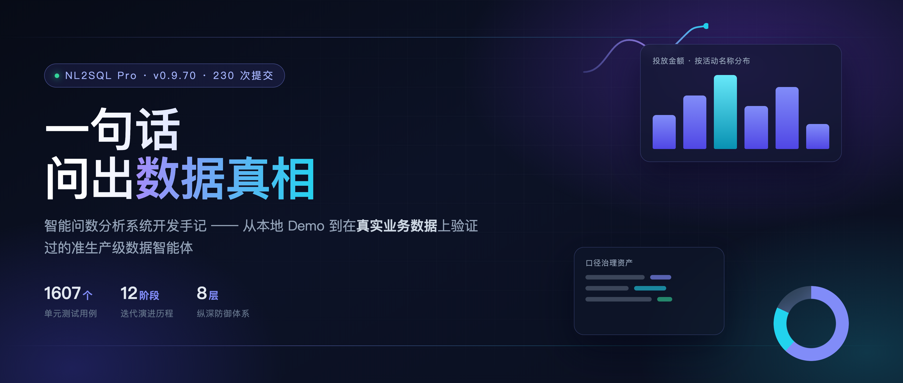
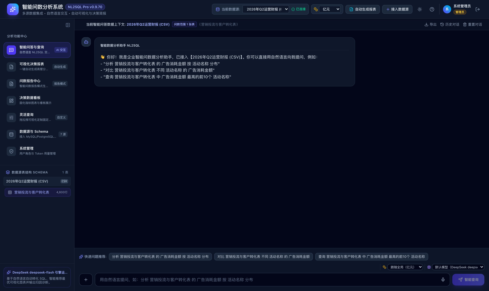
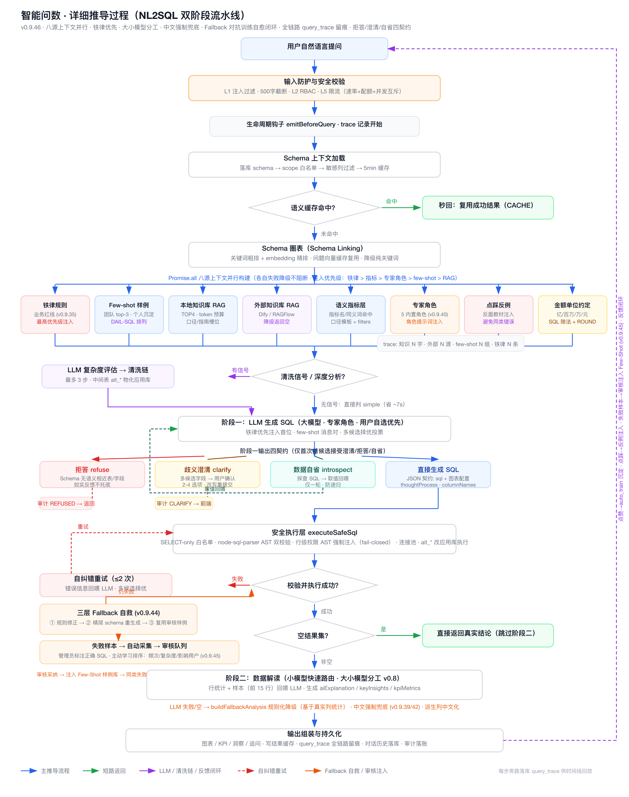
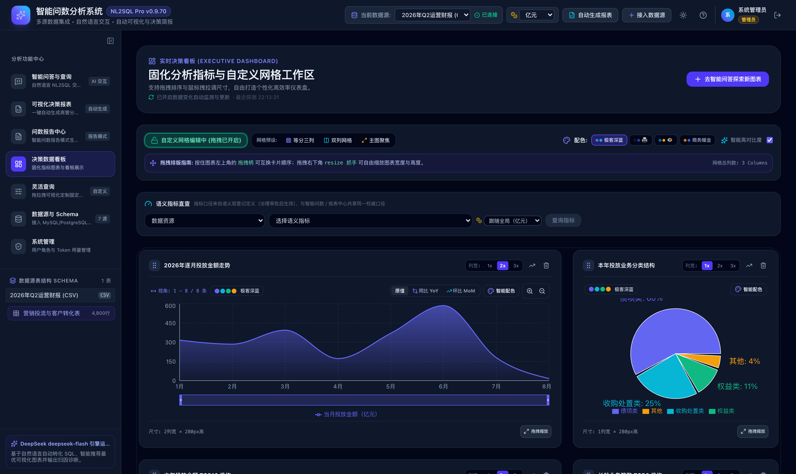
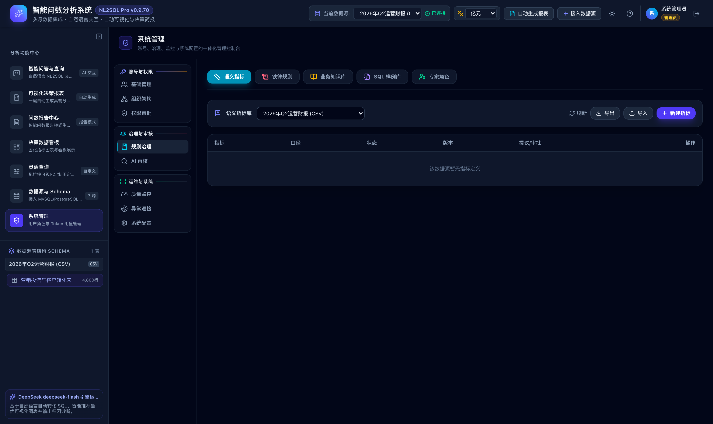
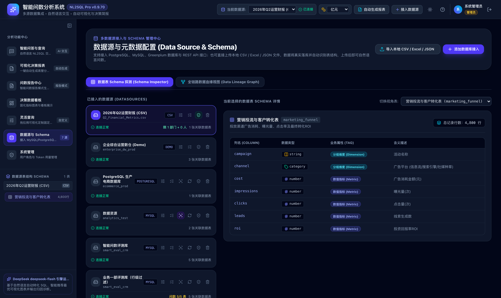
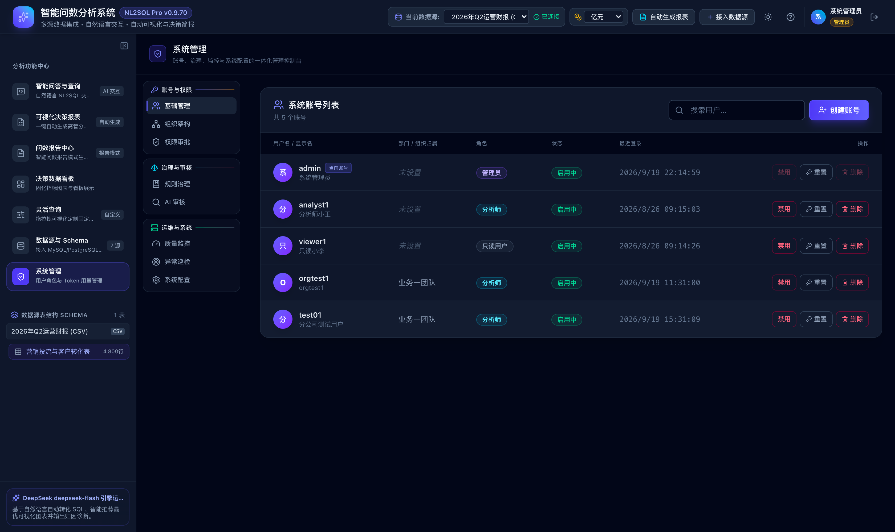
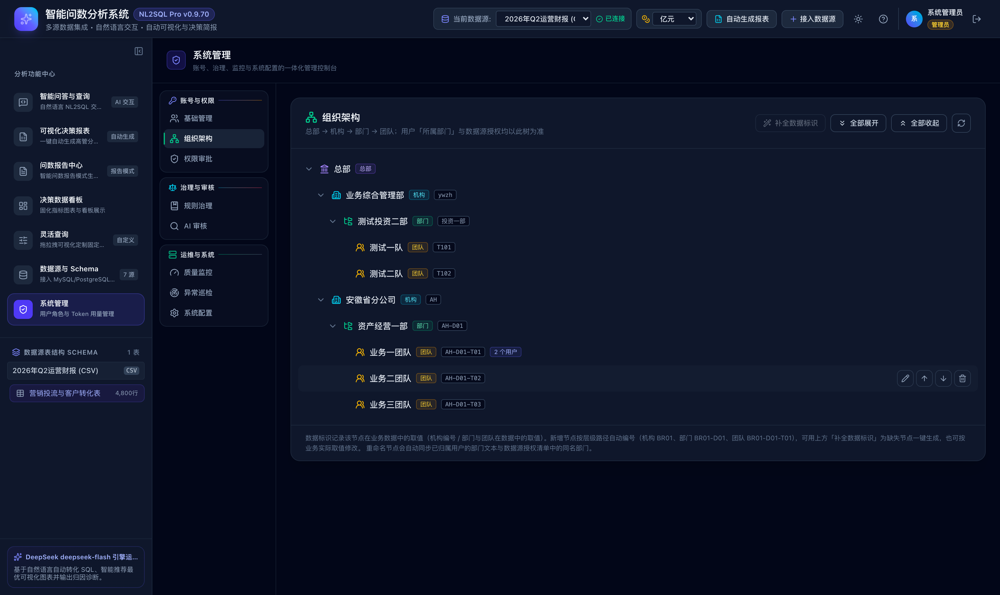
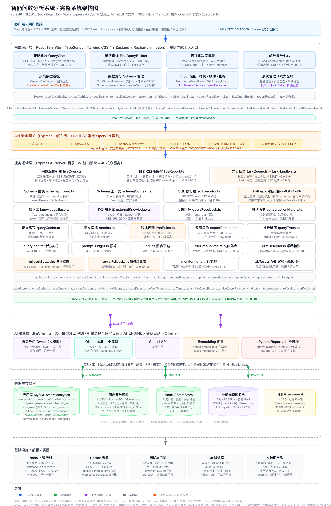
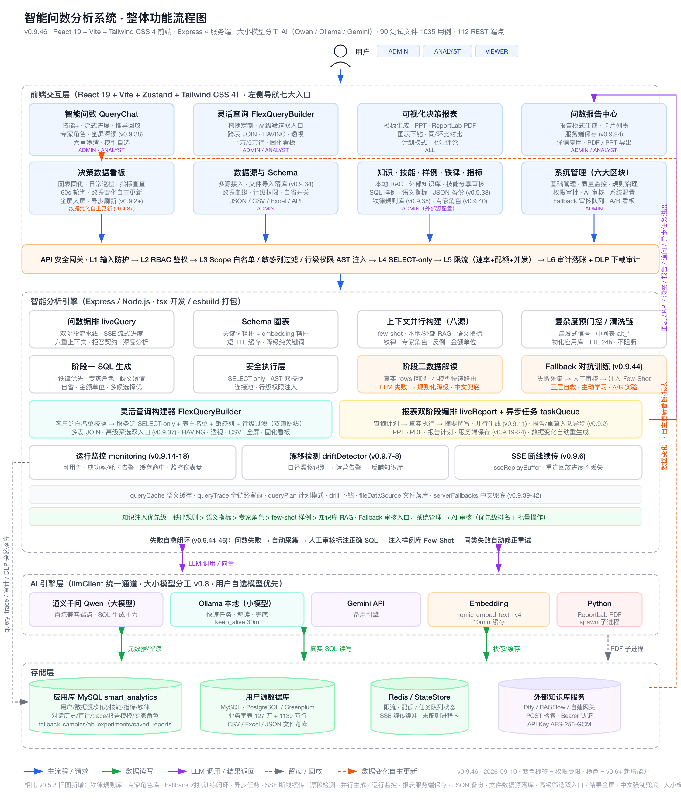

# 一句话，问出数据真相：一个企业级智能问数系统的开发手记

> **39204 亿。**
>
> 这是系统对「累计投放金额」给出的答案。而真实值，不到它的十七分之一。
>
> 这个数字来自一次内部核对。没有客户投诉，没有线上事故——但它让我意识到：**一个会说谎的数据系统，比一个不会用的系统危险得多。**

这篇文章记录我如何把一个 NL2SQL Demo，做成在真实业务数据上验证过的准生产级数据智能体。有功能亮点，也有踩过的坑和至今没解决的短板。

---

## 导读

- **230 次提交、12 个迭代阶段**：从本地 Demo 起步，经历权限重建、真实数据链路改造、四轮业界对标、全本地引擎迁移、口径治理资产化、质量评测体系建立
- **核心不是"让 AI 写 SQL"，而是"让 AI 不乱写 SQL"**：双阶段架构 + 四契约输出 + 四层口径防线
- **准确率不是汇报数字，而是 CI 阻断条件**：`npm run eval -- --min-accuracy 85` 不达标即红灯
- **最诚实的部分**：单表聚合准确率 94.4% 已近人类水位，但多维度组合仅 41.7%——这是当前最大的短板

---

## 一、为什么"能跑通"和"能信任"差着十万八千里

最初的需求很朴素：业务同事想查个数，不用等 IT 排期，直接用中文问一句就行。

第一版很快就跑通了。自然语言进，SQL 出，图表自动渲染。演示效果很好——直到我们把它接到真实业务库上。

问题不是"查不出来"，而是**它查出来了，但答案是错的，而且错得看不出来**。

### 坑 1：39204 亿——快照表跨期累加的陷阱

业务表是宽表快照结构：每月末给全部业务打一个快照，同一笔业务会在多个月份反复出现。

大模型生成的 SQL 逻辑上"完全正确"：

```sql
SELECT SUM(投放金额) FROM 业务宽表 WHERE 年份 = 2026
```

但它犯了三个错，每一个都致命：

1. **跨期累加**——12 个月快照全加了一遍，同一笔业务被算 12 次
2. **没锁核算版**——同一笔业务存在多个核算版本，应只取最新版
3. **没去重**——业务编号重复计入

结果就是虚增近 17 倍。

更可怕的是：如果我没有拿真实数字去核对，这个答案会一路畅通地出现在高管简报里。**它看起来完全合理。**

### 坑 2：模型幻觉编造了一个不存在的列

「长龄业务笔数及占比」这个查询返回空结果。排查半天，归因是 `YJFL = '收购处置类'` 没有匹配到数据。

真相是：评测期间我临时把引擎切到了 8b 小模型，忘了切回来。8b 模型**编造了一个根本不存在的列名**——正确的列应该是「是否长龄」标志列。

切回 27b 主模型后，查询立刻正确（1824/3212，占比 56.79%）。

这条教训我写进了项目铁律：**临时切换模型必须设切回检查点；出了问题先怀疑环境变更，再怀疑代码。**

### 坑 3：评测器自己制造了 20% 的假失败

宽表评测首轮，准确率只有 20%。我几乎要开始怀疑模型能力了。

但真相是：**评测器用字符串等值比较结果**。系统生成的 SQL 带 `ROUND(x, 2)`，与标准答案的全精度结果被判为"不相等"。

修复方式是引入数值容差比较。准确率立刻回到正常水位。

> **教训：评测工具本身的缺陷，会制造"系统性假失败"。先校验评测器，再归因模型。**

### 坑 4 和 5

另外还有两个：**package.json 少个尾逗号导致发布后启动失败**（`ERR_INVALID_PACKAGE_CONFIG`），以及**复杂查询超时把并发槽位锁死、后续查询全部无法发起**——后者要分三层治：资源释放、调用韧性、路由分流。

---

## 二、功能亮点：不是"能查数"，而是"敢用"

### 亮点 1：智能问数——双阶段架构从机制上杜绝"AI 编数字"



关键设计是**双阶段架构**：

- **阶段一不接触数据**：只根据 Schema 和业务口径生成并执行 SQL，拿到真实结果
- **阶段二不接触 Schema**：只根据真实结果生成自然语言解读

两个阶段的上下文严格隔离。这样做的原因很直接——**只要模型能同时看到数据和 Schema，它就有机会"编一个看起来合理的数字"**。物理隔离是最可靠的约束。



推导过程全程可视：从问题理解、Schema 召回、SQL 生成到结果校验，每一步都可追溯。

配套的还有**四契约输出**：

| 契约 | 含义 |
|---|---|
| 生成 | 能答的问题，给出 SQL + 结果 + 解读 |
| 澄清 | 有歧义时反问，不猜（如"上个月"指自然月还是最近 30 天） |
| 自省 | 结果可疑时主动确认数据取值 |
| **拒答** | **与当前数据源无关的问题，如实拒答并说明理由** |

拒答这一条最容易被当成"能力不足"，但在金融场景里，**宁可拒答，不可胡答**是信任的基石。实测中澄清与拒答两类行为的准确率都是 100%。

### 亮点 2：可视化决策报表与决策看板


一键生成高管分析简报，支持报告计划模式（批准后生成）、PPT 下载、PDF/Excel/Word 导出、图表批注与点击下钻。



看板还带了几个进阶能力：**时序预测**（移动平均/线性回归/季节分解自动回测择优）、**多维归因**（最新两期贡献度拆解、正负分离排序）、**情景推演**（按"如果……会怎样"改写固化 SQL → 安全校验 → 双执行对比）。

### 亮点 3：口径治理四层防线——39204 亿事故的遗产



那次事故最大的价值，是催生了一套**不依赖模型自觉**的口径治理体系：

| 防线 | 作用 |
|---|---|
| L1 业务知识库 | 术语与业务口径检索注入 |
| L2 指标库 | 把易错口径固化为受治理的指标资产，含审批与版本 |
| L3 SQL 样例库 | 正例参考 + **反例只给错误特征、不给完整错误 SQL**（防照抄污染） |
| L4 铁律红线 | 硬编码约束：快照期 MAX 子查询、版本过滤、COUNT DISTINCT、表路由 |

**核心思路：语义和口径缺陷优先改配置，而不是打代码补丁。** 更快、更安全、可回滚、可测试。

事故修复后，同类错误归零。

### 亮点 4：企业级安全与组织架构



**八层纵深防御**：输入防护（截断 + 注入检测）→ 鉴权 → 限流（速率 + 配额 + 并发槽位）→ Schema 白名单 → 敏感过滤 → 只读 SQL 执行 → 审计落账 → 可观测日志。

其中行级权限不是靠提示词约束，而是**在执行层做 AST 注入，fail-closed**——谓词解析失败或回写失败一律拒绝。**提示词可以被绕过，执行层不能。**

管理控制台按「账号与权限 / 治理与审核 / 运维与系统」三域分为 8 个分类，用户、组织、审批、规则、监控、配置集中在一处：



最新加入的是组织架构管理：



总部 → 机构 → 部门 → 团队四级组织树。这里有个容易被忽略的细节：**用户「所属部门」文本是数据源可见性 ACL 的匹配键**。所以节点改名时必须同步改写用户部门文本与数据源授权清单——否则被授权的用户会被静默挡在数据源之外，而且**没有任何报错**。这类"静默失效"是最难排查的问题。

### 技术架构





技术栈：React 19 + Vite + TypeScript + Tailwind 4 + Zustand / Express 4 + Node.js + MySQL + Redis，全本地 Ollama 引擎可切换（数据零出域）。

---

## 三、工程化：把"准确率"变成一道门禁

这一条我认为是整个项目里最有价值的决定。

准确率如果只是一个汇报数字，它会随着时间悄悄退化。所以我们把它变成了 **pre-push 门禁**——推送前必须通过 7 道检查：

1. tsc 主 tsconfig
2. tsc server strict
3. tsc 前端 strictNullChecks
4. **OpenAPI 契约同步校验**（代码路由与文档双向比对，防止 API 漂移）
5. 进程内状态巡检
6. ESLint（error 级）
7. **全量单元测试**

当前状态：**1607 个测试用例、114 个测试文件**，全部通过。

质量治理的成果也很直观：

| 指标 | 治理前 | 治理后 |
|---|---|---|
| 业务代码 `any` | 488 ~ 546 | **0** |
| `console.*` 散落调用 | 34 | **0** |
| TODO/FIXME/HACK | 5 | **0** |
| 单元测试用例 | 1123 | **1607** |
| 路由测试覆盖 | 30:8 | **31:20** |
| >1000 行文件 | 4 | **2** |

---

## 四、诚实的短板：我不想只讲好听的

评测口径先说清楚——**执行准确率 = 生成 SQL 与标准答案的执行结果集关系等价**（行内排序 + 行间多重集对齐 + 数值容差），对别名、列序、等价写法天然宽容，只关心数值正确性。这比字符串比对严谨得多。

业务实测集（54 条）结果：

| 分类 | 准确率 | 解读 |
|---|---|---|
| 单表聚合 | **94.4%** | 已近人类水位（BIRD 人类基准 92.96%） |
| 歧义澄清 | **100%** | 机制有效 |
| 拒答边界 | **100%** | 把握准确 |
| 嵌套子查询 | 75.0% | 基本可用 |
| 时间语义 | 62.5% | 弱在相对时间锚定 |
| **多维度组合** | **41.7%** | **最大短板** |

还有两个比准确率均值更危险的问题：

- **同集三次运行波动 44.4% ~ 75.9%**（31 个百分点）
- **耗时波动 72s ~ 629s**（8.7 倍）

工程视角看，**体验不可预期比准确率低更致命**——用户无法建立信任，单点评测也无法作为质量依据。

所以我的结论是：当前优先要做的不是加功能，而是两个专项攻坚（多维度组合、时间语义）+ 两项基础工程（评测稳定性、值级检索）。

---

## 五、写在最后：几条我认为可复用的经验

1. **评估驱动开发**：每轮大改前先出评估报告并做 P0-P3 分级，批准后执行，执行后回归验证
2. **口径资产化**：口径不靠模型自觉，靠知识库/指标库/红线三层资产锁定
3. **四红线思维**：凡快照型宽表，先问"锁定期了吗、防重了吗、去重了吗、走对表了吗"
4. **配置优于补丁**：语义缺陷改配置，不改代码
5. **模型分工观**：主模型保正确性、快速模型保响应、纯推理模型不上生产链路（思考链过长必超时）
6. **让机器守住质量**：准确率、契约、类型、测试——能自动化的门禁，绝不靠人记得

回到开头那个 39204 亿。

它教会我的不是"怎么写对 SQL"，而是——**在企业级场景里，一个数据系统的第一职责不是"能回答"，而是"知道自己在什么情况下不该回答"。**

这个项目目前的准确率还谈不上优秀，多维度组合还是明显短板。但至少现在，它不会再给出一个"看起来很合理的错误答案"而不被发现了。

---

*项目已在 GitHub / Gitee 开源：`smart-data-analytics`*
*技术栈：React 19 · TypeScript · Express · MySQL · Redis · Ollama*
