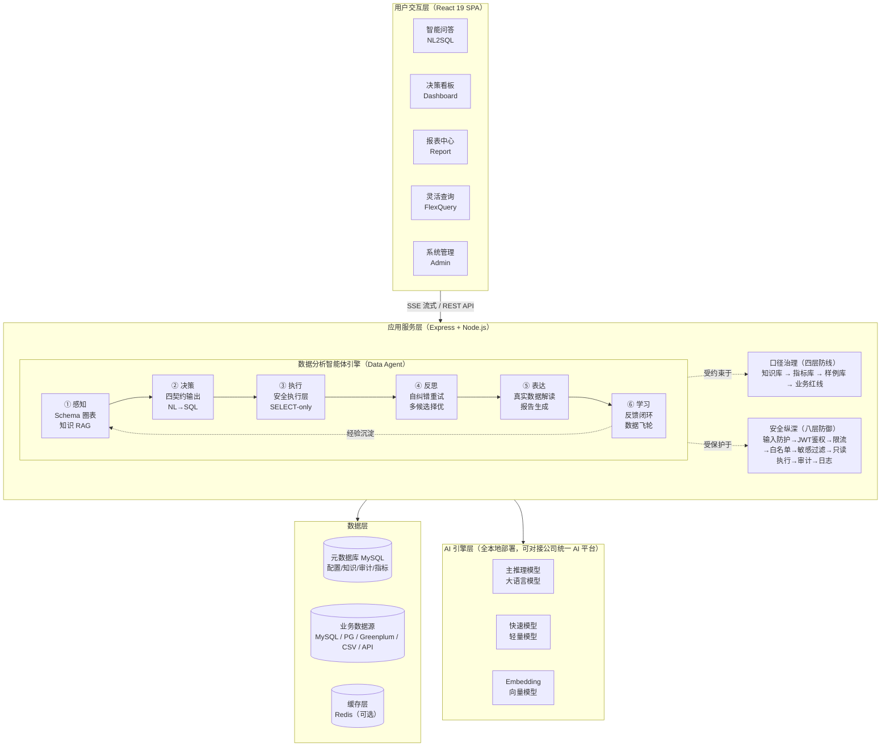
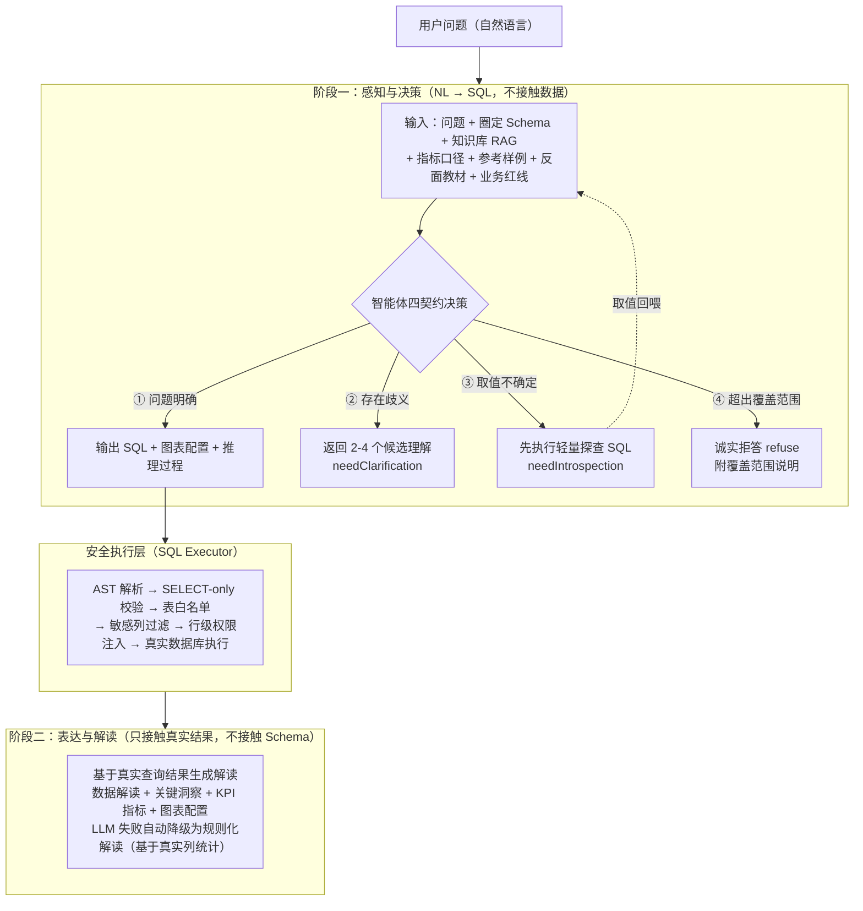

# 智能问数分析系统（NL2SQL Pro）— 方案设计说明

> 参赛赛道：智能创新赛道（AI 赋能金融技能大赛）
> 版本：v0.8.5 ｜ 日期：2026-08-25

---

## 一、总体架构

### 1.1 架构图



> 架构图使用 Mermaid 绘制，支持在 Markdown 阅读器中直接渲染，亦可导出为 PNG/SVG 用于汇报材料。

### 1.2 技术选型

| 层级 | 技术 | 选型理由 |
|------|------|----------|
| 前端 | React 19 + Vite + TypeScript + Tailwind CSS + Zustand + Recharts | 类型安全、组件化、响应式状态管理 |
| 后端 | Express 4 + Node.js（tsx 开发 / esbuild 打包） | 轻量高效、生态成熟 |
| 元数据库 | MySQL 8 | 事务支持、JSON 字段、企业级可靠性 |
| 业务数据源 | MySQL / PostgreSQL / Greenplum / CSV / API | 多源异构接入能力 |
| AI 引擎 | Ollama（本地部署） | 数据零出域、离线可用、零 API 成本；推理接口兼容 OpenAI 标准协议，**可无缝切换至公司统一 AI 平台** |
| 主模型 | 27B 参数级大语言模型（MLX 框架优化） | 中文理解强、推理准确、消费级硬件可运行 |
| 快速模型 | 8B 参数级轻量模型 | 简单查询分流，提速约 50% |
| Embedding | 本地向量模型 | 圈表精排 + 知识检索向量化 |
| SQL 安全 | AST 解析器 | 行级权限注入、SELECT-only 校验 |
| PDF 导出 | 服务端排版引擎 | 矢量文本、中文字体内置、跨平台稳定 |
| 测试 | 690 单元测试 + E2E + 100+ 条 NL2SQL 评测集 | 三层质量保障 |

---

## 二、数据分析智能体（Data Agent）引擎设计

本项目的核心不是"NL2SQL 转换器"，而是一个遵循**感知 → 决策 → 执行 → 反思 → 表达 → 学习**工作闭环的数据分析智能体：

| 环节 | 对应模块 | 智能体能力 |
|------|----------|-----------|
| 感知 | Schema 圈表 + 知识 RAG + 指标命中 | 理解与问题相关的数据环境和业务语义 |
| 决策 | 四契约输出（生成/澄清/自省/拒答） | 自主判断"该答、该问、该查、该拒" |
| 执行 | 安全执行层（SELECT-only + 行级权限） | 在硬性安全边界内真实取数 |
| 反思 | 自纠错重试 + 多候选表决 + 评测回归 | 发现错误并自主修正 |
| 表达 | 图表推荐 + 真实数据解读 + 报告生成 | 将结果转化为业务可读的洞察 |
| 学习 | 点赞沉淀 / 点踩反例 / 个人记忆 | 从每次交互中积累领域经验 |

以下按核心机制展开。

### 2.1 双阶段生成架构



**关键设计决策**：

- **阶段一不接触数据**：只生成 SQL，不生成任何数值，从机制上杜绝「AI 编数字」
- **阶段二不接触 Schema**：只拿到查询结果的行数据，解读永远基于真实数据
- **四契约输出**：宁可拒答/澄清，不可强行生成错误 SQL

### 2.2 Schema 圈表（Schema Linking）

超宽表（数百列）全量注入 prompt 会导致 token 爆炸，圈表机制自动选择与问题相关的表和列：

```
用户问题
  │
  ├─→ 关键词粗排（表名/列名/描述匹配）
  │     ↓
  ├─→ Embedding 精排（向量化，余弦相似度）
  │     ↓
  └─→ 列级裁剪（数百列宽表压至 ~30 列注入 prompt）
        ↓
  输出：精简 Schema（仅相关表 + 相关列）
```

**降级策略**：Embedding 模型不可用时自动降级为纯关键词匹配，不阻断主链路。

### 2.3 自纠错与多候选择优

```
首次生成（1 候选）
  │
  ├─→ SQL 校验通过 → 执行 → 成功 → 返回结果
  │
  └─→ 校验/执行失败
        │
        ▼
  重试（N 候选并行生成，Promise.allSettled）
        │
        ▼
  Self-Consistency 多数表决择优
        │
        ▼
  最优候选 → 执行 → 返回结果
```

**复杂度分档路由**：
- 简单单表查询 → 快速模型，1 候选
- 复杂/多表查询 → 主模型，多候选择优

> 关键决策：同源多候选表决无法纠正系统性偏差（如去重计数遗漏），因此复杂问题强制走主模型保口径正确性。

---

## 三、口径治理体系设计

### 3.1 四层防线架构

```
┌─────────────────────────────────────────────────────────┐
│                    用户提问                              │
└────────────────────────┬────────────────────────────────┘
                         │
                         ▼
┌─────────────────────────────────────────────────────────┐
│  L1 知识库（RAG 检索注入）                               │
│  业务术语、指标口径、易错反例文档                          │
│  → 向量检索 + 词法匹配混合召回，token 预算截断             │
└────────────────────────┬────────────────────────────────┘
                         │
                         ▼
┌─────────────────────────────────────────────────────────┐
│  L2 指标库（权威口径模板化注入）                           │
│  管理员登记：指标名/同义词/聚合表达式/固定过滤条件           │
│  → 命中即注入，LLM 禁止自行变更口径                        │
│  示例：累计业务规模 = SUM(金额列) WHERE 版本='核算版'      │
│        AND 快照期=(SELECT MAX(快照期) FROM ...)          │
└────────────────────────┬────────────────────────────────┘
                         │
                         ▼
┌─────────────────────────────────────────────────────────┐
│  L3 样例库（Few-shot 参考注入）                           │
│  验证正确的「问题-SQL」对，作为对话历史注入                │
│  → 同类问题自动对齐口径                                   │
│  来源：管理员导入 + 用户点赞沉淀 + 个人对话沉淀             │
└────────────────────────┬────────────────────────────────┘
                         │
                         ▼
┌─────────────────────────────────────────────────────────┐
│  L4 业务红线（硬编码规则约束）                             │
│  R1 快照期锁定：取最新一期快照，禁止跨期累加                │
│  R2 版本防重：默认取核算版，防止分成版重复计数              │
│  R3 去重计数：业务/项目数用 COUNT(DISTINCT) 去重           │
│  R4 表路由：财务指标走财务宽表，业务指标走业务宽表           │
└─────────────────────────────────────────────────────────┘
```

### 3.2 数据源名注入

为防止 LLM 将数据源名称误判为业务过滤值：

```
【当前数据源】名为「XXX」。这是系统数据源名称，不是业务数据值，
严禁将其用作 WHERE 过滤条件。当用户问题中提到该名称时，表示查询
本数据源的整体数据，直接按 Schema 中的表和字段正常生成 SQL，不要
因此触发澄清。
```

### 3.3 金额单位保护

- 默认不做单位换算，使用聚合函数原值输出
- 用户可选择金额单位（亿元/百万元/万元/元），选择后 SQL 自动按除数换算
- 白名单校验，非法值拒绝并审计

---

## 四、安全纵深设计

### 4.1 八层防御链

```
用户输入
  │
  ├─ [1] 输入防护：截断 + 注入检测（SQL 关键字/XSS 模式）
  ├─ [2] JWT 鉴权：Token 校验 + 角色识别
  ├─ [3] 限流配额：速率限制 + 并发槽位控制
  ├─ [4] Schema 白名单：仅授权表可见，未授权表不出现在 prompt
  ├─ [5] 敏感列过滤：自动剔除标记为敏感的列
  ├─ [6] 只读执行：SELECT-only AST 校验 + 行级权限注入 + 只读连接
  ├─ [7] 审计落账：多态审计（成功/缓存/降级/错误/澄清/拒答/越权/限流）
  └─ [8] 可观测日志：全链路 trace + 慢查询审计
```

### 4.2 行级权限（fail-closed）

```
原始 SQL：SELECT * FROM 业务宽表 WHERE 版本='核算版'
              │
              ▼ AST 解析
              │
注入后 SQL：SELECT * FROM (
              SELECT * FROM 业务宽表 
              WHERE 机构编号 IN (SELECT 授权机构 FROM 用户权限 WHERE ...)
            ) AS 业务宽表 
            WHERE 版本='核算版'
```

- 递归覆盖子查询/UNION/JOIN
- 注入失败直接拒绝执行（fail-closed）
- LLM 无法绕过（执行层强制注入，非 prompt 层面）

### 4.3 角色权限矩阵

| 功能 | 管理员 | 分析师 | 只读用户 |
|------|:------:|:------:|:--------:|
| 智能问数 | ✅ | ✅ | ❌ |
| 报表/看板 | ✅ | ✅ | ✅ |
| 数据源管理 | ✅ | ❌ | ❌ |
| 系统管理 | ✅ | ❌ | ❌ |
| 知识库/样例/技能 | ✅（审核分享） | ✅（个人维度） | ❌ |

---

## 五、自学习闭环设计

### 5.1 三通道反馈机制

```
┌─────────────────────────────────────────────────────┐
│                  用户交互                             │
└──────┬──────────────┬──────────────┬────────────────┘
       │              │              │
       ▼              ▼              ▼
  ┌─────────┐  ┌─────────┐  ┌──────────────┐
  │ 点赞     │  │ 点踩     │  │ 历史成功问答  │
  │ 自动沉淀  │  │ 反面教材  │  │ 个人 few-shot│
  │ 团队样例  │  │ 注入     │  │ 沉淀         │
  └────┬────┘  └────┬────┘  └──────┬───────┘
       │              │              │
       ▼              ▼              ▼
  ┌─────────────────────────────────────────┐
  │           下次提问时注入 prompt           │
  │  团队样例（前） + 个人沉淀（后）           │
  │  + 反例（不给错误 SQL，防污染）           │
  └─────────────────────────────────────────┘
```

### 5.2 知识资产体系

| 资产类型 | 作用 | 维护方式 |
|----------|------|----------|
| 语义指标库 | 权威口径定义，命中即锁定 | 管理员登记 + 版本管理 |
| 知识库 | 业务术语、口径说明、易错反例 | 管理员撰写 + RAG 检索注入 |
| SQL 样例库 | Few-shot 参考，口径对齐 | 管理员导入 + 用户点赞沉淀 |
| 评测用例集 | 质量门禁，持续回归 | 管理员编写 + 差评自动回流 |

---

## 六、质量保障体系

### 6.1 三层测试

| 层级 | 工具 | 覆盖 | 当前状态 |
|------|------|------|----------|
| 单元测试 | Vitest | 60 文件 / 690 用例 | ✅ 全部通过 |
| E2E 测试 | Playwright | 核心用户旅程 | ✅ 已实现 |
| NL2SQL 评测 | 自研评测框架 | 100+ 条用例（执行准确率） | ✅ 基线已建立 |

### 6.2 评测框架设计

```bash
# 默认评测集
npm run eval

# 指定评测集文件
npm run eval -- --file <评测集路径>

# CI 门禁（准确率低于阈值阻断）
npm run eval -- --min-accuracy 85
```

**评测方法**：Execution Accuracy（执行准确率）——生成的 SQL 在真实数据库执行，结果集与 golden SQL 结果集做关系等价比较（数值容差吸收精度差异，口径错误不受影响）。

### 6.3 可观测性

- **全链路 Trace**：多类步骤记录（圈表/知识检索/SQL 生成/执行/解读等），每步记录输入摘要/输出摘要/耗时
- **推导过程回放**：前端时间线展示，可追溯每环节 SQL/行数/耗时
- **LLM 用量统计**：按用户/引擎/模型三维统计 token 消耗
- **慢查询审计**：执行超阈值自动记录

---

## 七、部署方案

### 7.1 硬件要求

| 组件 | 最低配置 | 推荐配置 |
|------|----------|----------|
| 应用服务器 | 4C8G | 8C16G |
| AI 推理（主模型） | 32GB 统一内存 | 64GB 统一内存 |
| AI 推理（快速模型） | 16GB 统一内存 | 32GB 统一内存 |
| 数据库 | 4C8G / 50GB SSD | 8C16G / 200GB SSD |

### 7.2 部署方式

| 方式 | 适用场景 | 特点 |
|------|----------|------|
| 本地开发 | 开发调试 | tsx 直跑，热重载 |
| Docker 容器 | 测试/预发 | Dockerfile 一键构建 |
| 生产服务器 | 正式部署 | esbuild 打包 + 进程管理 |

### 7.3 全本地离线部署

```
┌─────────────────────────────────────────┐
│           企业内网（离线环境）             │
│                                         │
│  ┌───────────┐    ┌───────────────────┐ │
│  │ 应用服务器 │    │ AI 推理服务器      │ │
│  │ Node.js   │───→│ Ollama 本地引擎    │ │
│  │ Express   │    │ 主模型 + 快速模型  │ │
│  └─────┬─────┘    │ + Embedding 模型   │ │
│        │          └───────────────────┘ │
│  ┌─────┴─────┐                          │
│  │ MySQL     │                          │
│  │ (元数据+  │                          │
│  │  业务数据) │                          │
│  └───────────┘                          │
│                                         │
│  零外网依赖 · 数据零出域 · 零 API 成本    │
└─────────────────────────────────────────┘
```

**与公司 AI 平台的关系**：推理接口兼容 OpenAI 标准协议。若公司统一 AI 平台提供模型服务，仅需修改配置（baseUrl + API Key）即可无缝切换，无需改动任何业务代码；本地部署作为验证方案与兜底选项，保证离线可用。

---

## 八、演进路线与战略对齐

| 阶段 | 方向 | 技术动作 |
|------|------|----------|
| 当前（已落地） | 单智能体可信问数 | 四契约决策 + 口径治理四层防线 + 全本地引擎 |
| 近期 | 平台对接 + 工具扩展 | 接入公司统一 AI 平台模型服务；基于 MCP 协议扩展智能体工具（定时巡检、订阅推送、跨系统数据汇总） |
| 中期 | 多模态增强 | 报表/合同图像识别问答、语音提问，延伸至尽调核查辅助场景 |
| 远期 | 多智能体协作 | 取数 Agent + 风控 Agent + 报告 Agent 协同，融入公司「东方智脑」企业智能愿景 |

**战略定位**：本项目验证的「可信、可控、可治理」AI 数据应用范式，可作为公司核心数据场景 AI 化的参考实现，向其他业务线与子公司复制推广。

---

## 九、关键技术决策记录

| 决策 | 结论 | 理由 |
|------|------|------|
| AI 引擎 | 全本地部署，不用云端 API | 金融数据合规要求，数据零出域 |
| 主模型 | 27B 参数级（MLX 优化） | 中文理解强、推理准确；禁用纯推理模型（思考链过长必超时） |
| 分档路由 | 简单走快速模型，复杂走主模型 | 同源多候选无法纠正系统性偏差，复杂问题必须主模型保口径 |
| 行级权限 | AST 强制注入（fail-closed） | 比 prompt 层面约束安全量级更高，LLM 无法绕过 |
| SQL 安全 | SELECT-only + 白名单 + 敏感列 + 行级过滤 | 纵深防御，任何一层失效不影响整体安全 |
| PDF 导出 | 服务端排版引擎 | 前端截图方案存在颜色不兼容、遮挡、错位等固有缺陷 |
| 金额单位 | 用户可选 + 白名单校验 | 口径一致性，防止不同人看不同单位的数据 |
| 数据源名注入 | prompt 上下文告知 LLM | 防止数据源名被误判为 WHERE 过滤值 |

---

## 十、风险与应对

| 风险 | 等级 | 应对措施 |
|------|------|----------|
| LLM 幻觉生成错误列名 | 高 | Schema 圈表 + 白名单校验 + 多候选择优 + 反例注入 |
| 宽表口径漂移 | 高 | 业务红线硬编码 + 指标库锁定 + 评测门禁 |
| 数据出域 | 高 | 全本地部署，零云端依赖 |
| 模型推理超时 | 中 | 复杂度分档路由 + 快速模型分流 + 超时预算管理 |
| 并发性能瓶颈 | 中 | 连接池管理 + 限流配额 + 缓存外置（可选） |
| 评测覆盖率不足 | 中 | 持续扩充评测集 + 差评自动回流 + 定期复盘 |
