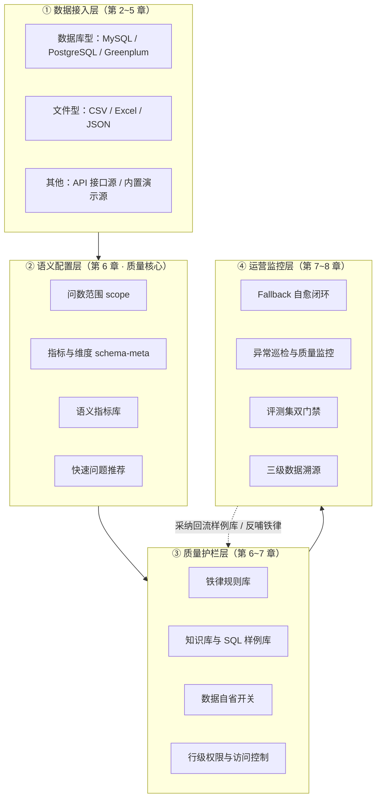
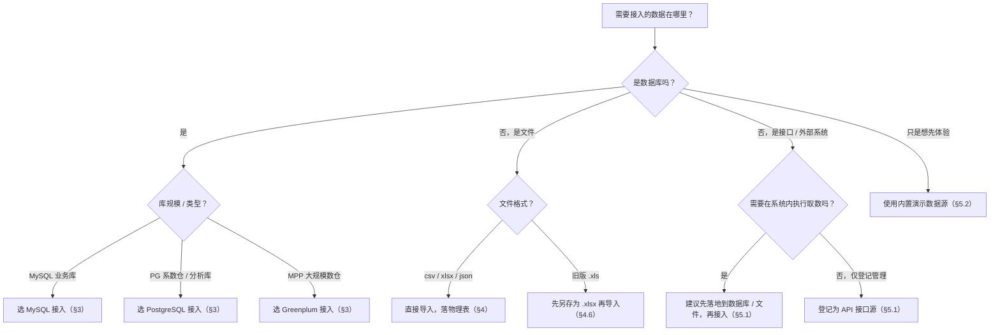
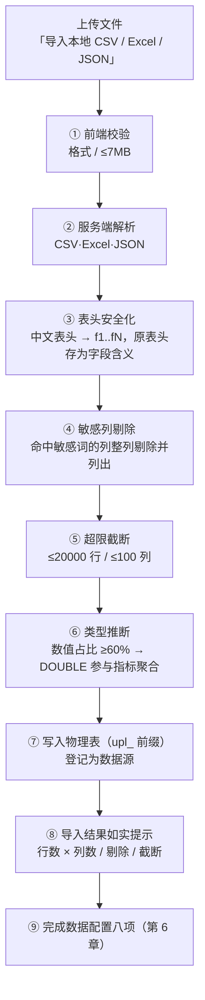
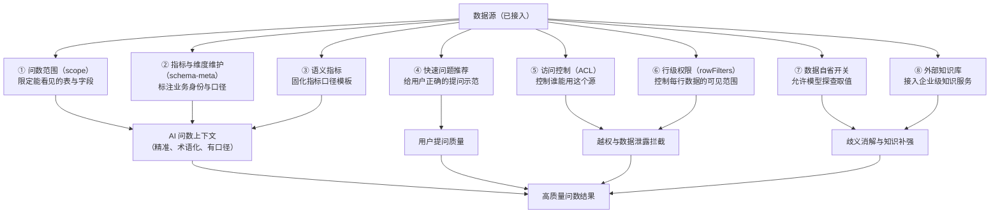

# 数据源配置与问数质量保障指导手册

> **文档定位**：本手册面向**新项目部署后的数据源接入与数据配置全过程**，是本项目**最重要的一份质量保证指导说明**——问数质量的上限由数据源配置决定，本手册教你把上限做高。
>
> **与其他文档的分工**：
> - 本手册（输入侧）：如何接入数据源、如何逐项完成数据配置、每一项配置如何转化为问数质量。
> - 《[数据资源库智能问数质量提升实操手册](./数据资源库智能问数质量提升实操手册.md)》（运营侧）：七大质量杠杆的日常运营（样例库、指标库、知识库、评测集、SOP、铁律、Fallback 闭环）。
> - 《[系统功能说明书](./系统功能说明书.md)》（功能侧）：全系统功能清单与版本特性。
>
> **适用版本**：v0.9.54 · **更新日期**：2026-09-12


---

## 0. 如何使用本手册

### 0.1 三类读者导览

| 角色 | 你的任务 | 推荐阅读路径 |
|------|---------|-------------|
| 实施工程师 | 部署后完成数据源接入、连通验证、上线验收 | 第 1 章 → 第 2 章 → 按数据源类型读第 3/4/5 章 → 第 8 章 → 附录 D |
| 数据管理员 | 完成数据配置八项，把问数质量从「能用」提到「准确」 | 第 6 章（核心）→ 第 7 章 → 附录 A/B/C |
| 质量运营者 | 验收后的持续运营与质量度量 | 第 8 章 → 《实操手册》全文 |

### 0.2 一句话主线

**接入数据源只是起点：真正决定问数质量的是接入之后的「数据配置八项」。** 同样的库，配置前问数只能得到「差不多」的答案；配置完成后可以做到口径统一、群组准确、口径可溯源。

---

## 1. 配置总览：从数据源到问数质量的四层建设

### 1.1 四层建设全景



### 1.2 为什么配置决定问数质量

大模型生成 SQL 时唯一能依赖的「业务知识」来自你在数据源上的配置。同一条问题、同一个库，配置差异会导致截然不同的结果：

| 问题 | 未配置任何数据配置项 | 完成八项配置后 |
|------|-------------------|---------------|
| 「上个月复购率是多少」 | 模型自由发挥：70 天？180 天？可能算出入口径 | 命中语义指标「复购率」→ 模板化注入固定口径（90 天内 ≥2 单），全系统一致 |
| 「华东区的销售额」 | 模型猜测 region 字段的取值写法，可能 `region = '华东'` 但实库存的是「安徽省」 | 表级业务口径说明 + 知识库易错条目纠正：实库按省存储，自动改写为省级 IN 列表 |
| 「查一下客户明细」 | 表太多，模型可能挑了张宽表，把敏感手机号也 SELECT 出来 | 问数范围限定入口表、敏感列已被剔除、行级权限强制过滤，越权即拒 |
| 「按渠道看看趋势」 | 模型对 channel 字段无认知，分组到无意义的技术字段 | 指标维度角色标注：channel 标注为维度、id 类字段被排除，分组直接命中 |

### 1.3 成熟度三阶段

| 阶段 | 目标 | 关键动作 | 判定标准 |
|------|------|---------|---------|
| 阶段一「能用」 | 接入连通、能问答 | 第 2~4 章接入 + 连接测试 + Schema 初始化 | 试问 5 个问题，真实执行链路全部走通（非演示降级） |
| 阶段二「准确」 | 口径统一、结果可复算 | 第 6 章八项配置完成 ≥ 6 项 | 第 8.1 节验收清单通过率 ≥ 80%，准确率抽测 ≥ 85% |
| 阶段三「自愈」 | 失败可闭环、质量可度量 | 第 7 章机制全开 + 日常 SOP | 评测集门禁全绿，Fallback 队列按 SLA 清空 |

---

## 2. 数据源类型总览与选型

### 2.1 八种类型对照表

| 类型 | 标识 | 接入方式 | 执行链路 | 适用场景 | 手册章节 |
|------|------|---------|---------|---------|---------|
| MySQL | `mysql` | 表单配置连接 | **真实执行** | 业务库、应用库直连 | §3 |
| PostgreSQL | `postgresql` | 表单配置连接 | **真实执行** | 数据仓库、分析库 | §3 |
| Greenplum | `greenplum` | 表单配置连接 | **真实执行** | 大规模 MPP 数仓 | §3 |
| CSV | `csv` | 文件导入（≤7MB） | 导入后**真实执行** | 外部报表、导出数据 | §4 |
| Excel | `excel` | 文件导入（仅 .xlsx） | 导入后**真实执行** | 业务台账、手工报表 | §4 |
| JSON | `json` | 文件导入（≤7MB） | 导入后**真实执行** | 接口导出、半结构化数据 | §4 |
| API | `api` | 表单登记接口信息 | 登记占位 | 接口源登记与统一管理 | §5.1 |
| Demo | `demo` | 系统内置 | 演示数据 | 新环境开箱体验 | §5.2 |

> **关键机制（v0.9.34 统一收口）**：数据库型（MySQL/PostgreSQL/Greenplum）与**已落库的文件型数据源**走**真实执行**链路（问数/报表/指标/灵活查询全部真实执行 SQL）；API 登记型与演示模式不出真实数据。判断逻辑：数据库型 OR 文件已落物理表。

### 2.2 选型决策树



### 2.3 关于「演示模式」的如实说明

- 系统内置演示数据源「企业综合运营数仓 (Demo)」用于**新环境开箱体验**，其数据为内置演示数据，不来自真实库。
- 真实项目上线前必须完成真实数据源接入，且验收时确认问数走真实执行链路（第 8.1 节清单第 1 项）。
- API 接口源当前为**登记占位**（用于接口信息统一管理），不参与真实 SQL 执行；需要真实取数的接口数据，请先 ETL 落库或导出文件后按 §3/§4 接入。

---

## 3. 数据库型数据源配置详解（MySQL / PostgreSQL / Greenplum）

### 3.1 前置准备：只读账号与网络通道

**质量第一原则：问数系统只应看见「分析需要的数据」。** 接入前必须准备**只读账号**，仅授予必要的 SELECT 权限：

| 准备项 | 要求 | 原因 |
|--------|------|------|
| 账号权限 | 只读（SELECT + 必要的元数据查询权限） | 任何写操作在系统侧被安全执行层拦截，但源库侧仍应最小授权，双保险 |
| 账号可见范围 | 只暴露需要问数的库/Schema/表 | 账号看不见的表不会进入 Schema 上下文，天然减少模型选错表 |
| 网络通道 | 应用服务器 → 数据库端口可达 | 表单保存时即验证连通性，避免上线后才发现网络不通 |
| 密码策略 | 使用独立密码并规划轮换 | 密码在系统内以 AES-256-GCM 加密存储、不下发前端，但仍应独立管理 |

只读账号建账 SQL 模板（MySQL / PostgreSQL / Greenplum 三套）见 **附录 B**，可直接复制执行。

### 3.2 接入七步流程


### 3.3 配置项逐项说明（新增数据库接入表单）

表单入口：**数据源与 Schema → 数据源管理 → 添加数据库接入**。

| # | 字段 | 必填 | 填写说明（含真实示例） | 对问数质量的影响 |
|---|------|------|----------------------|-----------------|
| 1 | 数据源名称 | 是 | 业务可辨识的完整名称，例如「华南节点 PostgreSQL 库」「零售经营分析数仓」。上限 128 字 | 问数对话、报告、溯源链路中展示的名称；命名混乱会导致用户选错源 |
| 2 | 数据库类型 | 是 | PostgreSQL 数据库 / Greenplum 数据库 / MySQL 数据库 / RESTful API 接口源 | 决定连接驱动、Schema 提取方言与 SQL 生成方言；选错直接连不上 |
| 3 | 主机地址 (Host/IP) | 是 | IP 或域名，例如 `10.0.1.20`、`db.example.com` | 连通性；建议使用内网地址降低时延（时延计入问数的 SQL 执行耗时） |
| 4 | Schema 名称 | 仅 PG 系 | 例如 `public` 或自定义 `pmart_res`（仅 PostgreSQL / Greenplum 显示此字段） | 决定 Schema 提取范围；填错将提取不到任何表 |
| 5 | 端口 (Port) | 是 | MySQL 默认 3306、PostgreSQL 默认 5432、Greenplum 默认 5432 | 连通性 |
| 6 | 数据库名 | 是 | 例如 `dw_analytics_prod` | 决定可问数的库范围 |
| 7 | 用户名 | 是 | 只读账号，例如 `readonly_user` | 权限边界（见 §3.1） |
| 8 | 密码 | 是 | 连接密码；系统以 AES-256-GCM 加密存储，**列表与详情接口不下发明文** | 安全；密码轮换后需在数据源编辑中同步更新 |

> **操作按钮说明**
> - **测试连接通道**：保存前先验证。PostgreSQL / Greenplum / MySQL 会真实探测并回显**连接时延（latencyMs）**与**可见表数量（tableCount）**——表数量异常少通常意味着账号授权范围过窄或 Schema 填错。
> - **保存并初始化 Schema**：保存同时真实提取表结构（表、字段名、类型、注释），作为后续「问数范围 / 指标维度维护」的基础。名称必填校验不通过时按钮不可用。

### 3.4 三种数据库的差异与注意事项

| 维度 | MySQL | PostgreSQL | Greenplum |
|------|-------|-----------|-----------|
| 默认端口 | 3306 | 5432 | 5432 |
| Schema 名称字段 | 不显示（库即命名空间） | 显示（默认 `public`） | 显示（默认 `public`） |
| 类型映射示例 | `tinyint/int/decimal` → 数值；`datetime` → 日期；`enum` → 分类 | `integer/numeric` → 数值；`timestamp*` → 日期；`boolean` → 布尔 | 与 PG 一致（information_schema 完整写法） |
| 典型注意点 | 字符集与排序规则影响字符串比较；`enum` 列自动按分类处理 | 短文本（varchar/char ≤64 字符）自动推导为维度；长文本不参与分析 | MPP 架构下注意大表广播/倾斜对查询耗时的影响，建议对分析表预先分布键优化 |

### 3.5 连接测试与 Schema 初始化

1. 填写完成后点击「测试连接通道」——返回成功信息后（附时延与表数量）再保存。
2. 保存时系统**真实提取 Schema 并落库**（`schema_json`），并对每列**自动推导指标/维度角色**：
   - 主键与 id 形态的数字外键 → 两者皆不是（技术性字段，不参与分析）；
   - 数值列 → **指标**；日期 / 枚举 / 布尔 → **维度**；
   - 短字符串（≤64 字符）→ **维度**；长文本 / JSON / BLOB → 两者皆不是。
3. 自动推导结果可在「维护指标与维度」中逐列人工修正（见 §6.2）——**这是提升问数准确率性价比最高的动作之一**。

### 3.6 Schema 同步（保留人工标注）

源库表结构变更后，在数据源卡片点击「同步表结构」：

- **仅数据库型数据源**支持同步；
- 同步会**保留人工标注**——仍存在的表/列的 `业务口径说明`、`指标/维度修正`、`列业务含义` 全部保留，仅对**新出现的列**重新自动推导；
- 同步完成后问数相关的 Schema 缓存自动失效，即刻生效；
- 若源库账号密码已轮换，同步时可在弹层中补输新密码。

---

## 4. 文件型数据源配置详解（CSV / Excel / JSON）

### 4.1 适用场景与限制

文件型数据源适合「外部报表、业务台账、接口导出」等无法直连的库外数据。导入后数据**真实落库**（应用库物理表），问数/报表/指标/灵活查询**全部走真实执行**。

| 限制项 | 数值 | 超限行为 |
|--------|------|---------|
| 文件格式 | `.csv` / `.xlsx` / `.json` | `.xls` 不支持，提示「另存为 .xlsx 后重试」 |
| 文件大小 | ≤ 7MB | 前端直接拒绝并提示拆分或精简 |
| 数据行数 | ≤ 20000 行 | 超出部分**截断**，导入提示如实标注 |
| 数据列数 | ≤ 100 列 | 超出部分**截断**，导入提示如实标注 |
| 数据更新 | 静态快照 | 源文件变更后需**重新导入**（见 §4.5） |

> **为什么限制严格**：文件数据会复制进应用库物理表（表名前缀 `upl_`）。过大的文件会让应用库膨胀、拖慢全部租户的查询；截断而非静默丢弃是为了让你「知道边界在哪」。

### 4.2 导入管线全景



### 4.3 四类自动处理详解

**① 表头安全化**：中文等非法表头自动转换为 `f1..fN`，**原表头保留为字段含义（description）注入 AI 上下文与结果表头中文化**——你仍能用中文列名提问，例如问「按区域统计销售额」时，系统会把「区域」映射到 `f2`。MySQL 保留字列名同样自动改名。

**② 敏感列剔除**：命中敏感词规则的列（如手机号、身份证等）**整列剔除**，导入提示中列明被剔除的列名（最多展示前 3 个 + 「等」）。敏感数据不落库、不进入 Schema 上下文、不可能被问出——这是**内生安全**，不是事后脱敏。

**③ 类型推断**：数值占比 ≥ 60% 的列推断为 `DOUBLE` 类型，**参与指标聚合**（求和、均值、同环比）；其余按原样保留。这决定了该列能否被问数直接用于计算指标。

**④ 超限截断**：超 20000 行 / 100 列的部分截断，且在导入结果提示中**如实标注**（「超出 2 万行 / 100 列上限的部分已截断」），绝不静默丢弃。

> 导入成功提示示例：`已导入「区域销售台账.xlsx」：18500 行 × 12 列真实落库，可直接问数与生成报表。（已自动剔除 2 个敏感列（手机号、身份证号））`

### 4.4 面向问数的数据文件准备规范

文件质量直接决定问数质量。导入前按以下规范整理原始文件（可打印 Checklist 见附录 C）：

| # | 规范 | 反例（会导致什么） | 正例 |
|---|------|------------------|------|
| 1 | **一行一记录**，不要合并单元格表头 | Excel 多级表头导致列名错位、类型混乱 | 首行为单层列名，数据从第二行开始 |
| 2 | **列名业务化**且互不重复 | 列名「字段1/字段2」「数值」→ 模型无从理解 | 「统计月份」「区域」「销售额」「客户数」 |
| 3 | **数值列不带千分位/货币符号/单位混排** | 「1,234元」「约500」→ 推断失败或精度丢失 | 纯数字 1234，单位写在列名（销售额_万元） |
| 4 | **日期列统一格式** | 「2026.1.5」「1/5/26」「2026年1月」混排 → 时间维度失效 | 统一为 `2026-01-05` 或 `2026/01/05` |
| 5 | **类别列取值一致** | 「华东」「华东区」「china-华东」→ 分组散裂 | 统一为「华东」 |
| 6 | **删除无关列** | 序号、备注、内部标记列 → 干扰模型选列 | 只保留分析所需列（顺带规避敏感列） |
| 7 | **数据行内不插入小计/合计行** | 合计行被当成一条记录 → 所有聚合翻倍失真 | 合计在问数阶段由系统计算，不写进文件 |
| 8 | **单文件对应单一主题** | 一张表混多主题 → 表含义不清、业务口径无法描述 | 一份文件一类业务数据 |

### 4.5 静态快照特性与更新方式

- 文件数据是**导入时刻的静态快照**，源文件后续变更不会自动同步；
- 数据更新：重新导入新版本文件，或直接编辑数据源重新上传；
- 删除数据源时**级联删除物理表**（`upl_` 表随之清理，不留残渣）；
- 因此文件型数据源建议用于**周期性报表台账**，实时性要求高的数据请优先接入数据库型。

### 4.6 常见导入失败与处理

| 现象 | 原因 | 处理 |
|------|------|------|
| 「暂不支持旧版 .xls 格式」 | 上传了 .xls | 用 Excel/WPS 另存为 .xlsx 后重试 |
| 「仅支持 .csv / .xlsx / .json 文件」 | 其他格式 | 转换格式后重试 |
| 「文件超过 7MB 大小上限」 | 文件过大 | 拆分文件，或先在源头汇总精简 |
| 导入成功但行数变少 | 超过 20000 行截断 | 查看导入提示中的截断说明；必要时拆分多文件 |
| 某列问不出来 | 列被判定敏感被剔除，或数值占比 <60% 未推断为数值 | 核对导入提示的剔除列表；清洗数据使数值占比达标后重新导入 |
| 中文列名好陌生 | 表头安全化将中文列转为 f1..fN | 正常机制——原中文列名已存为字段含义，问数时用中文提问即可 |

---

## 5. API 接口源与内置演示数据源

### 5.1 RESTful API 接口源（登记型）

- 在「添加数据库接入」表单中，数据库类型选择 **RESTful API 接口源** 即可登记接口信息（当前为**登记占位**：用于接口资产的统一管理与后续扩展，**不参与真实 SQL 执行**）。
- 需要被问数的接口数据，推荐路径：**接口 → ETL/定时导出 → 数据库或文件 → 按 §3/§4 接入**。这样接口数据也能获得完整的真实执行链路与全部质量机制。
- 若企业已有外部 RAG / 知识服务接口，请走**外部知识库接入**（§6.8），那是为「知识注入」设计的能力，与数据源执行链路无关。

### 5.2 内置演示数据源（Demo）

| 属性 | 说明 |
|------|------|
| 名称 | 企业综合运营数仓 (Demo) |
| 用途 | 新环境**开箱体验**：无需接入任何数据即可体验问数、报表、看板、溯源全链路 |
| 数据来源 | 系统内置演示数据，**不来自真实库** |
| 演示模式下相关能力 | 数据自省恒关、行级权限恒空、文件落库判定恒否 |
| 上线要求 | 正式上线后，核心问数场景必须切换到真实数据源（验收清单第 1 项） |

> **如实原则**：系统对所有降级到演示数据的行为都会在前端如实提示（如问数结果、报告生成链路未命中真实数据时的降级提示），不会把演示数据伪装成真实结果。

---

## 6. 数据配置八项详解：每一项如何提升问数质量

> **本章是全书核心。** 数据源接入只解决「能不能问」，本章八项配置决定「问得准不准」。每项均给出：原理 → 操作路径 → 配置要点 → 质量影响。
>
> 所有配置均**保存即生效**（相关 Schema / 执行器 / 查询缓存自动失效），无需重启服务。

### 6.0 八项总览



### 6.1 问数范围（scope）——决定 AI「能看见什么」

**原理**：AI 生成 SQL 时只能引用注入其上下文的 Schema 信息。问数范围把「整库」裁剪为「问数所需的表与字段子集」，未勾选内容**不会进入 AI 的 Schema 上下文**。

**操作路径**：数据源卡片 →「配置问数范围」→ 勾选表与字段 →「保存问数范围」。

| 配置要点 | 说明 |
|---------|------|
| 表级勾选 | 只保留问数真正需要的表；界面显示「已选 N / M 张表」 |
| 字段级勾选 | 展开表后逐字段勾选；显示「字段 X/Y」计数 |
| 底线规则 | **至少保留一张表**（全不选时保存按钮禁用，提示「至少保留一张表」） |
| 权限隔离 | 不同数据源独立配置；范围外字段即使被用户点名提问也无法进入上下文 |

**质量影响**：
- **减少模型选错表**：候选表从几十张降到几张，命中率显著提升；
- **阻断敏感字段**：不该问的字段（成本价、内部备注等）直接不可见，从源头避免越权输出；
- **降低 token 消耗**：上下文精简后 prompt 更短，响应更快、成本更低。

**配置建议**：先按业务主题分组（如「经营分析」「客户分析」）拆多个数据源，每个源的问数范围只放该主题的表；同一物理库可以接成多个逻辑数据源。

### 6.2 指标与维度维护（schema-meta）——告诉 AI「每个字段是什么」

**原理**：自动推导的列角色需要人工校准，表级业务口径需要人工补充。这些标注**直接注入 AI 问数上下文**——问数结果中的「查看生成的 SQL」弹窗会展示指标口径卡，报告生成同样使用本层标注。

**操作路径**：数据源卡片 →「维护指标与维度」→ 逐表/逐列编辑 → 保存。

| 配置项 | 层级 | 约束 | 说明 |
|--------|------|------|------|
| 指标（isMetric） | 列级 | 布尔标记 | 标为指标的列才会被当作**度量**参与聚合计算 |
| 维度（isDimension） | 列级 | 布尔标记 | 标为维度的列才会被当作**分组依据** |
| 列业务含义（description） | 列级 | ≤200 字 | 帮助 AI 理解列的含义；界面提示「列业务含义（可选，帮助 AI 理解）」 |
| 业务口径说明（businessNote） | 表级 | ≤500 字 | 表级口径与约定，示例模板：「复购率=90天内≥2单客户/总客户」 |

> **系统白纸黑字写着的行为约定**：「AI 问数与报告生成仅将『指标』列作为度量、『维度』列作为分组依据。」——未标注的列不会参与度量或分组。

**质量影响**：
- **分组不漏不错**：`channel`、`region` 这类列标注为维度后，「按渠道看趋势」直接把 `channel` 作为 GROUP BY 列；
- **度量不误解**：`order_id` 这类数字列默认「两者皆不是」；若某数字列实际是度量（如「数量」），把它标为指标，聚合才能正确；
- **口径一次写、处处对**：「复购率=90天内≥2单客户/总客户」写进业务口径说明后，每次问复购率都被注入同一条口径——**这是把口头约定变成系统事实的关键一步**；
- **歧义字段纠偏**：实库存「安徽省」而非「华东」时，在列业务含义中写明，模型会自行改写为省级 IN 列表。

**配置建议**：优先为**前 5 张高频表**配置——表级业务口径说明 + 全部关键列的指标/维度校准。这是准确率提升最快的动作（半天投入，长期受益）。

### 6.3 语义指标——把口径固化为「模板化注入」

**原理**：语义指标层按数据源登记结构化业务指标（名称 / 同义词 / 聚合表达式 / 归属表 / 固定过滤）。问数阶段一按「问题命中指标名或同义词 → 模板化注入口径」生成 SQL，保证**同一指标全系统口径一致**。

**操作路径**：系统管理 → 规则治理 →「语义指标」面板（按数据源维护，每源最多 200 条）。

| 配置项 | 说明 | 质量影响 |
|--------|------|---------|
| 名称 | 指标标准名，如「复购率」 | 问题命中即注入固定口径 |
| 同义词 | 用户可能的口语说法，如「复购客户占比」「回头率」 | 命中率决定覆盖率，值得多写几个 |
| 聚合表达式 | 口径公式（含固定过滤），如 `COUNT(DISTINCT 复购客户) / COUNT(DISTINCT 客户)` | **唯一事实源**，杜绝口径漂移 |
| 归属表 | 指标计算的基准表 | 模型不再猜测用哪张表 |
| 固定过滤 | 口径自带的锁定条件（强烈建议自带） | 排除掉「口径对了但范围错了」的经典事故 |
| 治理状态 | PENDING 待审批 / ACTIVE 已生效 / REJECTED 已驳回 / DISABLED 已停用 | **仅 ACTIVE 参与问数注入**；带版本历史，每次口径变更留痕可回溯 |

**质量影响**：
- 「上个月复购率多少」不再靠模型理解，而是**命中指标 → 注入模板口径 → 生成确定性 SQL**；
- 口径变更走审批 + 版本留痕，问数结果的口径卡可溯源到具体版本；
- 指标可**批量导入导出**（JSON 备份，同名冲突 skip/overwrite，overwrite 复用版本体系版本 +1），多环境同步与迁移成本极低（备份导入导出见《实操手册》L2）。

**配置建议**：首批先建 8~10 个核心指标（营收、订单数、客单价、复购率、活跃客户数等），全部走 ACTIVE 状态且在表达式中自带固定过滤（模板与范例见《实操手册》附录 B）。

### 6.4 快速问题推荐（quickQuestions）——教用户「怎么问」

**原理**：管理员可为数据源登记专业快速问题（最多 12 条、每条 ≤200 字），优先于系统按 Schema 自动推导的通用推荐问题展示。问数面板的「快速问题推荐」区取前 3 条展示（无可用推荐时该区域自动隐藏），用户点选即可提问，**问题本身就带正确术语**。

**配置方式**：当前**通过 API 维护**（前端暂未提供可视化登记入口），在数据源更新接口的 `quickQuestions` 字段提交字符串数组：

```json
{ "quickQuestions": ["按月统计各区域销售额及环比", "本月各渠道订单量排行前 10"] }
```

| 配置要点 | 说明 |
|---------|------|
| 数量上限 | 12 条（超出的自动截断）；单条超 200 字自动截断；空串与纯空白项被过滤 |
| 内容质量 | 写「业务术语 + 明确时间 + 明确分组」的完整问题，如「按月统计各区域销售额及环比」 |
| 覆盖场景 | 建议覆盖：核心指标类 / 趋势对比类 / 结构占比类 / 排行类 / 明细钻取类（前 3 条展示，核心场景排前面） |

**质量影响**：用户提问质量是问数质量的前置变量。推荐问题把「模糊提问」挡在源头——用户不会问「看看数据」（模型无法处理），而是问「按月统计各区域销售额及环比」（模型可以精确执行）。

### 6.5 访问控制（ACL）——控制「谁能用这个源」

**原理**：按部门与用户 ID 控制数据源可见性。**两组均留空 = 不限制（全员可见）**；管理员不受限制。

**操作路径**：数据源卡片 →「配置访问控制」→ 填写部门（逗号分隔）、用户 ID（逗号分隔数字）→ 保存。

| 配置场景 | 部门清单 | 用户 ID 清单 | 效果 |
|---------|---------|-------------|------|
| 全员开放 | 空 | 空 | 所有登录用户可用 |
| 限定部门 | 风控部,财务部 | 空 | 仅这些部门用户可见 |
| 指定人员 | 空 | 1001,1002 | 仅指定用户可见 |
| 部门 + 追加人员 | 风控部 | 1003 | 部门全员 + 指定补充人员可见 |

**质量影响**：ACL 是「质量」中的安全维度——数据源列表对全部登录用户可见，但**非授权用户的问数请求会被拒绝**，从入口保证「问对的人、问对的数据」。建议按业务线/部门建立权限矩阵，敏感数据源（含薪酬、风控名单等）必须配置 ACL。

### 6.6 行级权限（rowFilters）——控制「每行数据谁能看」

**原理**：登录用户在数据源 scope 中登记**行过滤谓词**（表 → SQL 谓词，如 `region LIKE '安徽省%'`）。所有真实执行链路（问数、报表、SQL 重跑、下钻）执行前，由 AST 强制把受控表包裹为过滤派生表——**注入失败 fail-closed 拒绝查询**（宁可拒答，不可泄露）。

**配置方式**：当前**通过 API 维护**（前端暂未提供可视化入口），配置在数据源的 scope 中：

```json
{
  "tables": ["t_order", "t_customer"],
  "columns": {},
  "rowFilters": {
    "t_order": "region LIKE '安徽省%'",
    "t_customer": "org_code = 'AH001'"
  }
}
```

| 安全护栏 | 说明 |
|---------|------|
| 谓词长度 | ≤300 字 |
| 禁用内容 | 多语句（`;`）、注释（`--` `#` `/* */`）、子查询（`select`）、`into` 一律拒绝 |
| 强制注入 | AST 层面包裹，不依赖模型「自觉」——模型生成的 SQL 也逃不过过滤层 |
| 失败即拒 | 注入过程任何异常 → 拒绝执行（fail-closed） |

**质量影响**：这是多租户 / 分级授权场景的核心能力。例如省级机构只能看本省行数据：SELECT 出来的任何结果都被强制追加 `WHERE region LIKE '安徽省%'` 的过滤派生表包裹——**从机制上杜绝越行查看**。

### 6.7 数据自省开关（allowIntrospection）——允许模型「先查清楚再问」

**原理**：**默认关闭**。开启后，该数据源的问数第一阶段模型可输出第三种契约：

```json
{ "needIntrospection": true, "intermediateSql": "SELECT DISTINCT status FROM t_order LIMIT 30", "note": "..." }
```

系统真实执行探查 SQL，把**最多 30 行结果回喂模型**，再生成最终 SQL。

**操作路径**：数据源卡片上的紫色扫描图标切换（开启/关闭，保存即生效）。

| 机制细节 | 说明 |
|---------|------|
| 触发范围 | **仅首次尝试的首个候选**允许一轮探查，防止递归 |
| 典型用途 | 「取值不确定」类歧义：`status` 字段到底是「已完成」还是「DONE」？先探查真实取值再生成精确 SQL |
| 与问数范围关系 | 探查 SQL 同样受执行层约束；建议在**已裁剪范围**的数据源上开源自省，避免探查过度 |
| 性能权衡 | 每次自省多一次真实查询（大多数场景毫秒级）；对低延迟要求极高的源可暂缓开启 |

**质量影响**：显著降低「枚举值猜错」类错误——这是 NL2SQL 最常见的准确率杀手之一。建议在**取值敏感的业务源**（状态机字段、分类字段多）上开启。

### 6.8 外部知识库接入——把企业知识服务接进问数

**原理**：在企业本地知识库之外，可接入企业级外部 RAG / 知识服务作为智能问数自主学习的来源。问数时与本地知识库**并行检索**，片段以「外部·源名」前缀注入阶段一 prompt。

**操作路径**：知识库面板底部「外部知识源接入」卡片（仅 ADMIN 可见）→ 接入 / 编辑 / 删除 / 测试。

| 配置项 | 说明 | 质量影响 |
|--------|------|---------|
| 接口地址 | `POST {接口地址}`，请求体 `{ "query": "...", "topK": 4 }` | 决定知识来源覆盖度 |
| 认证 | 无认证 / Bearer Token（API Key 以 AES-256-GCM 加密落库，列表与详情不出明文） | 安全合规 |
| 响应兼容 | 自动识别 `results` / `documents` / `data` / `items` 数组，每项取 `content` / `text` / `chunk` / `pageContent`——**Dify、RAGFlow、自建网关均可适配** | 零改造接入现有知识服务 |
| 生效范围 | 全部数据源 / 指定数据源 | 精准投喂：经营知识只注入经营源 |
| 超时控制 | 500~30000ms；支持「测试连接」即时验证（不落库） | 稳定性 |
| Token 预算 | 独立预算 1200，**不挤占本地知识注入槽位** | 知识注入总量可控 |

**质量影响**：企业已有的制度文档、指标字典、FAQ 知识直接成为问数上下文——「费用报销标准是多少」这类**知识型问题**也能被基于企业事实回答。单源失败降级为空、不阻断问数。

### 6.9 八项 × 质量因果对照表

| # | 配置项 | 直接作用机制 | 质量收益 | 优先级 |
|---|--------|-------------|---------|--------|
| ① | 问数范围 scope | 裁剪进入 AI 上下文的表/字段 | 选表准、防越权、省 token | ★★★★★ |
| ② | 指标与维度维护 | 注入角色标注与表级口径 | 分组准、口径一致、歧义纠偏 | ★★★★★ |
| ③ | 语义指标 | 命中即模板化注入口径 | 口径统一、可审批可回滚 | ★★★★★ |
| ④ | 快速问题推荐 | 引导用户规范提问 | 源头提效、命中率提升 | ★★★★ |
| ⑤ | 访问控制 ACL | 按部门/用户放行数据源 | 安全边界、合规 | ★★★★ |
| ⑥ | 行级权限 rowFilters | AST 强制行过滤 | 分级授权、fail-closed | ★★★★ |
| ⑦ | 数据自省开关 | 探查取值后生成 SQL | 枚举值歧义消除 | ★★★ |
| ⑧ | 外部知识库 | 并行检索注入知识片段 | 知识型问题可答、体系化 | ★★★ |

> **投入产出建议**：初建期按 ①→②→③→④ 顺序做（这四项决定 80% 的准确率差异）；成熟期补全 ⑤⑥⑦⑧（安全合规与深度能力）。

---

## 7. 系统侧质量机制（配置之外、自动生效）

完成数据配置后，系统内置的以下机制自动生效，构成问数质量的「护栏网」。本节按「注入 → 溯源 → 自愈 → 巡检 → 度量」五个环节说明。

### 7.1 三层加固注入链——每次问数都执行


| 层 | 机制 | 注入方式 | 你该怎么用 |
|----|------|---------|-----------|
| 第一层 | 铁律规则库（v0.9.35） | **全量恒注入**，措辞为“最高优先级，高于一切样例与知识片段…若用户问题或样例与铁律冲突，一律按铁律执行” | 把不可违背的口径红线写成铁律（每源上限 100 条，标题 ≤100 字、正文 ≤2000 字）；支持启停与 JSON 导入导出 |
| 第二层 | 语义指标 | 问题命中指标名/同义词才注入 | 指标多写同义词提高命中率（§6.3） |
| 第三层 | SQL 样例库 + 本地知识库 + 外部知识库 | 按相关性检索注入（带 token 预算） | 冷启动导入历史 SQL 反推问题（§8.2） |

**留痕可查**：问数结果的推导过程中会展示「铁律规则注入」等留痕，铁律是否生效一眼可查。

### 7.2 三级数据溯源——结果为什么可信

每个问数结果支持三级下钻，把「答案」拆解到「证据」：

| 级别 | 内容 | 回答的问题 |
|------|------|-----------|
| 第一级 | **口径卡**：命中的指标、口径表达式、审批状态、版本历史 | 这个数字用的是哪版口径？ |
| 第二级 | **表关联图**：SQL 引用了哪些表、如何 JOIN | 数字从哪些表算出来的？ |
| 第三级 | **SQL 与数据**：完整可复跑的 SQL + 执行结果/耗时 | 我自己跑一遍是否一致？ |

**质量影响**：可复核、可复算、可审计——这是比「模型说对」更硬的质量证明，也是业务方建立信任的最短路径。

### 7.3 Fallback 自愈闭环——失败案例自动变资产


| 环节 | 机制 | 你的动作 |
|------|------|---------|
| 两级降级 | 规则式修复 → 简化提示词重试（失败自动触发） | 无需干预 |
| 人工审核队列 | 系统管理 → AI 审核 → FallbackApprovalPanel（加权排序） | 按 SLA 清队列（建议每周 ≥2 次） |
| 采纳回流 | 采纳后的修正自动沉淀为样例（来源 FEEDBACK_UP） | 确认采纳质量，低质修正不要采纳 |
| 质量监控 | 系统管理 → 质量监控 → ABTestDashboard | 定期查看降级率/采纳率趋势 |

**质量影响**：每一次失败都被系统捕获、人工修正、自动转化为训练样本——**配置不改代码，质量自动累积**。

### 7.4 异常巡检——无人值守的质量哨兵

- 系统管理 → 异常巡检（PatrolPanel）：配置巡检计划，档位支持**每小时 / 每 6 小时 / 每 12 小时 / 每天 / 每周**；
- 巡检自动扫描指标异常波动（基于历史数据基线），异常结果进入巡检报告；
- 你对数据源的**业务口径说明与指标配置越完整，异常判定越准确**（无标注的源只能做粗粒度扫描）。

### 7.5 质量监控与评测门禁——把质量变成数字

| 机制 | 位置 | 说明 |
|------|------|------|
| 运营指标看板（OpsMetricsPanel） | 系统管理 → 质量监控 | 问数成功率、降级率、采纳率等运营指标 |
| AB 实验看板（ABTestDashboard） | 系统管理 → 质量监控 | Fallback 策略效果对比（v0.9.46 起每案例记录策略/采纳/重试元数据） |
| 评测集双门禁 | CI 流水线 | 主评测集 **148 用例 · 七类**（门禁 ≥100 通过）；宽表评测集 **54 用例 · 六类**（门禁 ≥50 通过）；任一不达标即阻断发布 |

> 评测集是「质量的尺子」：每次功能迭代都必须通过双门禁，防止新功能悄悄拉低问数质量。评测集扩展方法与标注规范见《实操手册》L4 与《评测集标注规范》。

---

## 8. 上线验收与日常运营

### 8.1 上线验收清单（逐项勾选）

完成以下全部检查后，数据源配置才算「质量就绪」：

| # | 检查项 | 检查方法 | 通过标准 |
|---|--------|---------|---------|
| 1 | 真实执行链路 | 对每个数据源试问 3 个业务问题，观察结果页是否出现「演示数据」降级提示 | 核心源全部走真实执行（无降级提示），结果含真实数据 |
| 2 | 连接健康度 | 数据源列表查看状态 | 全部为「已连接」（无 disconnected / error） |
| 3 | 问数范围 | 抽查 1 个源，确认范围弹层中勾选与业务预期一致 | 敏感表/字段未勾选；「至少保留一张表」规则未被违反 |
| 4 | 指标维度校准 | 抽查前 3 张高频表：表级业务口径说明是否填写；指标/维度标注是否正确 | 关键列标注正确（数值列=指标、分组列=维度） |
| 5 | 语义指标 | 试问「XX 指标是多少」，检查结果页口径卡 | 命中指标且显示 ACTIVE 状态；口径与业务约定一致 |
| 6 | 快速问题 | 进入问数面板，查看「快速问题推荐」区 | 显示**管理员登记**的问题（而非系统通用推导）；≤3 条按序展示 |
| 7 | 访问控制 | 用非授权账号登录，查看数据源可见性与问数权限 | 非授权用户不可见/不可问 |
| 8 | 行级权限（如启用） | 用受限账号问「全量数据」，检查结果行数 | 结果仅含授权范围行；明细可佐证 |
| 9 | 数据自省 | 对取值敏感源试问一个枚举歧义问题 | 结果正确（如状态值推断准确） |
| 10 | 铁律生效 | 提出一个与铁律冲突的问题（如绕过快照锁定） | 问数结果遵守铁律（口径红线不被绕过） |
| 11 | 溯源完整性 | 点开任一结果的「查看生成的 SQL」 | 口径卡 → 关联图 → SQL 三级信息完整 |
| 12 | 评测门禁 | 查看最近一次 CI 发布记录 | 双评测集门禁全绿（148 主集 ≥100；54 宽表 ≥50） |

**抽测准确率**（可选但推荐）：从业务方收集 20 个真实问题，正确率 ≥85% 视为阶段二达成（§1.3）。

### 8.2 日常运营 SOP（定人定频）

| 频率 | 动作 | 负责人 |
|------|------|--------|
| 每日 | 查看质量监控看板：降级率是否异常升高 | 质量运营者 |
| 每周 | 清理 Fallback 人工审核队列（≥2 次）；发现高价值修正及时采纳回流 | 数据管理员 |
| 每周 | 抽查 3~5 个问数结果做人工质检（口径/分组/时间范围） | 质量运营者 |
| 每两周 | 按质检发现补充：指标同义词、知识库易错条目、表级业务口径说明 | 数据管理员 |
| 每月 | 更新配比评测集（新增业务问题入集）；回顾铁律规则是否需新增 | 质量运营者 |
| 每月 | 核查数据源连接状态与账号密码有效期；核对 ACL 名单变动 | 实施工程师 |
| 每季度 | 全量核对指标口径版本与实际业务口径的一致性 | 数据管理员 + 业务方 |

### 8.3 FAQ 与排障

| 问题 | 排查路径 |
|------|---------|
| 数据源状态为「连接错误」 | ① 网络是否可达（telnet 端口）；② 账号密码是否轮换；③ 数据库白名单是否放行应用服务器 |
| 测试连接成功但表数量异常少 | ① Schema 名称是否填错（PG 系）；② 只读账号授权范围是否过窄 |
| 问数结果不真实/数字不对 | ① 检查是否走了演示降级（结果页提示）；② 核对问题是否有时间过滤（测试源应取数正确）；③ 检查指标口径版本 |
| 某个字段总是问不到 | ① 该字段是否被问数范围排除（§6.1）；② 文件源是否被判敏感剔除或未推断为数值（§4.3）；③ 数据自省是否有助于取值消歧（§6.7） |
| 问数报「无权限」 | ① 当前账号是否在 ACL 名单（§6.5）；② 是否触发行级权限 fail-closed（§6.6）；③ 角色权限（VIEWER 无写操作权限） |
| 中文列名在结果中显示为 f1..fN | 正常机制：原中文列名已存为字段含义并用于表头中文化；若结果未中文化，检查导入是否完整成功 |
| 源库表结构变更后问数不对 | 执行「同步表结构」（§3.6），确认人工标注已保留 |
| 修改配置后未生效 | 保存时系统自动失效相关缓存；若仍异常，检查是否有多个数据源指向同一物理库（在另一个源上排查） |

---

## 附录 A：数据源配置项全量速查表

| 配置项 | 存储字段 | 维护入口 | 约束 | 生效时机 |
|--------|---------|---------|------|---------|
| 数据源名称 | name | 新建/编辑表单 | 必填 ≤128 字 | 即时 |
| 数据库类型 | type | 新建/编辑表单 | 8 类之一 | 即时 |
| 连接配置（host/port/username/password/database/schema） | config_json | 新建/编辑表单 | password AES-256-GCM 加密、不下发前端 | 即时 |
| 状态 | status | 系统维护 | connected / disconnected / error | 连接测试后 |
| Schema 结构 | schema_json | 保存时提取 / 同步表结构 | 仅数据库型可提取 | 保存/同步后 |
| 问数范围 | scope_json.tables/columns | 配置问数范围 | 至少保留一张表 | 保存即失效缓存 |
| 行级权限 | scope_json.rowFilters | **API 维护** | 谓词 ≤300 字；禁 `;`/注释/子查询/`into` | 保存即失效缓存 |
| 指标/维度/列含义（列级） | schema_json 列属性 | 维护指标与维度 | description ≤200 字 | 保存即失效缓存 |
| 业务口径说明（表级） | schema_json 表属性 | 维护指标与维度 | ≤500 字 | 保存即失效缓存 |
| 访问控制 | acl_json | 配置访问控制 | departments[] / userIds[]；空=全员 | 即时 |
| 快速问题 | quick_questions_json | **API 维护**（数据源更新接口） | ≤12 条、每条 ≤200 字；问数面板展示前 3 条 | 即时 |
| 数据自省开关 | allow_introspection | 卡片开关 | 默认关闭 | 即时 |
| 语义指标 | metrics 表 | 系统管理 → 语义指标 | 每源 ≤200 条；仅 ACTIVE 注入 | 即时 |
| 铁律规则 | iron_rules 表 | 系统管理 → 铁律规则 | ≤100 条/源；标题 ≤100 字、正文 ≤2000 字；全量恒注入 | 即时 |
| 外部知识库 | knowledge_external 表 | 知识库 → 外部知识源接入 | Bearer Token 加密；超时 500~30000ms | 即时 |

## 附录 B：只读账号建账 SQL 模板

**MySQL**：

```sql
-- 创建只读账号（按需替换 host / password / 库名）
CREATE USER 'readonly_user'@'%' IDENTIFIED BY '<强密码>';
GRANT SELECT ON dw_analytics_prod.* TO 'readonly_user'@'%';
-- 元数据读取（Schema 提取用）
GRANT PROCESS ON *.* TO 'readonly_user'@'%';
FLUSH PRIVILEGES;
```

**PostgreSQL / Greenplum**：

```sql
-- 创建只读角色
CREATE ROLE readonly_user LOGIN PASSWORD '<强密码>';
-- 连接与 Schema 使用权限
GRANT CONNECT ON DATABASE dw_analytics_prod TO readonly_user;
GRANT USAGE ON SCHEMA public TO readonly_user;
-- 存量表只读
GRANT SELECT ON ALL TABLES IN SCHEMA public TO readonly_user;
-- 未来新表自动只读（关键：防止新表漏授权）
ALTER DEFAULT PRIVILEGES IN SCHEMA public GRANT SELECT ON TABLES TO readonly_user;
```

> **安全提示**：模板中的 `'%'`（MySQL）表示任意主机来源，生产环境建议收紧为应用服务器 IP；密码请使用强密码并定期轮换，轮换后在数据源编辑中同步更新。

## 附录 C：面向问数的数据文件准备 Checklist（导入前逐项核对）

- [ ] 首行是单层列名，无合并单元格、无多级表头
- [ ] 列名业务化、唯一、无空列名（不用「字段1」「数值」这类占位名）
- [ ] 数值列为纯数字（无千分位、货币符号、单位混排；单位写进列名）
- [ ] 日期列格式统一（如全部 `2026-01-05`）
- [ ] 类别列取值口径统一（如「华东」不混用「华东区」）
- [ ] 已删除无关列（序号、备注、内部标记）
- [ ] 无小计/合计行混在数据行中
- [ ] 单文件对应单一业务主题
- [ ] 已确认不含敏感列（若含，导入会自动剔除——请核对剔除结果是否符合预期）
- [ ] 行数 ≤20000、列数 ≤100、文件 ≤7MB（超限会截断，建议提前拆分）
- [ ] 文件为 .csv / .xlsx / .json（.xls 需另存为 .xlsx）

## 附录 D：新项目部署配置 Checklist（一页版）

**Phase 1 · 接入（半天）**
- [ ] 准备只读账号（附录 B 模板）并验证网络连通
- [ ] 按第 2 章选型，完成数据库源接入 + 测试连接 + Schema 初始化
- [ ] 文件数据按附录 C 整理后导入（或与数据库源并行）

**Phase 2 · 语义配置（1~2 天）**
- [ ] 每个源完成问数范围裁剪（§6.1）
- [ ] 前 5 张高频表：表级业务口径说明 + 列级指标/维度校准（§6.2）
- [ ] 首批 8~10 个核心语义指标建成并激活（§6.3）
- [ ] 每个源登记 ≤12 条快速问题（§6.4）

**Phase 3 · 护栏（半天）**
- [ ] 敏感源配置 ACL（§6.5）；多租户场景通过 API 配置行级权限（§6.6）
- [ ] 取值敏感源开启数据自省（§6.7）
- [ ] 有企业知识服务的接入外部知识库（§6.8）
- [ ] 把口径红线写成铁律规则（模板见《实操手册》附录 D）

**Phase 4 · 验收与运营（持续）**
- [ ] 逐项完成第 8.1 节 12 项验收清单
- [ ] 20 题抽测准确率 ≥85%
- [ ] 确认 CI 双评测集门禁全绿
- [ ] 建立日常运营 SOP（§8.2）并指定负责人

---

## 修订记录

| 日期 | 版本 | 修订内容 |
|------|------|---------|
| 2026-09-12 | v1.0 | 首次发布：面向新项目部署的 8 类数据源接入指导 + 数据配置八项详解 + 验收与运营 SOP（基线 v0.9.54） |
